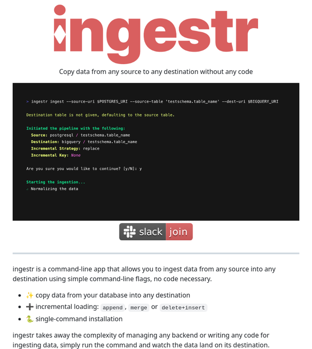

# tech_note_18756871

**Tweet URL:** [https://x.com/tom_doerr/status/1875687158742237611](https://x.com/tom_doerr/status/1875687158742237611)

**Tweet Text:** ingestr: A CLI tool to copy data from any source to any destination using simple command-line flags

**Image 1 Description:** The image is an advertisement for the Ingestr application, which allows users to copy data from any source to any destination without requiring any code.

* **Ingestr logo**: 
	+ The logo features large red text that reads "ingestr" in a sans-serif font.
	+ Below the main title, smaller black text states "Copy data from any source to any destination without any code."
* **Code snippet**:
	+ A black box contains a block of code in white and green text.
	+ The code appears to be written in a programming language such as Python or JavaScript.
	+ It includes comments and variable names, suggesting that it is intended for use by developers or technical users.
* **Call-to-action buttons**:
	+ Two rectangular buttons are located below the logo and code snippet.
	+ One button features white text on a black background that reads "slack" and has a small white Slack logo next to it.
	+ The other button features white text on a red background that reads "join" and has a small white icon of a person with their arms raised in celebration.

Overall, the image effectively communicates the key benefits and features of the Ingestr application, while also inviting users to learn more about how to use it.

