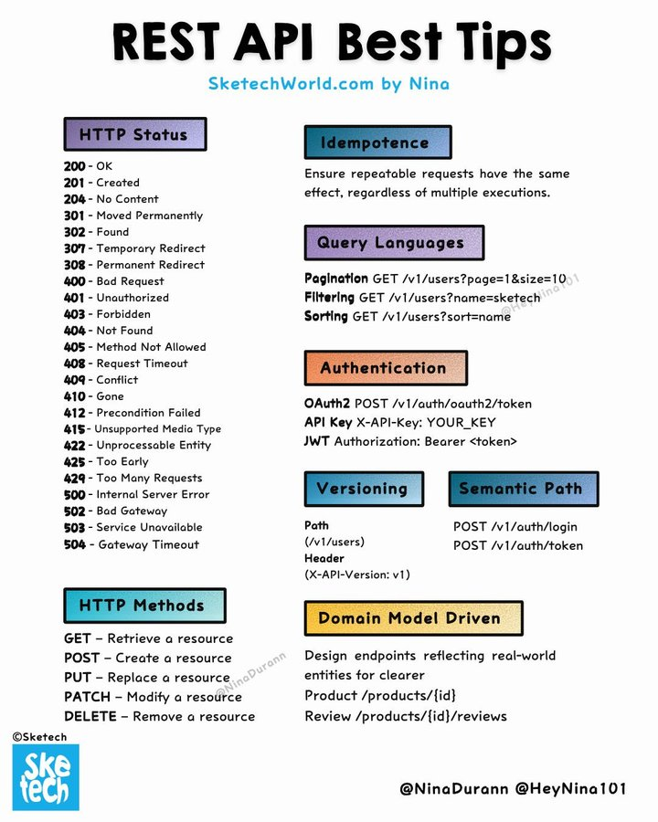

# tech_note_18783091

**Tweet URL:** [https://x.com/GuidesJava/status/1878309179439616041](https://x.com/GuidesJava/status/1878309179439616041)

**Tweet Text:** #restapi #bestpractices

**Image 1 Description:** The image presents a comprehensive guide to REST API best practices, titled "REST API Best Tips" in bold black text at the top. The infographic is divided into nine sections, each with a distinct color scheme and containing valuable information about REST APIs.

*   **HTTP Status Codes**
    *   HTTP status codes are used to indicate the outcome of an HTTP request.
    *   There are five categories of status codes: informational responses (100-199), successful responses (200-299), redirection messages (300-399), client errors (400-499), and server errors (500-599).
*   **Idempotence**
    *   Idempotence is the property of a method that has the same effect whether it's called once or multiple times.
    *   It ensures that repeated requests do not result in unintended consequences.
*   **Query Languages**
    *   Query languages are used to query data in a database or other data storage system.
    *   They allow users to specify conditions for which they want the data and retrieve only the relevant information.
*   **Authentication**
    *   Authentication is the process of verifying the identity of a user or device before granting access to a resource or system.
    *   It involves checking credentials such as usernames, passwords, or biometric data against stored records.
*   **Versioning**
    *   Versioning is the practice of tracking changes made to an API over time.
    *   It ensures that old versions of the API are still supported and can be used by clients who have not updated their software.
*   **Semantic Path**
    *   A semantic path is a URL path that indicates the meaning or purpose of the resource it points to.
    *   It helps users understand what they will find at the end of the link without having to click on it.
*   **HTTP Methods**
    *   HTTP methods are used to specify the action to be taken on a resource identified by the URL.
    *   The most common methods include GET, POST, PUT, DELETE, and PATCH.
*   **Domain Model Driven**
    *   Domain model-driven development is an approach that focuses on modeling business concepts and processes first.
    *   It ensures that the software developed aligns with the needs of the organization and its users.

In summary, this infographic provides a detailed overview of REST API best practices, covering topics such as HTTP status codes, idempotence, query languages, authentication, versioning, semantic path, HTTP methods, and domain model-driven development. By following these guidelines, developers can create robust and maintainable APIs that meet the needs of their users and stakeholders.

