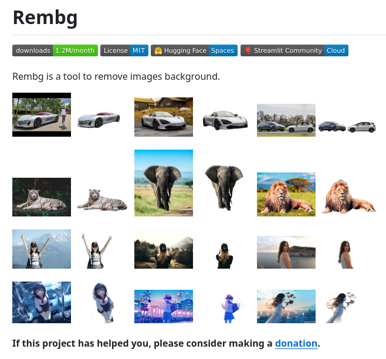

# tech_note_18788667

**Tweet URL:** [https://x.com/tom_doerr/status/1878866744833347762](https://x.com/tom_doerr/status/1878866744833347762)

**Tweet Text:** Remove image backgrounds with Rembg

**Image 1 Description:** The image presents a screenshot of the Rembg website, which offers a tool to remove backgrounds from images. The website's main page features a collection of images with various objects, including cars, animals, people, and landscapes.

* **Website Header**
	+ The title "Rembg" is displayed in large black text at the top left.
	+ A navigation bar with links to different sections of the website is located below the title.
	+ A search bar is also present, allowing users to input specific keywords or phrases.
* **Image Gallery**
	+ A grid of images showcasing various objects, such as cars, animals, people, and landscapes, is displayed on the main page.
	+ Each image has a brief description or caption underneath it.
	+ Users can click on an image to view more details about it or download it.
* **Call-to-Action**
	+ A prominent call-to-action (CTA) button in blue text reads "Donate" and is accompanied by a PayPal logo.
	+ The CTA encourages users to support the website's development and maintenance by making a donation.
* **Footer Section**
	+ A footer section at the bottom of the page provides additional information about the website, including its purpose, features, and contact details.
	+ Links to social media profiles and other relevant resources are also included.

Overall, the Rembg website appears to be a useful tool for removing backgrounds from images, with a user-friendly interface and a clear call-to-action to support its development.

