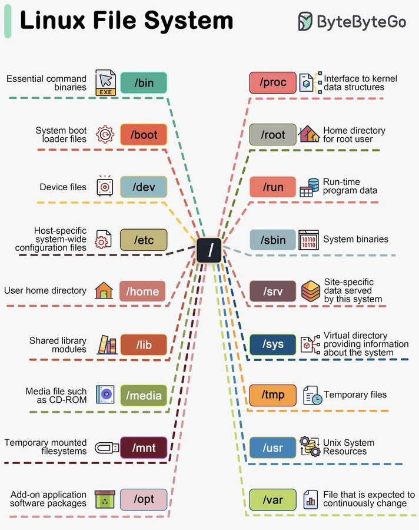

# technical_note_1879033206881800532

**Tweet URL:** [https://x.com/sahnlam/status/1879033206881800532](https://x.com/sahnlam/status/1879033206881800532)

**Tweet Text:** Understanding the Linux File System Layout

**Image 1 Description:** The image is a diagram of the Linux file system, which displays various directories and files in a tree-like structure.

**Title:** The title of the image is "Linux File System" and it is located at the top left corner of the page.

**Visual Representation:**

*   The image features a colorful, hand-drawn illustration of the Linux file system.
*   It starts with the root directory "/" and branches out into different directories such as "/bin", "/boot", "/dev", "/etc", "/home", "/lib", "/media", "/mnt", "/opt", "/proc", "/root", "/sbin", "/sys", "/tmp", "/usr", "/var", "/usr/local/bin", "/usr/share/man", and "/usr/src".
*   Each directory has its own set of subdirectories or files, which are also illustrated in the diagram.
*   The illustration is colorful and easy to read, making it clear that each directory has its own specific purpose and function within the Linux operating system.

**Key Features:**

*   **Root Directory:** The root directory "/" serves as the topmost level of the file system hierarchy.
*   **Subdirectories:** Each subdirectory represents a different part of the file system, such as "/bin" for binary files, "/boot" for boot loader files, and "/dev" for device files.
*   **Files:** Some directories contain files within them, such as "/etc/hosts" or "/usr/share/man/man1".
*   **System Files:** The diagram also highlights system files that are essential for the operation of the Linux operating system.

**Conclusion:**

The image provides a clear and concise visual representation of the Linux file system. It shows how each directory is related to others and how they fit together to form the overall structure of the file system. This can be useful for anyone looking to understand the basics of the Linux file system or wanting to learn more about its organization and layout.

