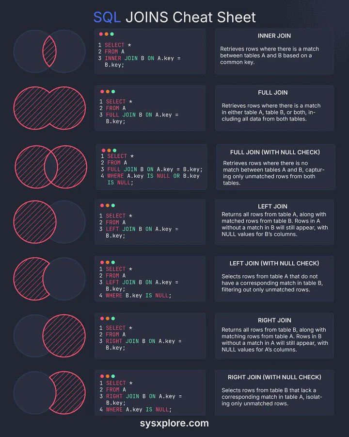

# technical_note_1878513153492877751

**Tweet URL:** [https://x.com/sysxplore/status/1878513153492877751](https://x.com/sysxplore/status/1878513153492877751)

**Tweet Text:** SQL cheat sheet - Every JOIN explained:

**Image 1 Description:** The image presents a comprehensive cheat sheet for SQL JOIN operations, providing a detailed guide to understanding and executing various types of joins in SQL queries.

*   **SQL JOINS Cheat Sheet**
    *   The cheat sheet is divided into two columns, with each column representing a different type of join.
    *   The left column illustrates the syntax for performing an INNER JOIN, while the right column demonstrates the syntax for performing an OUTER JOIN.
    *   Each row in the table represents a specific type of join, including INNER JOIN, LEFT JOIN, RIGHT JOIN, and FULL OUTER JOIN.
    *   The cheat sheet also includes examples of how to use these joins in real-world scenarios, making it easier for users to understand and apply them effectively.
*   **INNER JOIN**
    *   An INNER JOIN returns only the rows that have matching values in both tables.
    *   It combines rows from two or more tables based on a related column between them.
    *   The syntax for an INNER JOIN is SELECT columns FROM table1 INNER JOIN table2 ON condition.
*   **OUTER JOIN**
    *   An OUTER JOIN returns all the rows from one or both tables, including NULL values where there are no matches.
    *   It combines rows from two or more tables based on a related column between them and includes all rows from one or both tables in the result set.
    *   The syntax for an OUTER JOIN is SELECT columns FROM table1 LEFT/RIGHT/FULL OUTER JOIN table2 ON condition.
*   **LEFT JOIN**
    *   A LEFT JOIN returns all the rows from the left table and the matching rows from the right table, or NULL if there are no matches.
    *   It combines rows from two or more tables based on a related column between them and includes all rows from the left table in the result set.
    *   The syntax for a LEFT JOIN is SELECT columns FROM table1 LEFT JOIN table2 ON condition.
*   **RIGHT JOIN**
    *   A RIGHT JOIN returns all the rows from the right table and the matching rows from the left table, or NULL if there are no matches.
    *   It combines rows from two or more tables based on a related column between them and includes all rows from the right table in the result set.
    *   The syntax for a RIGHT JOIN is SELECT columns FROM table1 RIGHT JOIN table2 ON condition.
*   **FULL OUTER JOIN**
    *   A FULL OUTER JOIN returns all the rows from both tables, including NULL values where there are no matches.
    *   It combines rows from two or more tables based on a related column between them and includes all rows from both tables in the result set.
    *   The syntax for a FULL OUTER JOIN is SELECT columns FROM table1 FULL OUTER JOIN table2 ON condition.

In summary, this SQL JOINS cheat sheet provides a clear and concise guide to understanding and performing various types of joins in SQL queries. By following the syntax and examples provided, users can effectively combine rows from multiple tables based on related columns and retrieve the desired data.

