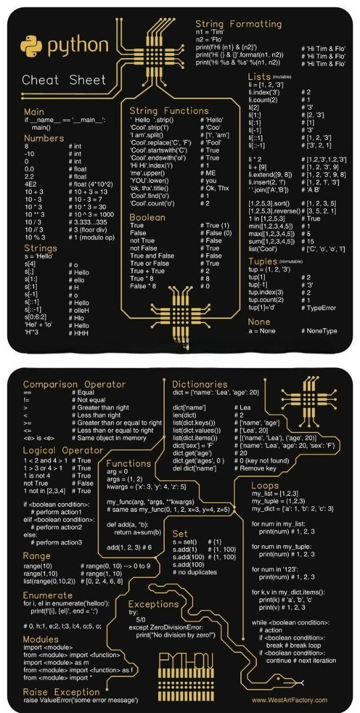

# technical_note_1878831965321011530

**Tweet URL:** [https://x.com/PythonPr/status/1878831965321011530](https://x.com/PythonPr/status/1878831965321011530)

**Tweet Text:** Python Cheat-Sheet - A Quick Reference Guide for Programmers

**Image 1 Description:** The image presents a comprehensive "Cheat Sheet" for Python programming, featuring two main sections: a top section labeled "Python Cheat Sheet" and a bottom section titled "Python Cheatsheet." The cheat sheet is designed to be easily readable on various devices, with each section divided into smaller rectangles.

**Main Points:**

* **Top Section:**
	+ Title: "Python Cheat Sheet"
	+ Subsections:
		- String Formatting
			- A1 = 'Tim'
			- n2 = Flo'
		- Lists (minimise)
			- II = [1, 2, 3]
			- III = count(2)
		- Main
			- if __name__ == '__main__':
				main()
	+ Statistics:
		- No statistics are presented in this section.
* **Bottom Section:**
	+ Title: "Python Cheatsheet"
	+ Subsections:
		- Comparison Operator
			- Equal
			- Not equal
			- Greater than or equal to
			- Less than or equal to
		- Dictionaries
			- dict = {'name': 'Lea', 'age': 20}
		- Functions
			- def add(a, b):
				return a + b
	+ Statistics:
		- No statistics are presented in this section.

**Summary:**

The image provides a concise and informative Python cheat sheet, covering various aspects of the programming language. The top section focuses on string formatting, lists, and main functions, while the bottom section delves into comparison operators, dictionaries, and functions. Overall, the cheat sheet serves as a valuable resource for Python programmers, offering quick access to essential concepts and syntax.

