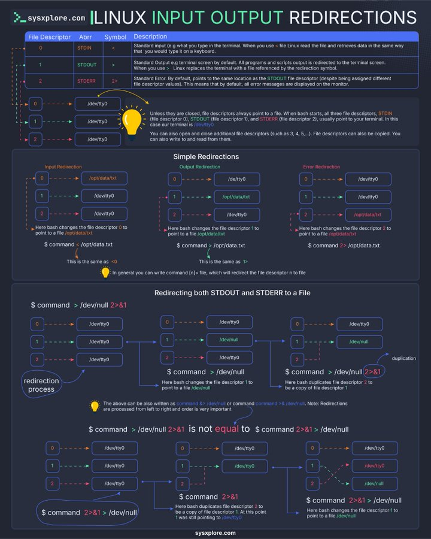

# technical_note_1878825004319773077

**Tweet URL:** [https://x.com/sysxplore/status/1878825004319773077](https://x.com/sysxplore/status/1878825004319773077)

**Tweet Text:** Linux Input/Output Redirections crash course

**Image 1 Description:** The infographic, titled "Linux Input Output Redirections," provides a comprehensive guide to understanding Linux input/output redirection using various symbols and commands.

**File Descriptors**

* The top section introduces file descriptors and their corresponding symbols:
	+ Standard input: STDIN (<)
	+ Standard output: STDOUT (>)
	+ Standard error: STDERR (2>)

**Simple Redirections**

* The middle-left section explains simple redirections, including:
	+ Input redirection: < symbol
	+ Output redirection: > symbol
	+ Error redirection: 2> symbol

**Complex Redirections**

* The middle-right section delves into complex redirections, covering topics such as:
	+ Command chaining using | (pipe)
	+ Redirecting output to multiple files

**Symbol Descriptions**

* A key at the bottom provides a concise explanation of each symbol used in the infographic.

Overall, this infographic serves as an effective resource for learning Linux input/output redirection, offering a clear and organized presentation of concepts.

