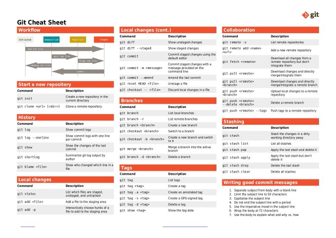

# technical_note_1868207061147992094

**Tweet URL:** [https://x.com/itsrajputamit/status/1868207061147992094](https://x.com/itsrajputamit/status/1868207061147992094)

**Tweet Text:** Git Cheat Sheet 

**Image 1 Description:** The image presents a comprehensive "Git Cheat Sheet" that serves as a valuable resource for individuals familiar with Git, providing an overview of various commands and their functions.

**Workflow Section:**

*   This section illustrates the workflow process in Git, including:
    *   Untracked files
    *   Staged files
    *   Commits

**Command Reference Section:**

*   This section provides a detailed list of available commands, each accompanied by a brief description and an example:

    *   Start a new repository
        *   Command: `git init`
        *   Description: Create a new repository in the current directory
        *   Example: `git init myproject`
    *   History
        *   Command: `git log`
        *   Description: Display a list of recent commits, along with their hashes and commit messages
        *   Example: `git log -10` (display the last 10 commits)
    *   Tags
        *   Command: `git tag <tagname>`
        *   Description: Create a new annotated tag
        *   Example: `git tag v1.0`
    *   Stashing
        *   Command: `git stash push`
        *   Description: Save the current changes and switch to a clean working directory
        *   Example: `git stash push`
    *   Writing good commit messages
        *   Command: None
        *   Description: Guidelines for writing clear and descriptive commit messages

**Local Changes Section:**

*   This section provides information on how to manage local changes in Git:

    *   Add file
        *   Command: `git add <filename>`
        *   Description: Stage a new file for the next commit
        *   Example: `git add README.md`
    *   Remove file
        *   Command: `git rm --cached <filename>`
        *   Description: Unstage a file that has already been committed
        *   Example: `git rm --cached README.md`

In summary, this Git Cheat Sheet offers a concise and user-friendly guide to navigating the world of Git. By providing clear explanations and examples for each command, it enables users to quickly learn how to use Git effectively.

