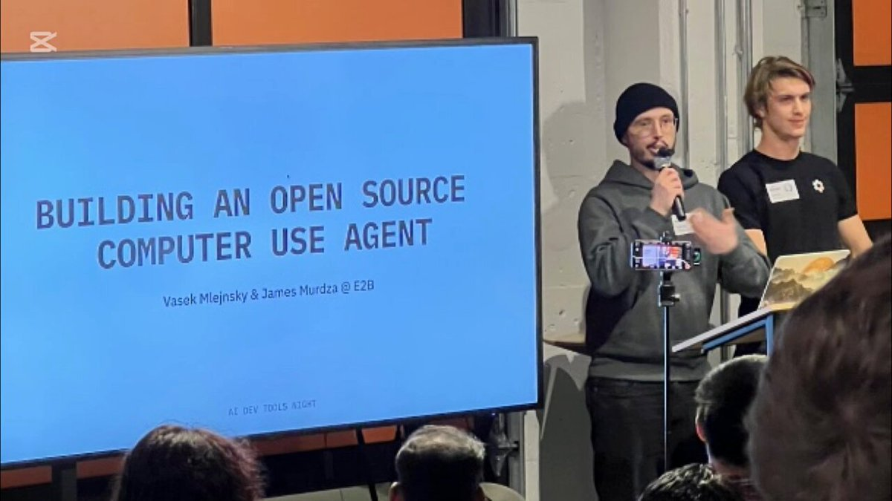

# technical_note_1878834392891838556

**Tweet URL:** [https://x.com/tereza_tizkova/status/1878834392891838556](https://x.com/tereza_tizkova/status/1878834392891838556)

**Tweet Text:** Listen to 
@jamesmurdza
's demo of a 100% open-source Computer Use.

The agent is using 3 different LLMs:
Llama 3.2 (
@AIatMeta
)
Llama 3.3
OS-Atlas (
@Alibaba_Qwen
, 
@JustinLin610
)

This example is using 
@e2b_dev
's Desktop Sandbox as a virtual computer.  It's completely open-source too, so go build your own agent.

**Image 1 Description:** The image shows a presentation or workshop with two men standing at a podium, addressing an audience. The scene is set in front of a large screen displaying the title "BUILDING AN OPEN SOURCE COMPUTER USE AGENT" on a blue background.

*   **Large Screen:**
    *   Displays the title "BUILDING AN OPEN SOURCE COMPUTER USE AGENT"
    *   Blue background
*   **Two Men at Podium:**
    *   One man wearing a black beanie and gray hoodie, holding a microphone
    *   Other man standing to his right, wearing a black t-shirt with a white logo
*   **Audience:**
    *   Several people seated in front of the podium, facing the presenters
*   **Background:**
    *   White wall behind the audience

The overall atmosphere suggests a professional or educational setting, possibly related to technology or computer science. The presence of two men at the podium and an audience implies a presentation or workshop is underway.

