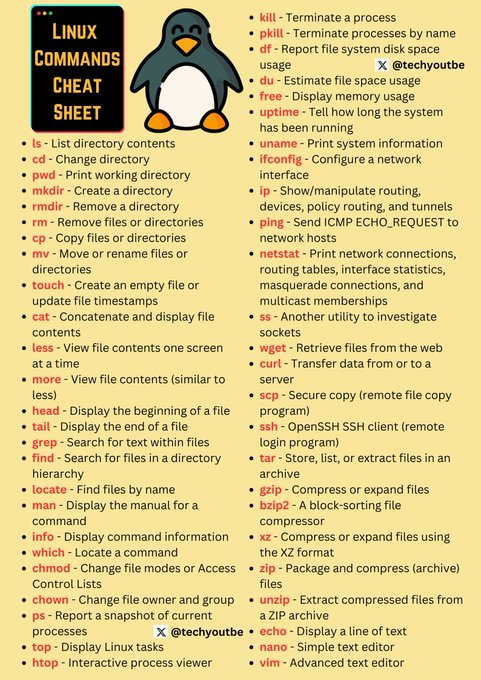

# technical_note_1868923330809532640

**Tweet URL:** [https://x.com/techyoutbe/status/1868923330809532640](https://x.com/techyoutbe/status/1868923330809532640)

**Tweet Text:** Linux (Imp) Commands - Cheat Sheet 

**Image 1 Description:** The image is a cheat sheet for Linux commands, featuring a penguin mascot and providing information on various command-line interfaces (CLI) used in Linux.

* A penguin:
	+ The penguin is depicted with its arms crossed and legs apart.
	+ It has a white belly and black feathers.
	+ Its beak is yellow, and it appears to be smiling.
* A logo that says "Linux Commands Cheat Sheet":
	+ The logo features the title of the cheat sheet in bold, yellow font.
	+ Below the title, there are two lines of smaller text: "Commands" and "Cheat Sheet".
	+ The background of the logo is a dark gray color with a subtle gradient effect.
* A list of Linux commands:
	+ The list includes over 50 different commands, each with a brief description or example usage.
	+ Some examples include:
		- `ls` (list directory contents)
		- `cd` (change directory)
		- `mkdir` (make a new directory)
		- `rm` (remove files or directories)
		- `cp` (copy files)
		- `mv` (move or rename files)

Overall, the image provides a comprehensive resource for anyone looking to learn about Linux commands and how to use them effectively. The inclusion of a penguin mascot adds a touch of whimsy and friendliness to the design, making it more approachable and engaging for users.

