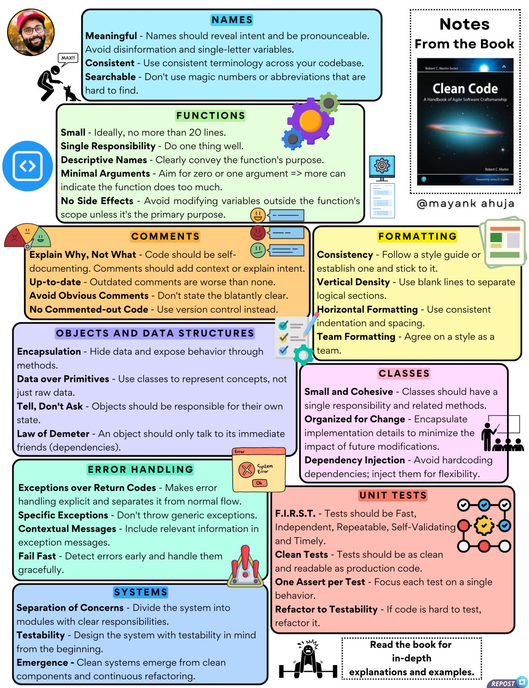

**Source:** [https://twitter.com/i/web/status/1881919516696772864](https://twitter.com/i/web/status/1881919516696772864)
**Original Post Date:** 2025-05-28 04:41:26

# Clean Code Principles: Essential Guidelines for Maintainable Software

## Introduction
This knowledge base item presents fundamental principles of clean code as outlined in 'Clean Code: A Handbook of Agile Software Craftsmanship' by Robert C. Martin. Clean code is not just about making programs work but writing maintainable, readable, and scalable software that enhances productivity and reduces technical debt.

## Names

Meaningful naming is foundational to clean code. Names should convey intent clearly while avoiding implementation details.

- Use pronounceable, meaningful names that reveal purpose
- Maintain consistent terminology throughout the codebase
- Avoid magic numbers and hard-to-find abbreviations

> **Note/Tip:** Names should never mislead developers about their purpose

## Functions

Functions are building blocks of clean code. They must be small, focused, and easy to understand.

Function design principles ensure maintainability and reusability.

_Example of a focused function handling only price calculation_

```python
def calculate_total_price(items):
    subtotal = sum(item.price for item in items)
    tax = subtotal * 0.1
    return subtotal + tax
```

- Limit function length to 20 lines or fewer
- Ensure single responsibility principle is followed
- Use descriptive names that convey purpose
- Minimize arguments (ideally zero or one)

## Comments and Formatting

Code should be self-documenting, but comments provide context when necessary.

Formatting consistency enhances readability.

- Explain 'why', not 'what' the code does
- Keep formatting consistent across team
- Use vertical spacing to separate logical sections

## Objects and Classes

Object-oriented principles ensure clean, maintainable architecture.

_Demonstrates encapsulation and single responsibility_

```python
class Order:
    def calculate_total(self):
        self._apply_tax()
        return self.subtotal + self.tax
```

- Follow encapsulation to hide implementation details
- Use 'Tell, Don't Ask' principle for object interaction
- Apply Law of Demeter to reduce dependencies

## Error Handling and Testing

Proper error handling and testability are crucial for clean code.

- Prefer exceptions over return codes
- Write F.I.R.S.T. compliant unit tests
- Design systems with testability in mind

## Key Takeaways

- Meaningful naming and consistent formatting are fundamental to clean code
- Functions should be small, focused, and have clear responsibilities
- Error handling must be explicit and well-documented
- Object-oriented design principles improve maintainability

## Conclusion
Implementing these clean code principles leads to more maintainable software, reduces technical debt, and improves team collaboration. Regular refactoring ensures code quality remains high over time.

## External References

- [Clean Code: A Handbook of Agile Software Craftsmanship](https://www.amazon.com/Clean-Code-Handbook-Software-Craftsmanship/dp/0132350882)
- [Original infographic by @mayankahuja](https://twitter.com/mayankahuja/status/[infographic_id])


## Media

**Image Description:** This image is a detailed and visually organized infographic summarizing key principles and best practices for writing clean and maintainable code. The content is structured into several sections, each focusing on a specific aspect of software development. Below is a detailed breakdown of the image:

### **Main Subject**
The main subject of the image is the principles of **Clean Code**, as outlined in the book *Clean Code: A Handbook of Agile Software Craftsmanship* by Robert C. Martin. The infographic serves as a concise summary of the book's key concepts, emphasizing readability, maintainability, and best practices in software development.

### **Visual Layout**
The infographic is divided into multiple sections, each with a distinct color-coded box and a heading. The sections are interconnected with icons, arrows, and visual cues to guide the reader through the content. The overall design is clean, organized, and visually appealing, making it easy to follow.

### **Sections and Details**
#### **1. Names**
- **Color:** Light blue
- **Key Points:**
  - **Meaningful:** Names should convey intent and be pronounceable. Avoid single-letter variables or names that reveal too much about the implementation.
  - **Consistent:** Use consistent terminology across the codebase.
  - **Searchable:** Avoid magic numbers or abbreviations that are hard to find.
  - **Notes:** Emphasizes avoiding disinformation and ensuring names are meaningful.

#### **2. Functions**
- **Color:** Light green
- **Key Points:**
  - **Small:** Ideally, no more than 20 lines.
  - **Single Responsibility:** Functions should do one thing well.
  - **Descriptive Names:** Clearly convey the function's purpose.
  - **Minimal Arguments:** Aim for zero or one argument; more arguments indicate the function is doing too much.
  - **No Side Effects:** Avoid modifying variables outside the function's scope unless it's the primary purpose.
  - **Icons:** Includes a gear icon to symbolize functionality.

#### **3. Comments**
- **Color:** Orange
- **Key Points:**
  - **Explain Why, Not What:** Code should be self-documenting; comments should add context or explain intent.
  - **Up-to-date:** Outdated comments are worse than none.
  - **Vertical Density:** Use blank lines to separate logical sections.
  - **Avoid Obvious Comments:** Don't state the obvious.
  - **No Commented-out Code:** Use version control instead.
  - **Icons:** Includes a comment icon to symbolize commenting practices.

#### **4. Formatting**
- **Color:** Yellow
- **Key Points:**
  - **Consistency:** Follow a style guide and stick to it.
  - **Vertical Density:** Use blank lines to separate logical sections.
  - **Horizontal Formatting:** Maintain consistent indentation and spacing.
  - **Team Formatting:** Agree on a style as a team.
  - **Icons:** Includes a code formatting icon.

#### **5. Objects and Data Structures**
- **Color:** Light blue
- **Key Points:**
  - **Encapsulation:** Hide data and expose behavior through methods.
  - **Data over Primitives:** Use classes to represent concepts, not just raw data.
  - **Tell, Don't Ask:** Objects should be responsible for their own state.
  - **Law of Demeter:** An object should only talk to its immediate friends (dependencies).
  - **Icons:** Includes a gear and a data structure icon.

#### **6. Classes**
- **Color:** Pink
- **Key Points:**
  - **Small and Cohesive:** Classes should have a single responsibility and related methods.
  - **Tell, Don't Ask:** Objects should be responsible for their own state.
  - **Law of Demeter:** An object should only talk to its immediate friends.
  - **Organized for Change:** Encapsulate implementation details to minimize the impact of future modifications.
  - **Dependency Injection:** Avoid hardcoding dependencies; inject them for flexibility.
  - **Icons:** Includes a class diagram icon.

#### **7. Error Handling**
- **Color:** Light green
- **Key Points:**
  - **Exceptions over Return Codes:** Makes error handling explicit and separates it from normal flow.
  - **Specific Exceptions:** Don't throw generic exceptions.
  - **Contextual Messages:** Include relevant information in exception messages.
  - **Fail Fast:** Detect errors early and handle them gracefully.
  - **Icons:** Includes an error icon.

#### **8. Unit Tests**
- **Color:** Pink
- **Key Points:**
  - **F.I.R.S.T. Principles:** Tests should be Fast, Independent, Repeatable, Self-Validating, and Timely.
  - **One Assert per Test:** Focus each test on a single behavior.
  - **Refactor to Testability:** If code is hard to test, refactor it.
  - **Icons:** Includes a test icon.

#### **9. Systems**
- **Color:** Light blue
- **Key Points:**
  - **Separation of Concerns:** Divide the system into modules with clear responsibilities.
  - **Testability:** Design systems with testability in mind from the beginning.
  - **Emergence:** Clean systems emerge from continuous refactoring.
  - **Icons:** Includes a system architecture icon.

### **Additional Elements**
- **Book Reference:** The infographic includes a small image of the book *Clean Code* by Robert C. Martin, indicating the source of the principles.
- **Notes Section:** A section titled "Notes From the Book" provides additional context and emphasizes the importance of reading the book for in-depth understanding.
- **Author Attribution:** The infographic is attributed to **@mayankahuja**, as indicated in the bottom right corner.
- **Visual Cues:** Icons, arrows, and color-coding are used to enhance readability and guide the viewer through the content.

### **Overall Theme**
The infographic effectively communicates the essence of clean code by breaking down complex principles into digestible sections. It emphasizes the importance of meaningful names, small and focused functions, descriptive comments, consistent formatting, encapsulation, cohesive classes, robust error handling, well-structured unit tests, and modular systems. The visual design ensures that the information is accessible and engaging for developers looking to improve their coding practices.
