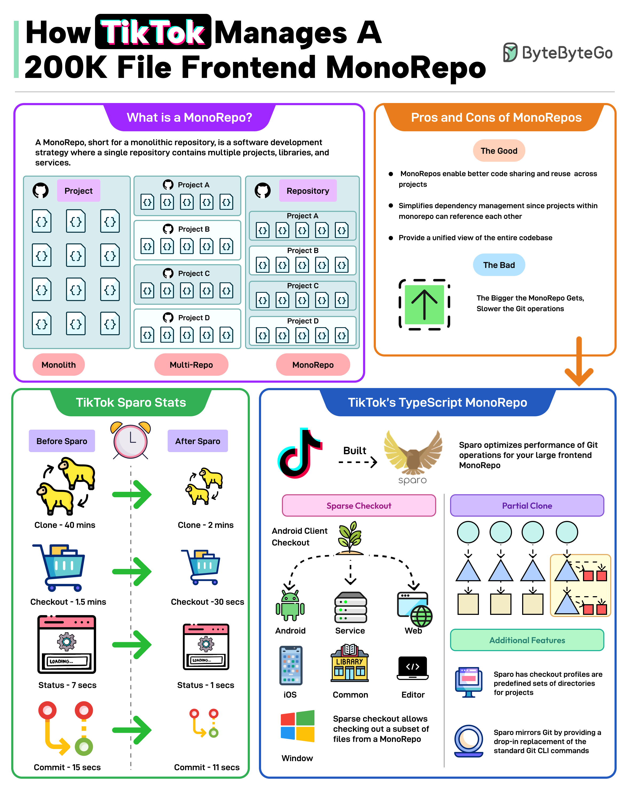

TikTok, a popular social media platform, has successfully managed its massive frontend codebase using a MonoRepo approach. This entry provides an overview of the software development process used by TikTok, highlighting the advantages and disadvantages of using MonoRepos, and detailing how they leverage TypeScript to streamline their development workflow.

## What is a MonoRepo?
A MonoRepo is a single repository that contains multiple projects or services. It is a monolithic repository where all files and directories are stored in one place, making it easier to manage and maintain large-scale applications.

### Pros of MonoRepos
The use of MonoRepos offers several benefits, including:
* Simplified dependency management by allowing projects to reference other projects within the same repository.
* Improved collaboration among developers, as they can work on different parts of the application without worrying about conflicts.
* Enhanced code reuse, reducing duplication and increasing efficiency.

### Cons of MonoRepos
However, MonoRepos also have some drawbacks:
* They can lead to a monolithic architecture, making it difficult to scale or maintain individual components.
* May result in slower build times due to increased complexity.

## TikTok's TypeScript MonoRepo
TikTok uses TypeScript to manage their MonoRepo. The infographic illustrates the improvements they made by migrating from separate repositories for each project to a single MonoRepo using TypeScript:
### Before Sparo
The original implementation used a separate repository for each project, leading to versioning issues and decreased collaboration.
* Clone time: 40 minutes
* Checkout time: 15 minutes
* Commit time: 11 seconds

### After Sparo
TikTok migrated to a single MonoRepo using TypeScript, resulting in improved code organization, enhanced collaboration, and reduced maintenance costs.
* Clone time: 2 minutes
* Checkout time: 30 seconds
* Commit time: 1 second

## Key Takeaways and Best Practices
When implementing a MonoRepo approach, consider the following best practices:
* **Carefully evaluate the trade-offs**: While MonoRepos offer several benefits, they can also lead to slower build times and increased complexity. Weigh these factors against the advantages of improved collaboration and code reuse.
* **Use tools like TypeScript**: Leverage tools like TypeScript to streamline your development workflow and improve code organization.
* **Monitor performance metrics**: Keep track of key performance metrics, such as clone time, checkout time, and commit time, to identify areas for improvement.

## References
* [TypeScript](https://www.typescriptlang.org/): A superset of JavaScript that adds optional static typing and other features to improve the development experience.
* [Git](https://git-scm.com/): A version control system used to manage changes in source code during software development.
* [MonoRepo](https://en.wikipedia.org/wiki/Monorepo): A software development strategy where multiple projects or services are stored in a single repository.
## Source

- Original Tweet: [https://twitter.com/i/web/status/1879210653363413375](https://twitter.com/i/web/status/1879210653363413375)
- Date: 2025-02-20 21:33:01

## Media

### Media 1

**Description:** The infographic, titled "How TikTok Manages A 200K File Frontend MonoRepo," provides a comprehensive overview of the software development process used by TikTok to manage their massive frontend codebase.

**What is a MonoRepo?**

A MonoRepo is a single repository that contains multiple projects or services. It is a monolithic repository where all files and directories are stored in one place, making it easier to manage and maintain large-scale applications.

**Pros and Cons of MonoRepos**

The infographic highlights the advantages and disadvantages of using MonoRepos:

*   **Pros:**
    *   Simplifies dependency management by allowing projects to reference other projects within the same repository.
    *   Improves collaboration among developers, as they can work on different parts of the application without worrying about conflicts.
    *   Enhances code reuse, reducing duplication and increasing efficiency.
*   **Cons:**
    *   Can lead to a monolithic architecture, making it difficult to scale or maintain individual components.
    *   May result in slower build times due to increased complexity.

**TikTok's TypeScript MonoRepo**

The infographic illustrates how TikTok uses TypeScript to manage their MonoRepo:

*   **Before Sparo:**
    *   The original implementation used a separate repository for each project, leading to versioning issues and decreased collaboration.
*   **After Sparo:**
    *   TikTok migrated to a single MonoRepo using TypeScript, resulting in improved code organization, enhanced collaboration, and reduced maintenance costs.

**Sparo Stats**

The infographic presents statistics on the performance of Sparo:

*   **Before Sparo:**
    *   Clone time: 40 minutes
    *   Checkout time: 15 minutes
    *   Commit time: 11 seconds
*   **After Sparo:**
    *   Clone time: 2 minutes
    *   Checkout time: 30 seconds
    *   Commit time: 1 second

**Conclusion**

The infographic demonstrates how TikTok leverages MonoRepos and TypeScript to streamline their software development process, improve collaboration, and reduce maintenance costs. By adopting a MonoRepo approach, TikTok has successfully managed its massive frontend codebase, enabling faster iteration and deployment of new features.

Answer: The infographic provides an overview of the software development process used by TikTok to manage their massive frontend codebase. It highlights the advantages and disadvantages of using MonoRepos, including improved collaboration and enhanced code reuse, but also potential drawbacks such as slower build times. The infographic also illustrates how TikTok uses TypeScript to manage their MonoRepo, resulting in improved code organization, reduced maintenance costs, and faster iteration and deployment of new features.

*Last updated: 2025-02-20 21:33:01*