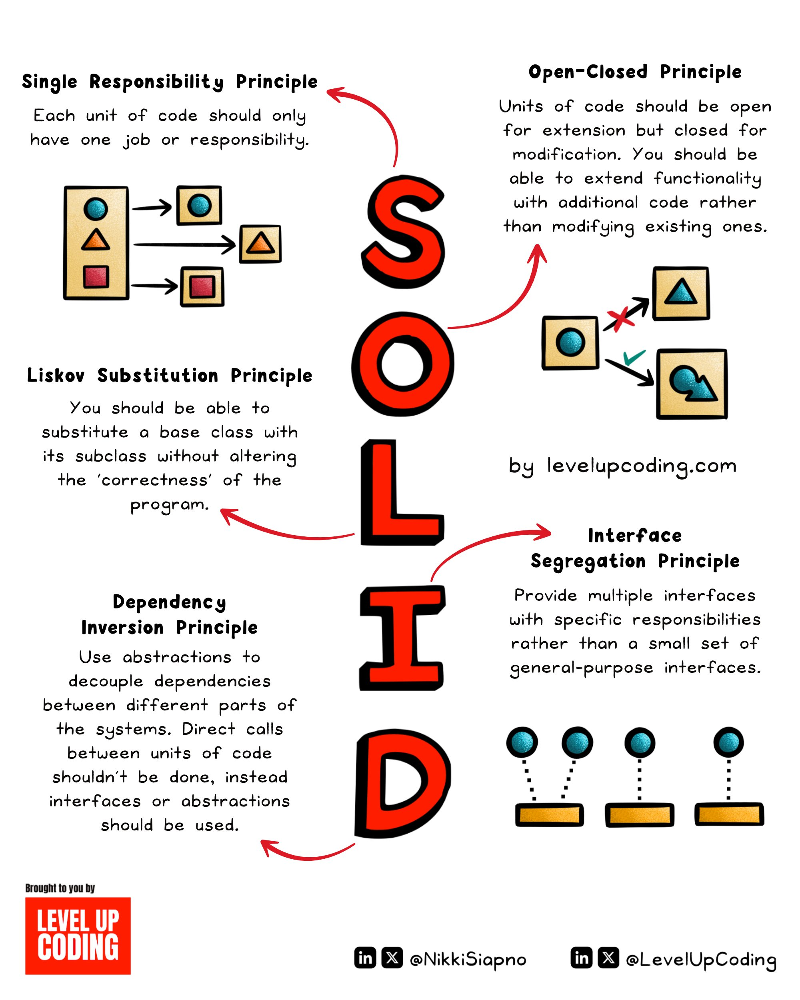

# Solid Principles

## Description
SOLID principles explained in under 2 minutes:

Whether or not you use OOP, knowing these principles gives you a lens into the foundations of clean code which can be applied to many areas of programmi...

## Content
SOLID principles explained in under 2 minutes:

Whether or not you use OOP, knowing these principles gives you a lens into the foundations of clean code which can be applied to many areas of programming.

S — Single Responsibility Principle
O — Open/Closed Principle
L — Liskov Substitution Principle
I — Interface Segregation Principle
D — Dependency Inversion Principle

Let’s break down each principle ↓

1. Single Responsibility Principle (SRP)

Each unit of code should only have one job or responsibility. A unit can be a class, module, function, or component. This keeps code modular and removes the risk of tight coupling.

2. Open-Closed Principle (OCP)

Units of code should be open for extension but closed for modification. You should be able to extend functionality with additional code rather than modifying existing ones. This principle can be applied to component-based systems such as a React frontend.

3. Liskov Substitution Principle (LSP)

You should be able to substitute objects of a base class with objects of its subclass without altering the ‘correctness’ of the program.

An example of this is with a Bird base class. You might assume that it should have a ‘fly’ method. But what about the birds that can’t fly? Like a Penguin. In this example, having a ‘fly’ method in the Bird class would violate LSP.

4. Interface Segregation Principle (ISP)

Provide multiple interfaces with specific responsibilities rather than a small set of general-purpose interfaces. Clients shouldn’t need to know about the methods & properties that don't relate to their use case.

Complexity ↓

Code flexibility ↑

5. Dependency Inversion Principle (DIP)

You should depend on abstractions, not on concrete classes. Use abstractions to decouple dependencies between different parts of the systems. Direct calls between units of code shouldn’t be done, instead interfaces or abstractions should be used.

~~
Thanks to our partner FusionAuth who keeps our content free to the community. 

Did you know you can have SSO, MFA, and general authentication implemented in minutes (not days or weeks)?

FusionAuth makes auth so simple and quick.

Try it for free: https://lucode.co/fusionauth-z7tt

## Category Information

- Main Category: software_engineering
- Sub Category: code_quality
- Item Name: solid_principles

## Source

- Original Tweet: [https://twitter.com/i/web/status/1890986211633959413](https://twitter.com/i/web/status/1890986211633959413)
- Date: 2025-02-20 15:36:34

## Media

### Media 1

**Description:** The infographic presents SOLID principles of object-oriented programming (OOP), a coding methodology that emphasizes simplicity, readability, and maintainability. The acronym "SOLID" is used to represent five fundamental design principles:

*   **Single Responsibility Principle**: Each unit of code should have one job or responsibility.
*   **Open-Closed Principle**: Units of code should be open for extension but closed for modification.
*   **Liskov Substitution Principle**: You can substitute a base class with its subclass without altering the correctness of the program.
*   **Interface Segregation Principle**: Provide multiple interfaces with specific responsibilities rather than a single general-purpose interface.
*   **Dependency Inversion Principle**: Use abstractions to decouple dependencies between different parts of the system.

The infographic features a white background with black text and red arrows connecting each letter, making it easy to read and understand. The SOLID principles are crucial for creating maintainable, flexible, and scalable code, ensuring that your application can adapt to changing requirements without becoming rigid or inflexible. By following these principles, developers can write more modular, reusable, and efficient code, leading to better software design and development practices.

The infographic is presented by Level Up Coding, a company that provides coding tutorials and resources for individuals looking to improve their programming skills. The company's logo is displayed in the bottom-left corner of the image, along with social media handles and a call-to-action to visit their website or follow them on social media platforms such as LinkedIn and X (formerly Twitter).

*Last updated: 2025-02-20 15:36:34*