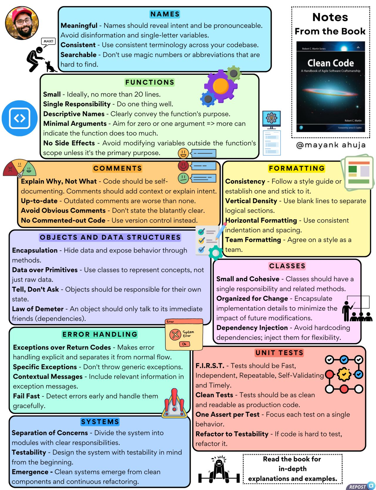

Clean code principles are essential guidelines for software developers to write maintainable, efficient, and effective code. This entry provides a comprehensive overview of clean code principles, including naming conventions, function design, commenting, formatting, object-oriented programming, error handling, unit testing, and best practices.

#### Technical Content
Clean code principles are designed to make code more readable, understandable, and modifiable. The following sections outline key principles and best practices for writing clean code:

##### Names
* Use meaningful names for variables, functions, and classes.
* Avoid using abbreviations or acronyms unless they are widely recognized in the industry.
* Use a consistent naming convention throughout the project.

Example:
```python
# Good practice
def calculate_total_cost(price, tax_rate):
    total_cost = price + (price * tax_rate)
    return total_cost

# Bad practice
def calc_tc(p, tr):
    tc = p + (p * tr)
    return tc
```

##### Functions
* Functions should have a single responsibility and descriptive names.
* Avoid using complex conditionals or deeply nested loops.
* Keep functions short and focused.

Example:
```python
# Good practice
def validate_user_input(username, password):
    if not username:
        raise ValueError("Username is required")
    if not password:
        raise ValueError("Password is required")

def authenticate_user(username, password):
    try:
        validate_user_input(username, password)
        # Authenticate user logic here
    except ValueError as e:
        print(f"Error: {e}")
```

##### Comments
* Comments should explain why code is written in a certain way, not just what it does.
* Use comments to provide context and clarify complex logic.

Example:
```python
# Good practice
# Calculate the total cost by adding the price and tax amount
# The tax rate is assumed to be 8% for this example
def calculate_total_cost(price):
    tax_amount = price * 0.08
    total_cost = price + tax_amount
    return total_cost
```

##### Formatting
* Code should be formatted consistently throughout the project.
* Use indentation, spacing, and line breaks to make code more readable.

Example:
```python
# Good practice
def calculate_total_cost(price):
    tax_rate = 0.08
    tax_amount = price * tax_rate
    total_cost = price + tax_amount
    return total_cost

# Bad practice
def calculate_total_cost(price): tax_rate=0.08;tax_amount=price*tax_rate;total_cost=price+tax_amount;return total_cost;
```

##### Objects and Data Structures
* Encapsulation and data hiding are essential for object-oriented programming.
* Use classes and objects to organize code and reduce coupling.

Example:
```python
# Good practice
class User:
    def __init__(self, username, password):
        self.__username = username
        self.__password = password

    def get_username(self):
        return self.__username

    def get_password(self):
        return self.__password
```

##### Error Handling
* Error handling mechanisms should be implemented to catch and handle potential errors.
* Use try-except blocks to handle exceptions and provide meaningful error messages.

Example:
```python
# Good practice
try:
    # Code that may raise an exception
    file = open("example.txt", "r")
except FileNotFoundError:
    print("Error: File not found")
```

##### Systems
* Separation of concerns is crucial for maintaining a clean and organized codebase.
* Use modular design to separate logic into distinct components.

Example:
```python
# Good practice
class Database:
    def __init__(self):
        self.connection = None

    def connect(self):
        # Establish database connection logic here
        pass

class UserService:
    def __init__(self, database):
        self.database = database

    def get_user(self, username):
        # Retrieve user data from database logic here
        pass
```

##### Unit Tests
* Unit tests should be written to verify the functionality of individual units of code.
* Use testing frameworks to write and run unit tests.

Example:
```python
# Good practice
import unittest

class TestUserService(unittest.TestCase):
    def test_get_user(self):
        # Mock database connection logic here
        database = Database()
        user_service = UserService(database)
        user = user_service.get_user("example")
        self.assertIsNotNone(user)
```

#### Clean Code Principles
The following principles should be followed to write clean code:

* **Don't Repeat Yourself (DRY)**: Avoid duplicating code or logic.
* **Meaningful Variable Names**: Use descriptive names for variables and functions.
* **Short and Focused Functions**: Keep functions concise and focused on a single task.
* **Avoid Complex Conditionals**: Simplify complex conditionals using early returns or refactoring.
* **Early Returns**: Use early returns to simplify code and reduce nesting.

#### Key Takeaways and Best Practices
To write clean code, follow these key takeaways and best practices:

* Use meaningful names for variables, functions, and classes.
* Keep functions short and focused on a single task.
* Avoid complex conditionals and use early returns instead.
* Use encapsulation and data hiding in object-oriented programming.
* Implement error handling mechanisms to catch and handle potential errors.
* Write unit tests to verify the functionality of individual units of code.

#### References
The following tools and technologies are mentioned in this entry:

* **Python**: A popular programming language used for examples throughout this entry.
* **unittest**: A testing framework for Python used for writing and running unit tests.
## Source

- Original Tweet: [https://twitter.com/i/web/status/1881919516696772864](https://twitter.com/i/web/status/1881919516696772864)
- Date: 2025-02-24 12:51:07


## Media

### Media 1

**Description:** The infographic presents a comprehensive guide to software development principles and best practices, organized into 18 distinct sections. Each section is represented by a different color and features a unique icon or graphic, accompanied by concise text that summarizes key concepts.

**Key Principles:**

* **Names:** Meaningful names should be used for variables, functions, and classes.
* **Functions:** Functions should have single responsibility and descriptive names.
* **Comments:** Comments should explain why code is written in a certain way, not just what it does.
* **Formatting:** Code should be formatted consistently throughout the project.
* **Objects and Data Structures:** Encapsulation and data hiding are essential for object-oriented programming.
* **Error Handling:** Error handling mechanisms should be implemented to catch and handle potential errors.
* **Systems:** Separation of concerns is crucial for maintaining a clean and organized codebase.
* **Units Tests:** Unit tests should be written to verify the functionality of individual units of code.
* **Clean Code Principles:**

	+ Follow the Don't Repeat Yourself (DRY) principle
	+ Use meaningful variable names
	+ Keep functions short and focused
	+ Avoid complex conditionals
	+ Use early returns

**Conclusion:**

The infographic provides a thorough overview of software development principles and best practices, covering topics such as naming conventions, function design, commenting, formatting, object-oriented programming, error handling, unit testing, and clean code principles. By following these guidelines, developers can write more maintainable, efficient, and effective code.

*Last updated: 2025-02-24 12:51:07*