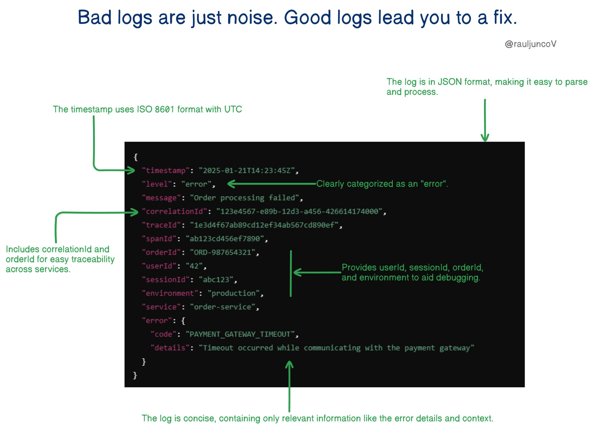

Effective logging is crucial for efficient debugging and troubleshooting in software development. Good logs provide valuable information that leads developers to a fix, while bad logs can be nothing more than noise. This article outlines 7 rules of thumb for effective logging, including the use of structured logging, unique identifiers, and standardized timestamps.

## Technical Content
### Introduction to Effective Logging
Logging is an essential aspect of software development, allowing developers to track events, errors, and other important information within their applications. However, not all logs are created equal. Poorly designed logs can lead to confusion, wasted time, and frustration, while well-structured logs can significantly reduce the time spent on debugging and troubleshooting.

### 7 Rules of Thumb for Effective Logging
The following rules provide a foundation for effective logging practices:

1. **Use Structured Logging**: Format log entries in a structured way to enable easy parsing and processing by tools and automation systems. This can be achieved using formats like JSON or XML.
2. **Include Unique Identifiers**: Each log entry should have a unique identifier, such as correlation IDs, request IDs, or transaction IDs, to trace requests across distributed services.
3. **Log Entries Should Be Small, Easy to Read, and Useful**: Avoid overloading logs with unnecessary information. Focus on what's important and ensure logs are easy to read.
4. **Standardize Timestamps**: Use consistent time zones (preferably UTC) and formats. Mixed time zones or formats can turn debugging into a nightmare.
5. **Categorize Log Levels**: Use standardized log levels, such as:
	* **Debug**: Detailed technical information for troubleshooting during development.
	* **Info**: High-level operational information.
	* **Error**: Critical issues requiring attention.
6. **Include Contextual Information**: Provide contextual details to make debugging easier, including:
	* User ID
	* Session ID
	* Environment-specific identifiers (e.g., instance ID)
7. **Protect Sensitive Information**: Avoid logging private data like passwords, API keys, or Personally Identifiable Information (PII). If unavoidable, mask, redact, or hash sensitive data to protect users and systems.

### Example Code Snippet
The following code snippet demonstrates effective logging practices:
```csharp
// Using Serilog for structured logging
Log.Information("Order {OrderId} placed by user {UserId} in session {SessionId}", 
    orderId: 12345, 
    userId: "user123", 
    sessionId: "session456");
```
In this example, the log entry includes a unique identifier (order ID), user ID, and session ID, making it easier to trace and debug issues.

### Benefits of Effective Logging
Effective logging practices offer several benefits, including:

* Reduced debugging time
* Improved issue tracing and resolution
* Enhanced security through protection of sensitive information
* Better insights into application performance and behavior

## Key Takeaways and Best Practices
To implement effective logging in your applications, follow these key takeaways and best practices:

* Use structured logging formats like JSON or XML.
* Include unique identifiers and contextual information in log entries.
* Standardize timestamp formats and use consistent time zones.
* Categorize log levels using standardized categories (debug, info, error).
* Protect sensitive information by avoiding or masking private data.

## References
Many logging frameworks, such as [Serilog](https://serilog.net/), support the features outlined in these 7 rules of thumb. By leveraging these frameworks and following effective logging practices, developers can significantly improve their debugging and troubleshooting experiences.
## Source

- Original Tweet: [https://twitter.com/i/web/status/1881696953190264862](https://twitter.com/i/web/status/1881696953190264862)
- Date: 2025-02-24 13:12:08


## Media

### Media 1

**Description:** The image presents a code snippet with annotations highlighting its benefits, accompanied by a title that reads "Bad logs are just noise. Good logs lead you to a fix." The purpose of the image is to illustrate the importance of well-structured logging in software development.

* A code snippet:
	+ The code snippet is written in a programming language and appears to be related to error handling or debugging.
	+ It includes various keywords such as "timestamp", "level", "message", and "correlationId".
	+ The code is surrounded by green annotations that highlight its benefits, including clear categorization of errors, concise logging, and easy traceability across services.
* A title:
	+ The title emphasizes the importance of good logs in resolving issues efficiently.
	+ It suggests that bad logs can be distracting and unhelpful, while good logs provide valuable information for debugging and troubleshooting.
* Green annotations:
	+ The annotations are placed throughout the code snippet to highlight specific features or benefits.
	+ They include phrases such as "Clearly categorized as an 'error'", "Provides user ID, session ID, order ID, and environment to aid debugging", and "Includes correlation and order ID for easy traceability across services".

Overall, the image effectively conveys the importance of good logging practices in software development. By highlighting the benefits of clear, concise, and easily traceable logs, the image encourages developers to prioritize effective logging in their code.

*Last updated: 2025-02-24 13:12:08*