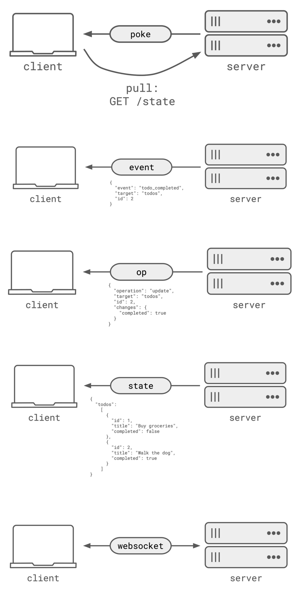

**Source:** [https://twitter.com/i/web/status/1890769143940468888](https://twitter.com/i/web/status/1890769143940468888)
**Original Post Date:** 2025-05-28 06:33:40

# Real-Time Communication Patterns: Hybrid Pull-Push Architecture with WebSockets

## Introduction
Real-time systems require efficient synchronization between clients and servers. This knowledge base explores a hybrid architecture that combines three essential patterns: pull-based polling using HTTP GET, push-based event notifications via WebSockets, and operation-based state modifications. Understanding this integration is crucial for building responsive, scalable applications with minimal latency.

## Pull-Based Communication (HTTP GET)

The pull pattern enables clients to retrieve server state on demand via HTTP GET requests. This approach provides immediate access to current data but may introduce latency due to polling frequency.

```http
GET /state/todos
Response:
{
  "todos": [
    {
      "id": 1,
      "title": "Buy groceries",
      "completed": false
    },
    {
      "id": 2,
      "title": "Walk the dog",
      "completed": false
    }
  ]
}
```

## Event-Driven Communication (WebSocket)

WebSockets enable real-time bidirectional communication, reducing latency and server load compared to traditional polling methods.

```json
{
  "event": "todo_completed",
  "target": "todos",
  "id": 2
}
```

## Operation-Based Communication

Clients send operation requests to modify server state, maintaining data consistency across the system.

```json
{
  "operation": "update",
  "target": "todos",
  "id": 2,
  "changes": {
    "completed": true
  }
}
```

## State Synchronization

The system ensures consistent state through periodic full updates and incremental event notifications.

```json
{
  "todos": [
    {
      "id": 1,
      "title": "Buy groceries",
      "completed": false
    },
    {
      "id": 2,
      "title": "Walk the dog",
      "completed": true
    }
  ]
}
```

## Implementation Considerations

- Implement reconnection logic for WebSocket disconnections
- Use exponential backoff for HTTP retry mechanisms
- Maintain sequence numbers to prevent event loss

> **Note/Tip:** Consider using JSON Schema validation for operation requests

> **Note/Tip:** Implement server-side rate limiting for both pull and push operations

## Key Takeaways

- Hybrid communication patterns optimize real-time performance by combining pull-based polling with event-driven notifications
- WebSocket connections provide low-latency, bidirectional communication without the overhead of traditional HTTP requests
- Operation-based state management ensures consistency across distributed systems

## Conclusion
This hybrid approach to real-time communication balances the need for immediate state access with efficient server-client synchronization. By combining pull-based polling with WebSocket notifications and operation-based updates, systems can achieve optimal performance while maintaining data consistency.

## External References

- [WebSocket API Specification](https://tools.ietf.org/html/rfc6455)
- [HTTP/1.1 State Management Mechanism](https://tools.ietf.org/html/rfc7230)


## Media

**Image Description:** The image is a sequence of diagrams illustrating the interaction between a **client** and a **server** in a system that uses a combination of **pull-based** and **event-driven** communication patterns. The diagrams depict the flow of data and operations between the client and server, highlighting the use of HTTP requests, WebSocket connections, and state updates. Below is a detailed breakdown of the image:

---

### **1. Overview of the Diagram**
The image is divided into several sections, each representing a different interaction pattern or communication step between the client and server. The main components are:
- **Client**: Represented as a laptop or device.
- **Server**: Represented as a set of stacked boxes, indicating a server or database.
- **Communication Channels**: HTTP requests (GET, POST, etc.) and WebSocket connections.

---

### **2. Detailed Breakdown of Each Section**

#### **Section 1: Pull-based Communication (GET Request)**
- **Client**: Initiates a **GET** request to the server.
- **Request**: The client sends a `GET /state/todos` request to fetch the current state of the server.
- **Response**: The server responds with the current state of the `todos` list.
  - The state is represented as a JSON object:
    ```json
    {
      "todos": [
        {
          "id": 1,
          "title": "Buy groceries",
          "completed": false
        },
        {
          "id": 2,
          "title": "Walk the dog",
          "completed": false
        }
      ]
    }
    ```
- **Purpose**: The client retrieves the current state of the server's `todos` list using a pull-based approach.

---

#### **Section 2: Event-driven Communication (Event Notification)**
- **Server**: Sends an **event** to the client.
- **Event**: The server notifies the client about a change in the `todos` list.
  - The event is represented as a JSON object:
    ```json
    {
      "event": "todo_completed",
      "target": "todos",
      "id": 2
    }
    ```
- **Purpose**: The server informs the client that the todo with `id: 2` has been marked as completed. This is an example of event-driven communication, where the server pushes updates to the client.

---

#### **Section 3: Operation-based Communication (Update Operation)**
- **Client**: Sends an **operation** to the server.
- **Operation**: The client sends an update operation to mark a todo as completed.
  - The operation is represented as a JSON object:
    ```json
    {
      "operation": "update",
      "target": "todos",
      "id": 2,
      "changes": {
        "completed": true
      }
    }
    ```
- **Response**: The server acknowledges the operation and updates its state.
- **Purpose**: The client initiates an operation to modify the server's state, specifically marking a todo as completed.

---

#### **Section 4: State Synchronization**
- **Server**: Sends the updated state to the client.
- **State**: The server sends the updated `todos` list to the client.
  - The updated state is represented as a JSON object:
    ```json
    {
      "todos": [
        {
          "id": 1,
          "title": "Buy groceries",
          "completed": false
        },
        {
          "id": 2,
          "title": "Walk the dog",
          "completed": true
        }
      ]
    }
    ```
- **Purpose**: The server ensures that the client has the latest state of the `todos` list after the update operation.

---

#### **Section 5: WebSocket Connection**
- **WebSocket**: The client establishes a **WebSocket** connection with the server.
- **Purpose**: The WebSocket connection enables real-time, bidirectional communication between the client and server. This allows the server to push updates (e.g., events) to the client in real time without the need for the client to repeatedly poll the server.

---

### **3. Key Technical Details**
1. **HTTP GET Request**:
   - Used for pull-based communication where the client retrieves the server's state.
   - Endpoint: `/state/todos`.

2. **Event-driven Communication**:
   - The server pushes events to the client to notify about changes in the state.
   - Events are JSON-formatted and include details like the type of event (`todo_completed`), the target (`todos`), and the affected ID (`id: 2`).

3. **Operation-based Communication**:
   - The client sends operations to the server to modify the state.
   - Operations are JSON-formatted and include details like the type of operation (`update`), the target (`todos`), the ID of the item to update, and the changes to be applied.

4. **WebSocket**:
   - Enables real-time, bidirectional communication.
   - Used for server-to-client event notifications and other real-time updates.

5. **State Synchronization**:
   - The server ensures that the client always has the latest state by sending updates after operations or events.

---

### **4. Summary**
The image illustrates a hybrid communication pattern where:
- The client uses **pull-based** communication (HTTP GET) to fetch the initial state.
- The server uses **event-driven** communication (WebSocket) to push updates to the client in real time.
- The client uses **operation-based** communication to modify the server's state.

This approach ensures that the client and server remain synchronized, with real-time updates and efficient state management. The use of WebSocket for event-driven communication is a key feature, enabling real-time notifications and reducing the need for frequent polling. 

---

### **Final Answer**
The image depicts a system where the client and server interact using a combination of **pull-based** (HTTP GET), **event-driven** (WebSocket), and **operation-based** communication patterns. The client retrieves the server's state, sends operations to update the state, and receives real-time event notifications via WebSocket. This ensures efficient and synchronized communication between the client and server. **\boxed{\text{Hybrid Communication Pattern with WebSocket}}** is the main subject of the image.
