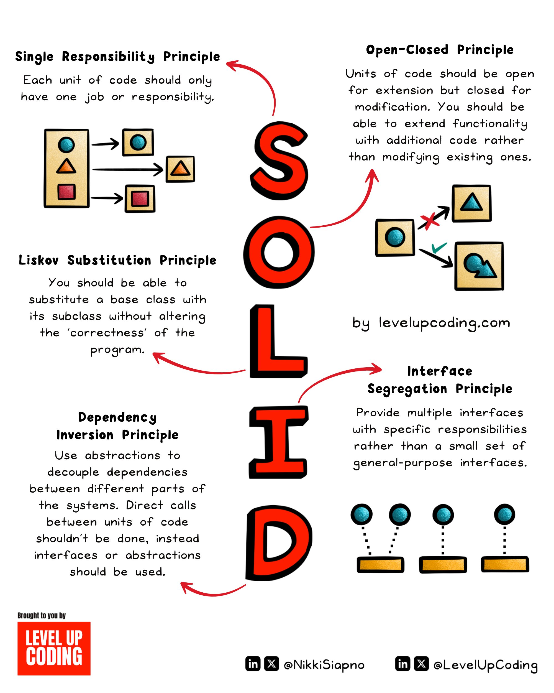

**Source:** [https://twitter.com/i/web/status/1890986211633959413](https://twitter.com/i/web/status/1890986211633959413)
**Original Post Date:** 2025-05-28 06:37:41

# SOLID Design Principles Explained: Best Practices in Object-Oriented Software Engineering

## Introduction
The SOLID design principles form the cornerstone of modern object-oriented software development. These five interconnected principles guide developers in creating maintainable, flexible, and scalable codebases. This knowledge base item provides a comprehensive breakdown of each principle, their practical applications, and how they contribute to robust system architecture.

## Single Responsibility Principle (SRP)

A class should have only one reason to change. This means each class should encapsulate a single functionality or responsibility.

Violating SRP leads to God classes that become difficult to maintain and test. For example, mixing database operations with business logic in the same class creates tight coupling.

- Each class has a single purpose
- Easy to modify without affecting other parts of the system
- Simplifies unit testing

> **Note/Tip:** Start by identifying cohesive groups of related methods before creating new classes.

## Open-Closed Principle (OCP)

Software entities should be open for extension but closed for modification. This principle encourages using inheritance and interfaces to extend functionality without altering existing code.

Implementing OCP improves system reliability by reducing the risk of introducing bugs in tested code.

```typescript
// Base interface
interface PaymentMethod {
  processPayment(amount: number): boolean;
}
// Implementation class
class CreditCard implements PaymentMethod {
  processPayment(amount: number) {
    // Process credit card payment
  }
}
// New implementation without modifying existing code
class PayPal implements PaymentMethod {
  processPayment(amount: number) {
    // Process PayPal payment
  }
}
```

## Liskov Substitution Principle (LSP)

Subtypes must be substitutable for their base types without affecting the correctness of the program. This principle ensures that derived classes maintain or strengthen the contract established by their parent class.

1. All operations that use superclass references must work with objects of derived classes.
1. Subtypes should not require additional information to operate properly.
1. Subtypes should be able to replace base types without causing errors.

> **Note/Tip:** Avoid using private methods in subclasses as they violate LSP by making substitution impossible.

## Interface Segregation Principle (ISP)

Clients should not be forced to depend on interfaces they do not use. This principle advocates for creating smaller, more specific interfaces rather than large, all-encompassing ones.

Segregated interfaces improve code organization and reduce unnecessary dependencies.

## Dependency Inversion Principle (DIP)

High-level modules should not depend on low-level modules. Both should depend on abstractions. This principle promotes loose coupling through dependency injection and interface-based design.

Implementing DIP makes systems more modular and easier to test.

- High-level components define their needs as interfaces
- Low-level components implement these interfaces
- Dependency injection frameworks can manage dependencies automatically

## Key Takeaways

- Each SOLID principle addresses a specific aspect of system design that contributes to overall maintainability and scalability.
- Following these principles reduces technical debt and improves code quality over time.
- SOLID principles work together - implementing one effectively often requires consideration of the others.

## Conclusion
Mastering the SOLID principles is essential for creating robust, maintainable software systems. By applying these principles consistently, developers can build architectures that are flexible, scalable, and easier to modify as requirements evolve.

## External References

- [Robert C. Martin's Clean Code Book](https://www.amazon.com/Clean-Code-Handbook-Software-Craftsmanship/dp/0132350882)
- [Martin Fowler's Blog on SOLID Principles](https://martinfowler.com/articles/fallacies.html)


## Media

**Image Description:** The image is a detailed and colorful illustration of the **SOLID principles**, which are fundamental guidelines in software design and object-oriented programming. The acronym **SOLID** stands for five key principles: **Single Responsibility**, **Open-Closed**, **Liskov Substitution**, **Interface Segregation**, and **Dependency Inversion**. Each principle is explained with text, diagrams, and visual metaphors to aid understanding. Below is a detailed breakdown of the image:

---

### **Main Subject: SOLID Principles**
The central focus of the image is the acronym **SOLID**, written in large, bold, red letters. Each letter corresponds to one of the five principles, and the explanations are organized around the acronym.

---

### **1. Single Responsibility Principle (SRP)**
- **Explanation**: 
  - "Each unit of code should only have one job or responsibility."
  - This principle emphasizes that a class or module should have only one reason to change.
- **Visual Representation**:
  - A diagram shows a square divided into three sections, each containing a different shape (circle, triangle, square). Arrows indicate that each section is separated into its own unit, representing the idea of breaking down responsibilities into individual components.

---

### **2. Open-Closed Principle (OCP)**
- **Explanation**:
  - "Units of code should be open for extension but closed for modification."
  - This principle suggests that software entities (classes, modules, functions, etc.) should be open for extension but closed for modification, meaning new functionality should be added without altering existing code.
- **Visual Representation**:
  - A diagram shows a square with a blue circle, which is extended into a new square with a blue circle and a blue triangle. Arrows indicate the extension process, while a red "X" shows that direct modification is discouraged.

---

### **3. Liskov Substitution Principle (LSP)**
- **Explanation**:
  - "You should be able to substitute a base class with its subclass without altering the correctness of the program."
  - This principle ensures that objects of a subclass can replace objects of a superclass without affecting the correctness of the program.
- **Visual Representation**:
  - A diagram shows a square with a blue circle, which is replaced by a square with a blue triangle. Arrows indicate substitution, and a green checkmark signifies correctness.

---

### **4. Interface Segregation Principle (ISP)**
- **Explanation**:
  - "Provide multiple interfaces with specific responsibilities rather than a single general-purpose interface."
  - This principle advocates for smaller, more specific interfaces over large, all-encompassing ones.
- **Visual Representation**:
  - A diagram shows multiple small circles (representing interfaces) connected to individual squares (representing classes). This illustrates the idea of segregating responsibilities into smaller, more focused interfaces.

---

### **5. Dependency Inversion Principle (DIP)**
- **Explanation**:
  - "Use abstractions to decouple dependencies between different parts of the systems. Direct calls between units of code shouldn't be done; instead, interfaces or abstractions should be used."
  - This principle promotes the use of abstractions (interfaces or abstract classes) to decouple dependencies, ensuring that high-level modules depend on abstractions rather than concrete implementations.
- **Visual Representation**:
  - A diagram shows multiple circles (representing interfaces) connected to squares (representing classes). Arrows indicate the dependency flow, emphasizing the use of abstractions to avoid direct coupling.

---

### **Additional Details**
- **Layout**: The principles are arranged vertically around the central **SOLID** acronym, with each principle having its own section.
- **Color Coding**: 
  - The acronym **SOLID** is in bold red.
  - Each principle is accompanied by diagrams with distinct colors (e.g., blue, yellow, green) to visually differentiate them.
- **Arrows and Symbols**:
  - Arrows are used extensively to illustrate relationships, such as inheritance, substitution, and dependency.
  - Symbols like checkmarks (✓) and "X" marks are used to indicate correctness or incorrectness in the diagrams.
- **Attribution**:
  - The image is credited to **Level Up Coding** and includes social media handles for **@NikkiSiapno** and **@LevelUpCoding**.

---

### **Overall Design**
The image is visually engaging and educational, using a combination of text, diagrams, and colors to explain complex software design principles in an accessible manner. The use of metaphors and visual aids makes the concepts easier to understand, especially for beginners in software design and object-oriented programming.

--- 

This detailed breakdown covers the main subject and technical details of the image, highlighting how each principle is explained and visually represented.
