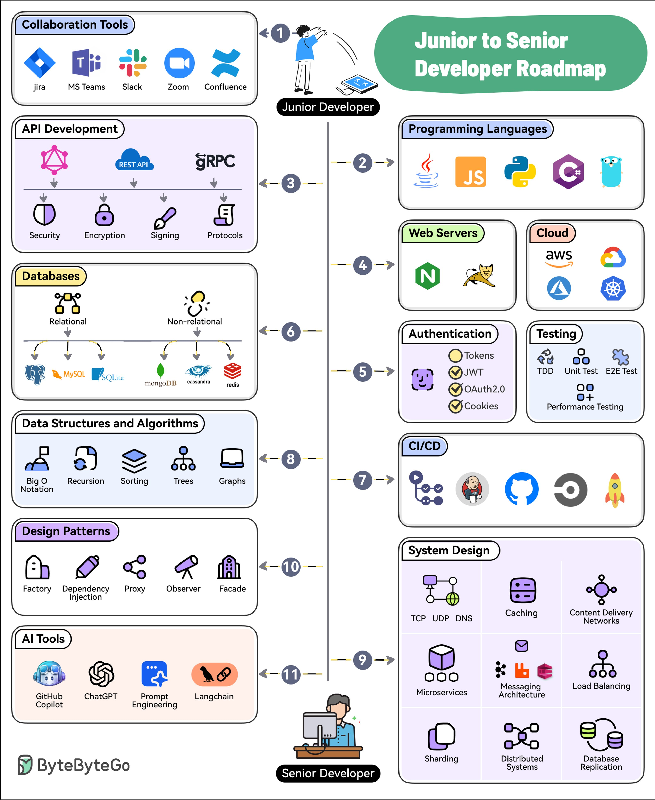

**Source:** [https://twitter.com/i/web/status/1885197578389905733](https://twitter.com/i/web/status/1885197578389905733)
**Original Post Date:** 2025-05-27 17:59:21

# Junior to Senior Developer Roadmap: Essential Technical Progression

## Introduction
The progression from a junior to senior developer requires mastering both foundational and advanced concepts while staying current with industry trends. This roadmap provides a structured path through essential technical domains, emphasizing practical skills in modern software engineering. It covers the evolution of responsibilities, technologies, and architectural understanding needed at each career stage.

## Foundation: Junior Developer Core Skills

Junior developers must build a strong foundation across multiple technical domains to prepare for senior roles. This includes mastering collaboration tools essential for team communication, API development fundamentals with REST and gRPC protocols, and database management in both relational and NoSQL environments.

Understanding data structures and algorithms is crucial for developing efficient solutions, while design patterns provide proven approaches to common programming challenges. Modern AI-assisted tools like GitHub Copilot and ChatGPT are increasingly important for accelerating productivity and code quality.

- Master essential collaboration platforms (Jira, Teams)
- Implement secure REST APIs with proper error handling
- Design efficient database schemas for relational databases

## Advanced: Senior Developer Expertise

Senior developers must demonstrate proficiency across multiple programming languages and deep understanding of system architecture. This includes cloud platform expertise, secure authentication mechanisms, comprehensive testing strategies, and automation through CI/CD pipelines.

Advanced knowledge in distributed systems, microservices architecture, and network protocols is essential for designing scalable solutions. Senior developers also need to lead technical decisions and mentor junior team members.

1. Implement OAuth2 authentication flows with JWT tokens
1. Design high-availability microservices using load balancing
1. Configure CI/CD pipelines for automated deployments

## Progression Pathways

The journey from junior to senior requires systematic skill development across technical and leadership domains. Each stage builds upon previous knowledge, with increasing emphasis on system design, architecture decisions, and team collaboration.

Modern developers must also stay current with emerging technologies like AI tools while maintaining core competencies in traditional areas.

## Key Takeaways

- Master foundational skills before advancing to senior responsibilities
- Develop both technical depth (specific technologies) and breadth (architectural understanding)
- Stay updated with industry trends, including modern AI development tools

## Conclusion
The junior-to-senior progression is marked by increasing responsibility in system design, team leadership, and architectural decision-making. By systematically developing skills across technical domains and staying current with emerging technologies, developers can successfully navigate this career journey.

## External References

- [AWS Cloud Documentation](https://docs.aws.amazon.com/)
- [NGINX Documentation](https://nginx.org/en/docs/)

## Media

**Image Description:** This image is a comprehensive roadmap titled **"Junior to Senior Developer Roadmap"**, designed to guide developers from a junior level to a senior level in their career. The roadmap is visually structured into two main sections: **Junior Developer** (on the left) and **Senior Developer** (on the right), with arrows indicating the progression from one level to the next. Each section is further divided into key technical areas and tools, with icons and labels to represent various concepts and technologies. Below is a detailed breakdown:

---

### **Left Side: Junior Developer**
This section outlines the foundational skills and technologies that a junior developer should focus on mastering.

#### **1. Collaboration Tools**
- **Tools**: Jira, Microsoft Teams, Slack, Zoom, Confluence
- **Description**: These are essential tools for communication, project management, and collaboration in a team environment.

#### **2. API Development**
- **Concepts**: REST API, gRPC
- **Security and Protocols**: Security, Encryption, Signing, Protocols
- **Description**: Focuses on understanding and implementing APIs, including security best practices and protocols.

#### **3. Databases**
- **Relational Databases**: MySQL, SQLite
- **Non-Relational Databases**: MongoDB, Cassandra, Redis
- **Description**: Covers both relational and non-relational databases, emphasizing their use cases and implementation.

#### **4. Data Structures and Algorithms**
- **Topics**: Big O Notation, Recursion, Sorting, Trees, Graphs
- **Description**: Essential for understanding the efficiency and performance of algorithms and data structures.

#### **5. Design Patterns**
- **Patterns**: Factory, Dependency Injection, Proxy, Observer, Facade
- **Description**: Introduces common design patterns used to solve recurring problems in software design.

#### **6. AI Tools**
- **Tools**: GitHub Copilot, ChatGPT, Prompt Engineering, LangChain
- **Description**: Modern AI tools that assist in coding, prompt-based development, and advanced AI workflows.

---

### **Right Side: Senior Developer**
This section highlights the advanced skills and technologies that a senior developer should master.

#### **1. Programming Languages**
- **Languages**: Java, JavaScript, Python, C#, C++
- **Description**: Proficiency in multiple programming languages is crucial for handling diverse projects and technologies.

#### **2. Web Servers**
- **Servers**: NGINX, Apache
- **Description**: Understanding and configuring web servers is essential for deploying applications.

#### **3. Cloud**
- **Platforms**: AWS, Google Cloud, Azure
- **Description**: Cloud computing platforms are vital for scalable and robust application deployment.

#### **4. Authentication**
- **Methods**: Tokens, JWT, OAuth2, Cookies
- **Description**: Secure authentication mechanisms are critical for protecting user data and ensuring secure access.

#### **5. Testing**
- **Types**: TDD (Test-Driven Development), Unit Testing, E2E (End-to-End) Testing, Performance Testing
- **Description**: Comprehensive testing strategies ensure software reliability and performance.

#### **6. CI/CD**
- **Tools**: GitHub Actions, Jenkins, GitLab CI, CircleCI, Travis CI
- **Description**: Continuous Integration and Continuous Deployment tools automate the software development lifecycle.

#### **7. System Design**
- **Concepts**: TCP, UDP, DNS, Caching, Content Delivery Networks (CDNs)
- **Description**: Understanding network protocols and system architecture is key for designing scalable systems.

#### **8. Microservices**
- **Architecture**: Microservices, Messaging, Load Balancing
- **Description**: Microservices architecture enables modular and scalable application design.

#### **9. Distributed Systems**
- **Concepts**: Sharding, Distributed Systems, Database Replication
- **Description**: Handling distributed systems ensures high availability and scalability in large-scale applications.

---

### **Central Arrows and Progression**
- The roadmap uses numbered arrows (1 to 11) to indicate the progression from junior to senior developer. Each arrow connects a concept or tool on the left (Junior Developer) to a corresponding advanced concept or tool on the right (Senior Developer).

---

### **Visual Design**
- **Icons and Labels**: Each concept and tool is represented by an icon and a label, making the roadmap visually engaging and easy to understand.
- **Color Coding**: Different sections are color-coded to distinguish between foundational and advanced topics.
- **Central Figure**: A human figure is used to represent the developer, emphasizing the journey from junior to senior.

---

### **Overall Purpose**
This roadmap serves as a comprehensive guide for developers to identify the skills and technologies they need to master at each stage of their career. It provides a clear path for professional growth, highlighting both foundational and advanced topics in software development. The inclusion of modern tools like AI assistants (e.g., GitHub Copilot, ChatGPT) reflects the evolving nature of the field. 

---

This detailed roadmap is a valuable resource for developers looking to advance their skills and knowledge systematically.
