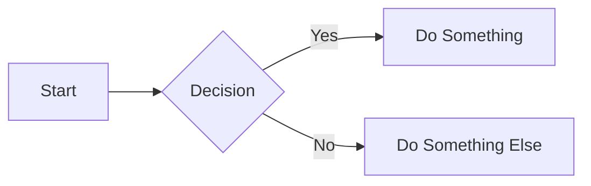

## Overview

**Dev Tools for Efficient Development**
=====================================

### Introduction

The right development tools can significantly impact a developer's productivity, saving time and energy. In this article, we will explore various dev tools categorized into eight main areas: Development Environment, Diagramming, AI Tools, Hosting and Deployment, Code Quality, Security, Note-taking, and Design.

### Development Environment
-------------------------

A good local development environment is crucial for efficient coding. Popular Integrated Development Environments (IDEs) include:

* VSCode
* IntelliJ IDEA
* Notepad++
* Vim
* PyCharm
* Jupyter Notebook

These IDEs provide features such as syntax highlighting, code completion, and debugging tools, making it easier to write and test code.

**Example:** Setting up a Python development environment using VSCode:
```python
# Install the Python extension for VSCode
code --install-extension ms-python.python

# Create a new Python file and start coding
print("Hello World!")
```

### Diagramming
-------------

Diagramming tools help visualize ideas and concepts. Some popular diagramming tools include:

* DrawIO
* Excalidraw
* Mindmap
* Mermaid
* PlantUML
* Microsoft Visio
* Miro

These tools enable developers to create flowcharts, UML diagrams, and other visual representations of their code.

**Example:** Creating a simple flowchart using Mermaid:


### AI Tools
------------

AI tools can significantly boost developer productivity. Some popular AI tools include:

* ChatGPT
* GitHub Copilot
* Tabnine
* Claude
* Ollama
* Midjourney
* Stable Diffusion

These tools provide features such as code completion, code review, and automated testing.

**Example:** Using GitHub Copilot to generate a Python function:
```python
# Ask GitHub Copilot to generate a function to calculate the area of a rectangle
def calculate_area(length, width):
    # GitHub Copilot generates the following code
    return length * width
```

### Hosting and Deployment
-------------------------

Hosting and deployment tools enable developers to deploy their applications to production environments. Some popular hosting and deployment tools include:

* AWS
* Cloudflare
* GitHub
* Fly
* Heroku
* Digital Ocean

These tools provide features such as scalability, security, and monitoring.

**Example:** Deploying a Node.js application to Heroku:
```bash
# Create a new Heroku app
heroku create my-app

# Deploy the app to Heroku
git push heroku main
```

### Code Quality
-----------------

Code quality tools help ensure that code is maintainable, efficient, and follows best practices. Some popular code quality tools include:

* Jest
* ESLint
* Selenium
* SonarQube
* FindBugs
* Checkstyle

These tools provide features such as automated testing, code analysis, and code formatting.

**Example:** Using ESLint to lint a JavaScript file:
```javascript
// Create a new JavaScript file
console.log("Hello World!");

// Run ESLint on the file
eslint my-file.js
```

### Security
-------------

Security tools help protect applications from vulnerabilities and attacks. Some popular security tools include:

* 1Password
* LastPass
* OWASP
* Snyk
* Nmap

These tools provide features such as password management, vulnerability scanning, and penetration testing.

**Example:** Using OWASP ZAP to scan a web application for vulnerabilities:
```bash
# Run OWASP ZAP on the app
zap --open-url http://my-app.com
```

### Note-taking
--------------

Note-taking tools help developers organize their knowledge and ideas. Some popular note-taking tools include:

* Notion
* Markdown
* Obsidian
* Roam
* Logseq
* Tiddly Wiki

These tools provide features such as note organization, tagging, and searching.

**Example:** Creating a new note in Notion:
```markdown
# Create a new note
## My Note
This is my note.
```

### Design
------------

Design tools help developers create visually appealing user interfaces. Some popular design tools include:

* Figma
* Sketch
* Adobe Illustrator
* Canva
* Adobe Photoshop

These tools provide features such as vector graphics, typography, and color management.

**Example:** Creating a new design in Figma:
```jsx
// Create a new frame
frame {
  width: 100px;
  height: 100px;
  background-color: #fff;
}
```

### Conclusion
----------

In conclusion, the right dev tools can significantly impact a developer's productivity and efficiency. By using tools from each of these categories, developers can streamline their workflow, ensure high-quality code, and create visually appealing user interfaces.

**Key Points:**

* Development Environment: IDEs such as VSCode, IntelliJ IDEA, and PyCharm
* Diagramming: Tools such as DrawIO, Mermaid, and PlantUML
* AI Tools: Tools such as ChatGPT, GitHub Copilot, and Tabnine
* Hosting and Deployment: Tools such as AWS, Cloudflare, and Heroku
* Code Quality: Tools such as Jest, ESLint, and SonarQube
* Security: Tools such as 1Password, OWASP, and Snyk
* Note-taking: Tools such as Notion, Markdown, and Obsidian
* Design: Tools such as Figma, Sketch, and Adobe Illustrator

**References:**

* [VSCode](https://code.visualstudio.com/)
* [Mermaid](https://mermaid-js.github.io/mermaid)
* [GitHub Copilot](https://copilot.github.com/)
* [Heroku](https://www.heroku.com/)
* [ESLint](https://eslint.org/)
* [OWASP](https://owasp.org/)
* [Notion](https://www.notion.so/)
* [Figma](https://www.figma.com/)

## Key Takeaways

- To be updated.

---
**Source**: [Original Tweet](https://twitter.com/i/web/status/1881934073058431112)