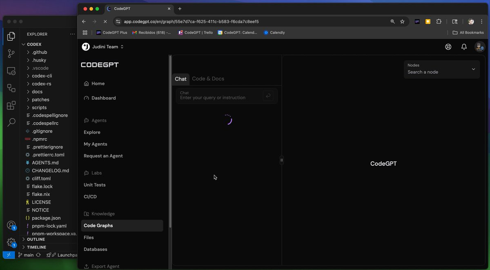

**Source:** [https://twitter.com/i/web/status/1926318512718401998](https://twitter.com/i/web/status/1926318512718401998)
**Original Post Date:** 2025-05-28 09:13:41

# CodeGPT Platform Overview: Integration of AI Tools in Modern Development Environments

## Introduction
CodeGPT represents a next-generation development environment that seamlessly integrates artificial intelligence capabilities with traditional coding tools. This article explores its core features, technical architecture, and workflow enhancements through a detailed analysis of the CodeX project interface. By examining components like code graphs, agent management, and CI/CD pipelines, we'll understand how CodeGPT modernizes software development practices.

The platform's unique blend of intelligent assistance and robust project management tools positions it as a comprehensive solution for teams seeking to streamline their development processes.

## Web-Based Development Environment

CodeGPT operates within a web browser, accessible via app.codegpt.co, offering a unified interface for coding and project management. The platform's URL structure indicates support for persistent projects through unique identifiers.

The EXPLORER sidebar demonstrates sophisticated project organization with directories like .github for version control hooks, .vscode for editor settings, and codex-cli/codex-rs indicating Rust-based components. Dependencies are managed via PNPM (evident from pnpm-lock.yaml), while CI/CD pipelines suggest automated deployment workflows.

_Sample project structure showing version control, build tools, and documentation organization_

```yaml
# CodeGPT Project Structure
- .github/
- .husky/
- .vscode/
- codex-cli/
- codex-rs/
- docs/
- CI/CD/
```

- Project-wide file explorer with nested directories
- PNPM-based dependency management
- Integrated CI/CD configuration support

## AI Integration via Agents and Chat Interface

The platform features a chat interface for natural language interactions, suggesting AI-driven code assistance. Multiple 'Agents' options indicate specialized automation tools for tasks like testing and documentation.

Code graphs enable visualization of project dependencies and structure, while the 'Labs' section suggests experimental features or development environments.

_Sample interaction demonstrating natural language command processing_

```plaintext
// Example Agent Query
Request an AI agent to refactor code in codex-cli module
```

## Collaborative Features and Workflow Integration

The 'Judini Team' header with team switching capabilities supports multi-team collaboration. The dashboard and unit tests sections suggest comprehensive project monitoring.

Export Agent functionality enables sharing of AI configurations, while the nodes search feature facilitates code navigation within large projects.

1. Agent management for automation tasks
1. Code graph visualization for dependency analysis
1. Team collaboration features with role-based access

## Key Takeaways

- CodeGPT merges traditional IDE capabilities with AI assistance through specialized agents and chat interfaces
- The platform supports modern development practices with PNPM, CI/CD integration, and code graph visualization
- Team collaboration is enhanced via shared projects, agent configurations, and centralized resource management

## Conclusion
CodeGPT exemplifies the evolution of development environments by integrating AI-driven tools within a comprehensive project management framework. Its features enable efficient coding workflows while maintaining robust technical practices through PNPM dependency management and CI/CD pipelines.

## External References

- [CodeGPT Official Documentation](https://app.codegpt.co/docs)
- [PNPM Package Manager Documentation](https://pnpm.io/)


## Media

**Image Description:** The image shows a screenshot of a user interface for a tool called **CodeGPT**, which appears to be a platform or application designed for coding, collaboration, and project management. Below is a detailed description of the image, focusing on the main elements and technical details:

### **Main Interface Components:**

1. **Browser Window:**
   - The application is being accessed through a web browser, as indicated by the browser tabs and URL bar at the top.
   - The URL in the address bar is: `app.codegpt.co/en/graph/55e7d7ca-f625-411c-b583-f6cda7c8eef5`. This suggests that the user is viewing a specific graph or project within the CodeGPT platform.

2. **Sidebar (Left Panel):**
   - The sidebar is labeled **"EXPLORER"** and contains a file explorer-like structure.
   - The directory structure is organized under a project named **"CODEX"**, which is expanded to show several subdirectories and files:
     - `.github`
     - `.husky`
     - `.vscode`
     - `codex-cli`
     - `codex-rs`
     - `docs`
     - `patches`
     - `scripts`
     - `LICENSE.nix`
     - `CI/CD`
     - `LICENSE`
     - `NOTICE`
     - `package.json`
     - `pnpm-lock.yaml`
     - `pnpm-workspace.yaml`
     - `OUTLINE-workspace`
     - `main`
   - The sidebar also includes sections like **"Files"**, **"Databases"**, and **"Code Graphs"**, indicating that the platform supports multiple types of resources and views.

3. **Header (Top Center):**
   - The header displays the name of the team or project: **"Judini Team"**.
   - There is a dropdown menu next to the team name, suggesting options for switching teams or projects.

4. **Main Content Area:**
   - The main content area is divided into two sections:
     - **Left Section:**
       - Contains a navigation menu with options such as:
         - **Home**
         - **Dashboard**
         - **Agents**
         - **My Agents**
         - **Request an Agent**
         - **Labs**
         - **Unit Tests**
         - **Knowledge**
         - **Code Graphs**
         - **Files**
         - **Databases**
       - This menu suggests that the platform offers features for managing agents (likely AI or automation tools), labs (experimental or development environments), and other project-related resources.
     - **Right Section:**
       - Displays a chat interface with the title **"Chat"**.
       - The chat interface has a prompt: **"Enter your query or instruction"**, indicating that users can interact with the platform using natural language or code-based queries.
       - A loading spinner is visible, suggesting that the platform is processing or loading content.

5. **Top Right Corner:**
   - Contains several icons for user actions:
     - **Avatar/Profile Icon:** Likely for accessing user settings or profile.
     - **Notification Bell:** For notifications.
     - **Help/Settings Icon:** For accessing help or settings.
   - There is also a dropdown labeled **"Nodes"** with a search bar, indicating a feature for searching or managing nodes within the graph or project.

6. **Footer (Bottom Left):**
   - Contains an icon labeled **"Export Agent"**, suggesting functionality to export or manage agents.

### **Technical Details and Observations:**
- **File Structure:** The sidebar reveals a well-organized project structure, including common directories like `.github`, `.husky`, `.vscode`, and `docs`. This indicates that the project is likely a software development project with version control, testing, and documentation.
- **Version Control:** The presence of files like `package.json`, `pnpm-lock.yaml`, and `pnpm-workspace.yaml` suggests that the project uses **PNPM** (a package manager) and is likely managed with a version control system like Git.
- **CI/CD:** The inclusion of a `CI/CD` directory suggests that the project has continuous integration and continuous deployment pipelines set up.
- **Code Graphs:** The "Code Graphs" section implies that the platform provides visualization or analysis of code dependencies or structure.
- **AI/Agent Integration:** The repeated mention of "Agents" and the chat interface suggests that the platform integrates AI or automation tools to assist with coding or project management tasks.

### **Overall Context:**
The image depicts a sophisticated development environment that combines traditional code management tools with AI-driven features. The platform appears to be designed for collaborative software development, offering tools for version control, testing, documentation, and AI-assisted coding. The chat interface and agent management features suggest an emphasis on automation and intelligent assistance in the development workflow.
