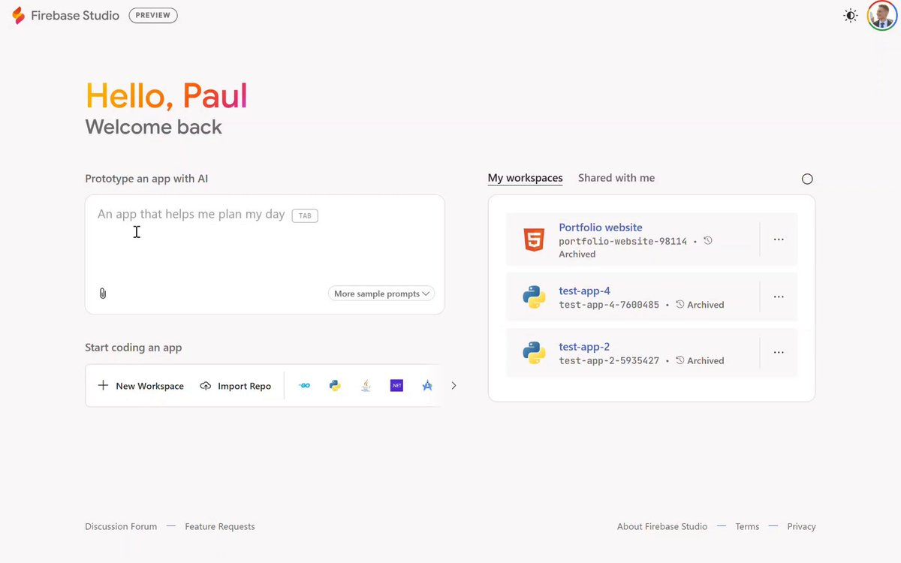

**Source:** [https://twitter.com/i/web/status/1910023406692753788](https://twitter.com/i/web/status/1910023406692753788)
**Original Post Date:** 2025-05-27 16:57:33

# Firebase Studio Workspace Management: Advanced Techniques and Best Practices

## Introduction
Firebase Studio serves as a comprehensive web-based IDE for managing Firebase projects, offering robust workspace management capabilities. This guide explores advanced techniques for optimizing your workflow, leveraging AI features, and maintaining clean project structures. Whether you're developing new applications or working with existing codebases, understanding these practices will significantly enhance productivity.

## Workspace Organization Strategies

Effective workspace organization starts with clear naming conventions for projects and repositories. Use descriptive names that include project purpose and version information.

Implement a consistent folder structure across all workspaces to maintain predictability and ease of navigation.

- Use semantic naming (e.g., 'user-auth-service-v2')
- Maintain separate development and production branches
- Document workspace configurations in README.md

## AI-Driven App Prototyping

Firebase Studio's AI integration enables rapid prototyping. Start with specific prompts that clearly define your application requirements.

Leverage sample templates and customize them according to project needs while maintaining best practices for security and performance.

_Example JSON structure for AI app prototyping request_

```json
{
  "prompt": "Design a real-time collaborative document editor using Firebase Realtime Database",
  "parameters": {
    "features": ["multi-user", "versioning", "realtime-sync"]
  }
}
```

## Version Control Integration

Integrate Firebase Studio with Git by connecting your repositories to maintain version history and collaborate effectively.

Implement branching strategies that support parallel development without compromising code integrity.

1. Create feature branches for new functionalities
1. Use pull requests for peer reviews
1. Maintain separate hotfix branches

## Security and Compliance Management

Configure Firebase Security Rules within workspaces to ensure data protection and access control.

Implement audit trails and logging mechanisms to track changes and maintain compliance.

_Basic Firebase Security Rule implementation_

```javascript
// Example Security Rule
{
  "rules": {
    ".read": true,
    ".write": false,
    "users": {
      "$uid": { ".validate":
        "auth != null && auth.uid == $uid" }
    }
  }
}
```

## Key Takeaways

- Organize workspaces with clear naming conventions and consistent folder structures
- Leverage AI prototyping for rapid development while maintaining security best practices
- Implement robust version control strategies using Git integration
- Configure comprehensive security rules to protect data integrity

## Conclusion
Effective workspace management in Firebase Studio requires a combination of structured organization, strategic use of AI features, and proper security implementation. By following these guidelines, developers can maintain efficient workflows while ensuring code quality and security.

## External References

- [Firebase Documentation](https://firebase.google.com/docs)
- [Git Version Control Guide](https://git-scm.com/book/en/v2)


## Media

**Video Description:** Video Content Analysis - media_seg0_item0.mp4:

The video appears to be a tutorial or demonstration of creating and prototyping a mind-mapping application using AI and web development tools. The sequence of frames suggests a step-by-step process, likely involving the use of Firebase, AI integration, and code editing. Below is a comprehensive description of the video based on the provided frames:

---

### **Overview of the Video**
The video guides viewers through the process of building a mind-mapping application, named "Mind Weaver," using AI-driven tools and web development frameworks. The application is designed to convert themes or topics into visual mind maps, leveraging AI for automation and efficiency.

---

### **Frame-by-Frame Analysis**

#### **Frame 1: Welcome Screen and Initial Setup**
- **Content**: The screen displays a welcome message, "Hello, Paul," indicating a personalized experience. The user is greeted with a prompt to prototype an app with AI, specifically focusing on creating a mind-mapping tool.
- **Key Elements**:
  - A text box with the description: "An app that turns a theme or topic into a mind map."
  - A button labeled "Generating..." suggests the AI is processing the request.
  - The interface includes options for editing code and managing projects, indicating a development environment.
- **Purpose**: This frame sets the context, introducing the project and its AI-driven nature.

#### **Frame 2: Code Editor and Development Environment**
- **Content**: The screen transitions to a code editor, showing the development environment for the mind-mapping application.
- **Key Elements**:
  - The code editor displays CSS and TypeScript files, indicating the use of modern web development technologies.
  - The file structure includes `globals.css`, `page.tsx`, and other files, suggesting a React or similar framework.
  - The code snippet includes styles for a dark theme, with variables like `bg-background` and `text-foreground`.
- **Purpose**: This frame highlights the technical setup, showing how the application's UI is being styled and structured.

#### **Frame 3: Application Preview and AI Integration**
- **Content**: The screen shows a live preview of the "Mind Weaver" application.
- **Key Elements**:
  - The application interface is minimalistic, with a text input field where users can enter topics (e.g., "how an autonomous AI agent works").
  - A "Generating..." button indicates that the AI is processing the input to create a mind map.
  - A sidebar lists files and dependencies, including `.env` for environment variables and `ai/dev.ts` for AI integration.
- **Purpose**: This frame demonstrates the application's functionality, focusing on the user experience and AI-driven generation of mind maps.

#### **Frame 4: Error Handling and Debugging**
- **Content**: The screen highlights an issue in the development process.
- **Key Elements**:
  - A red notification at the bottom left indicates an error: "1 Issue."
  - The sidebar shows a checklist for updating the Gemini API key, which is required for AI integration.
  - The code editor is still visible, suggesting that the user needs to resolve the issue before proceeding.
- **Purpose**: This frame emphasizes the importance of debugging and ensuring proper API configuration for AI functionality.

#### **Frame 5: Final Application Preview**
- **Content**: The screen shows the completed mind-mapping application in action.
- **Key Elements**:
  - The application successfully generates a mind map based on the input topic.
  - The interface is clean and user-friendly, with a focus on visualizing the mind map.
  - The sidebar continues to display the file structure and dependencies, reinforcing the technical setup.
- **Purpose**: This frame showcases the final product, demonstrating the successful integration of AI and web development to create a functional mind-mapping tool.

---

### **Key Technical Concepts**
1. **AI Integration**: The application leverages AI to automatically generate mind maps from user inputs, using tools like the Gemini API.
2. **Web Development**: The project uses modern web development technologies, including React (TypeScript), CSS, and Firebase for hosting and development.
3. **Environment Setup**: The use of `.env` files for managing API keys and other sensitive information is crucial for secure development.
4. **Error Handling**: The video emphasizes the importance of debugging and resolving issues, such as missing API keys, to ensure the application functions correctly.

---

### **Overall Narrative**
The video provides a comprehensive walkthrough of building a mind-mapping application from start to finish. It begins with a personalized welcome and a clear project description, transitions into the technical setup with code editing and styling, addresses potential issues like missing API keys, and concludes with a successful demonstration of the application. The focus on AI integration and modern web development techniques makes it particularly relevant for developers interested in creating intelligent, user-friendly applications.

---

### **Target Audience**
- Developers interested in AI and web development.
- Beginners looking to learn about integrating AI into web applications.
- Anyone interested in creating mind-mapping tools or similar applications.

---

This video effectively combines technical depth with a clear, step-by-step approach, making it both educational and engaging for its target audience.

Key Frames Analysis:
Frame 1: ### Description of Frame 1:

The image appears to be a screenshot of a user interface, likely from a web-based platform or application development tool. Below is a detailed breakdown of the visible content:

#### **Top Section:**
- **Greeting Text:**
  - The text "Hello, Paul Paul Paul" is displayed prominently at the top in large, bold font. The word "Paul" is repeated three times, with each instance in a different color:
    - "Hello," is in orange.
    - The first "Paul" is in red.
    - The second "Paul" is in pink.
    - The third "Paul" is in purple.
  - Below this, the text "Welcome back back" is displayed in a smaller, black font. The word "back" is repeated twice.

#### **Middle Section:**
- **Text Box:**
  - A large text box is present in the center of the screen. The text inside the box reads:
    - "An app that turns a theme or topic into a mindmap."
    - The word "mindmap" is underlined with a red squiggly line, indicating a possible spelling or grammar suggestion.
  - Below the text box, there is a button labeled "Prototype with AI" in a pink gradient color. The button has a circular loading icon next to it, suggesting that the prototype is being generated or processed.

#### **Bottom Section:**
- **Workspace Options:**
  - Below the text box, there are options for starting or managing workspaces:
    - **"Start coding an app"**: A section with a button labeled "New Workspace" and an option to "Import Repo."
    - Below this, there are icons representing different programming languages or frameworks:
      - Go (Go programming language icon)
      - Python (Python logo)
      - Java (Java logo)
      - C++ (C++ logo)
      - .NET (C#/.NET logo)
      - AI (AI-related icon)

#### **Right Sidebar:**
- **My Workspaces:**
  - On the right side, there is a section labeled "My workspaces," listing several projects:
    - **Portfolio website**: This project is archived and has an HTML logo (red and white).
    - **test-app-4**: This project has a Python logo (yellow and blue).
    - **test-app-2**: This project also has a Python logo (yellow and blue).

#### **General Layout:**
- The overall layout is clean and modern, with a white background and a focus on user-friendly design.
- The interface appears to be part of a development or prototyping tool, likely aimed at creating applications or prototypes using AI and various programming languages.

This frame suggests that the user is interacting with a platform designed for app development, with a focus on AI-assisted prototyping and workspace management. The repeated "Paul" in the greeting and the repeated "back" in the welcome message might indicate a playful or experimental design choice.
Frame 2: ### Description of Frame 2:

The image shows a development environment, specifically **Firebase Studio**, with a focus on a code editor and some design specifications. Below is a detailed breakdown of the visible content:

#### **Left Side: Code Editor**
1. **File Path and Name**:
   - The file being edited is located at: `src/app/globals.css`.
   - The file is a CSS file, as indicated by the `.css` extension.

2. **CSS Code**:
   - The code defines a dark theme using CSS variables and custom properties.
   - The `.dark` class is defined, which contains various color variables for different UI elements.
   - Variables include:
     - `--muted-foreground`: `0 0% 63.9%`
     - `--accent`: `0 0% 14.9%`
     - `--accent-foreground`: `0 0% 98%`
     - `--destructive`: `62.8% 100% 38%`
     - `--destructive-foreground`: `0 0% 98%`
     - `--border`: `0 0% 14.9%`
     - `--input`: `0 0% 14.9%`
     - `--ring`: `0 0% 83.1%`
     - `--chart-1` to `--chart-5`: Various color definitions for charts.
     - `--sidebar-background`, `--sidebar-foreground`, `--sidebar-primary`, `--sidebar-accent`, etc.: Color definitions for sidebar elements.
   - The code also includes a `@layer` directive, which organizes the CSS into layers. The `base` layer is defined, and it applies styles such as `border-border` to the `body` element.

3. **Syntax Highlighting**:
   - The code is syntax-highlighted, with different colors for variables, comments, and other elements for better readability.

#### **Right Side: Design Specifications**
1. **Design Notes**:
   - The right panel contains design specifications and notes for the application being developed, titled **"Mind Weaver"**.
   - The notes are organized into sections:
     - **Layout**:
       - Describes the layout as "Clean and spacious" to accommodate complex mind maps.
     - **Iconography**:
       - Mentions the use of simple and clear icons to represent different node types.
     - **Animation**:
       - Specifies smooth transitions and animations for expanding or collapsing nodes.

2. **Prototype Button**:
   - A button labeled **"Prototype this App"** is visible, suggesting an option to prototype the application based on the current design and code.

3. **File Changes Section**:
   - Lists the files that have been modified or are part of the project:
     - `src/app/globals.css`
     - `src/app/page.tsx`
     - `src/app/...` (other files)
     - `src/ai/ai.dev.ts`
     - `src/ai/ai-instance.ts`
   - Indicates that there are **+4 more files** not fully listed.

4. **Error Checking**:
   - At the bottom, there is a note stating: **"Checking for errors"**, indicating that the code is being validated for any issues.

5. **Gemini Note**:
   - A small note at the bottom mentions: **"Gemini can make mistakes, so double-check it"**, suggesting that the content might have been generated or assisted by an AI tool named Gemini.

#### **Top Bar**:
- The top bar shows the Firebase Studio interface, with the project name **"Mind Weaver"** and options like **"Publish"** and a user profile icon.

#### **Overall Context**:
- The frame depicts a development environment where a dark theme is being defined in a CSS file, alongside design specifications for a mind-mapping application. The environment suggests a focus on both styling and functionality, with an emphasis on clean design, clear icons, and smooth animations.

This frame provides a comprehensive view of the development process, combining code implementation with design considerations.
Frame 3: ### Description of Frame 3:

#### **Overview:**
The image shows a user interface from **Firebase Studio**, specifically within a project named **"Mind Weaver"**. The interface is designed for creating and managing a web application, with a focus on generating mind maps. The page appears to be in the process of generating content based on a user input query.

#### **Key Elements:**

1. **Header Section:**
   - The top left corner displays the **Firebase Studio** logo and the project name **"Mind Weaver"**.
   - There are navigation icons, including a back arrow, refresh button, and a search bar.

2. **Main Content Area:**
   - The central section is labeled **"Mind Weaver"** with the tagline: *"Turn any topic into a mind map."*
   - Below this, there is a text box containing the input query: *"how an autonomous ai agent works"*. This suggests the user is generating a mind map on this topic.
   - A prominent **"Generating..."** button is displayed, indicating that the system is actively processing the request.

3. **File Explorer on the Right:**
   - A file explorer panel is visible on the right side, listing the project files:
     - `.modified`
     - `src/app/globals.css`
     - `src/app/page.tsx`
     - `.env`
     - `src/ai/dev.ts`
     - Additional files are indicated with a "+5 more files" option.
   - This suggests the project is built using a modern web development framework, likely React or a similar framework, given the `.tsx` file extension.

4. **Gemini API Key Notification:**
   - A notification box on the right indicates that the app requires a **Gemini API key**. It states:
     - *"It appears that your app needs a Gemini API key!"*
     - Below this, there is a checkmark confirming that the **Gemini API key has been updated**.

5. **Instructions and Options:**
   - Below the file explorer, there is a section providing instructions:
     - It mentions that the first iteration of the app prototype is ready and encourages the user to try it out in the preview window.
     - It also suggests making changes directly in the code editor by clicking the `<></>` button at the top.
   - A button labeled **"Edit the Code"** is present, allowing the user to modify the application's code.

6. **Issue Notification:**
   - At the bottom left, there is a red notification bubble labeled **"1 Issue"**, indicating that there is at least one issue or error in the project that needs attention.

7. **Gemini Assistant Note:**
   - At the bottom right, there is a note about **Gemini**, stating:
     - *"Gemini can make mistakes, so double-check it."*
     - This suggests that the application is using the Gemini API for generating content, and users should verify the output.

8. **User Profile and Actions:**
   - The top right corner shows a user profile icon, indicating the logged-in user.
   - There is also a **"Publish"** button, suggesting the option to deploy or publish the application.

#### **Summary:**
The frame depicts a development environment in Firebase Studio where a user is working on a project called **"Mind Weaver"**. The app is designed to generate mind maps based on user input. The current input query is *"how an autonomous ai agent works"*, and the system is actively generating content. The interface provides options to edit the code, preview the app, and manage files. A notification about the Gemini API key and a note about potential errors in the output are also visible. The presence of an issue notification suggests that there may be a problem that needs to be addressed.
Frame 4: ### Description of Frame 4:

#### **Overview:**
The image shows a user interface from **Firebase Studio**, specifically within a project named **"Mind Weaver"**. The interface is designed to generate a mind map based on a given topic. The screen is divided into several sections, including a central input area, a preview section, and a sidebar with additional options and code details.

---

#### **Central Section:**
1. **Title and Description:**
   - The title **"Mind Weaver"** is prominently displayed.
   - Below the title, there is a description: **"Turn any topic into a mind map."**

2. **Input Field:**
   - A text input field contains the topic: **"how an autonomous ai agent works"**.
   - A button labeled **"Generating..."** is displayed below the input field, indicating that the mind map is currently being generated.

3. **Mind Map Preview:**
   - Below the input section, there is a section titled **"Mind Map Map Preview Preview"**.
   - The preview area shows a JSON representation of the mind map structure. The JSON includes:
     - A root object labeled `"mindMap"`.
     - An array of edges (`"edges"`) connecting nodes.
     - Example nodes:
       - `"source": "agent"` connected to `"target": "perception"`.
       - `"source": "agent"` connected to `"target": "reasoning"`.

---

#### **Right Sidebar:**
1. **Instructions and Notes:**
   - A section provides instructions for interacting with the prototype:
     - It mentions that the first iteration of the app prototype is ready and encourages the user to try it out in the preview window.
     - It prompts the user to describe any changes they would like to make.

2. **Code Editor Options:**
   - Buttons for editing the code:
     - **"Edit the Code"**: Allows direct editing of the code.
     - **"See the Code"**: Displays the JSON code of the mind map.

3. **JSON Code Display:**
   - The JSON code of the mind map is displayed, showing the structure of the nodes and edges.

4. **File Changes Section:**
   - Lists the files that have been modified:
     - `package-lock.json`
     - `.env`
     - `package.json`
     - `src/components/MindMap.tsx`
     - `src/app/page.tsx`
     - `src/page.tsx`

5. **Issue Notification:**
   - A red notification at the bottom left indicates **"1 Issue"**, suggesting there is a problem that needs attention.

---

#### **Additional Elements:**
- **Top Bar:**
  - The top bar shows the Firebase Studio interface with navigation options and a "Publish" button.
  - There is also a notification about the **Gemini API key** being updated.

- **Bottom Section:**
  - A text box at the bottom prompts the user to describe the changes they want to make.
  - A note mentions that **Gemini can make mistakes**, advising the user to double-check the results.

---

#### **Summary:**
The frame depicts a prototype of a mind map generator tool called **"Mind Weaver"**. The user has entered a topic ("how an autonomous ai agent works"), and the system is in the process of generating a mind map. The preview shows a JSON representation of the mind map structure, and the sidebar provides options for editing the code and viewing file changes. There is also a notification about an issue that needs to be addressed. The overall layout is clean and functional, designed for prototyping and development purposes.
Frame 5: ### Description of Frame 5:

#### **Overview:**
The image shows a user interface from **Firebase Studio**, specifically within a project named **"Mind Weaver"**. The interface is focused on a **Mind Map** visualization, which appears to be part of a development or design process. The layout includes a mind map diagram, a sidebar with instructions and options, and a code editor section.

---

#### **Key Components:**

1. **Title and Navigation:**
   - At the top, the title reads **"Firebase Studio > Mind Weaver"**, indicating the project and environment.
   - There are navigation icons and a search bar, suggesting functionality for browsing or searching within the project.

2. **Mind Map Visualization:**
   - The central part of the image displays a **Mind Map** diagram.
   - The mind map is structured around an **Autonomous AI Agent** at the top, with branches leading to various components:
     - **Planning**
     - **Reasoning**
     - **Perception**
     - **Sensors**
     - **Data Processing**
     - **Decision Making**
     - **Environment Interaction**
     - **Actuators**
     - **Action**
   - The nodes are connected with lines, illustrating the flow and relationships between the components.

3. **Sidebar Instructions:**
   - On the right side, there is a sidebar with instructions and options:
     - **Text Description:**
       - The text explains that the first iteration of the app prototype is ready and encourages the user to try it out in the preview window.
       - It also provides guidance on making changes directly by switching to the code editor.
     - **Buttons:**
       - A **"Publish"** button is visible at the top-right corner, indicating the option to publish the current state of the project.
       - A **"Edit the Code"** button is present, allowing the user to directly modify the code.
     - **File Changes Section:**
       - Below the buttons, there is a section titled **"File changes"** listing modified files:
         - `package-lock.json`
         - `.env`
         - `package.json`
         - `src/components/components/MindMap.tsx`
         - `src/app/page.tsx`
         - `src/page.tsx`
       - The current commit hash (`f9e2408a`) is displayed, indicating the version of the changes.

4. **Issue Notification:**
   - At the bottom-left corner, there is a red notification bubble labeled **"1 Issue"**, indicating that there is one unresolved issue in the project.

5. **Gemini API Key Update:**
   - At the top-right, there is a notification stating that the **Gemini API key has been updated**, suggesting integration with an AI service.

6. **Code Editor Section:**
   - The bottom-right section shows a code editor interface, where the user can view and edit the JSON code of the mind map.
   - The text in this section indicates that the user can see the JSON code but not the actual mind map visualization directly in the editor.

7. **User Interaction Prompt:**
   - At the bottom, there is a prompt asking the user to describe the changes they want to make, suggesting an interactive or conversational element in the interface.

---

#### **Summary:**
The frame depicts a development environment in Firebase Studio, where a mind map is being used to visualize the structure and flow of an **Autonomous AI Agent**. The interface provides options to preview, edit, and publish the project, along with a list of file changes and a notification about an unresolved issue. The sidebar offers guidance on making changes and integrating with the Gemini API. The overall layout suggests a collaborative and iterative development process.


**Image Description:** The image shows a screenshot of the **Firebase Studio** interface, a tool for managing and developing applications using Firebase services. Below is a detailed description of the image, focusing on the main elements and technical details:

### **Header Section**
1. **Top Left Corner**:
   - The Firebase Studio logo is displayed prominently in the top-left corner.
   - The word "PREVIEW" is shown in a small, rounded button next to the logo, indicating that this is a preview version of the interface.

2. **Top Right Corner**:
   - A user profile icon is visible, showing a circular avatar with a colorful design.
   - An alert or notification icon is present, indicating there might be notifications or updates for the user.

### **Main Content**
#### **Left Side: Prototype an App with AI**
1. **Greeting Section**:
   - The greeting "Hello, Paul Paul" is displayed in large, bold text. The repetition of "Paul" suggests a possible glitch or placeholder text.
   - Below the greeting, the text "Welcome back back" is repeated, which also appears to be a glitch.

2. **Prototype an App with AI Section**:
   - A text box is provided for users to input a description of the app they want to prototype.
   - The placeholder text in the input box reads: "An app that helps me plan my day."
   - A "TAB" button is visible next to the input box, likely for tabbing through fields or options.
   - Below the input box, there is a button labeled "More sample prompts," suggesting users can explore pre-defined prompts for app ideas.

3. **Start Coding an App Section**:
   - This section provides options for starting a new project or importing an existing one.
   - Buttons are available for:
     - **New Workspace**: To create a new workspace for a project.
     - **Import Repo**: To import an existing repository into Firebase Studio.
   - Icons for various programming languages and tools are displayed, including:
     - **JavaScript** (Node.js)
     - **Python**
     - **Java**
     - **C++**
     - **.NET**
     - **Flutter**
   - These icons indicate the supported development environments and languages in Firebase Studio.

#### **Right Side: My Workspaces**
1. **Workspace Management Section**:
   - The section is titled "My workspaces," indicating the user's list of projects or workspaces.
   - Below this, there is a tab labeled "Shared with me," suggesting the ability to view projects shared with the user.

2. **List of Workspaces**:
   - Several workspaces are listed, each with a name, a unique identifier, and an "Archived" status:
     - **Portfolio website**:
       - Name: "Portfolio website"
       - Identifier: "portfolio-website-98114"
       - Archived: Yes
     - **test-app-4**:
       - Name: "test-app-4"
       - Identifier: "test-app-app-4-7600485"
       - Archived: Yes
     - **test-app-2**:
       - Name: "test-app-2"
       - Identifier: "test-app-2-5935427"
       - Archived: Yes
   - Each workspace entry includes:
     - A language or framework icon (e.g., HTML5 for the portfolio website, Python for test-app-4, etc.).
     - A three-dot menu ("...") for additional options or actions related to the workspace.

### **Footer Section**
1. **Footer Links**:
   - Links are provided for:
     - **Discussion Forum**: For community discussions and support.
     - **Feature Requests**: To submit feature requests for Firebase Studio.
     - **About Firebase Studio**: Information about Firebase Studio.
     - **Terms**: Terms of service.
     - **Privacy**: Privacy policy.

### **Design and Layout**
- The interface is clean and modern, with a predominantly white background and minimalistic design.
- The use of color is subtle, with orange and blue accents for emphasis (e.g., the greeting text and icons).
- The layout is divided into two main columns: the left side for app prototyping and the right side for workspace management.

### **Technical Details**
1. **Firebase Studio**:
   - Firebase Studio is a web-based integrated development environment (IDE) for building and managing Firebase applications.
   - It supports multiple programming languages and frameworks, as indicated by the icons.

2. **Workspace Management**:
   - The interface allows users to manage their projects, including creating new workspaces, importing repositories, and viewing shared projects.
   - The "Archived" status indicates that the listed workspaces are not currently active but can be restored if needed.

3. **AI Integration**:
   - The "Prototype an app with AI" section suggests that Firebase Studio may offer AI-driven assistance for app development, allowing users to generate app ideas or code snippets based on input prompts.

### **Observations**
- The repeated text ("Paul Paul" and "Welcome back back") suggests that this is a preview or development version of the interface, and there may be bugs or placeholder text that need to be resolved.
- The interface is user-friendly and organized, with clear sections for different functionalities.

Overall, the image showcases Firebase Studio's capabilities for managing and developing applications, with a focus on workspace management and AI-assisted app prototyping.
