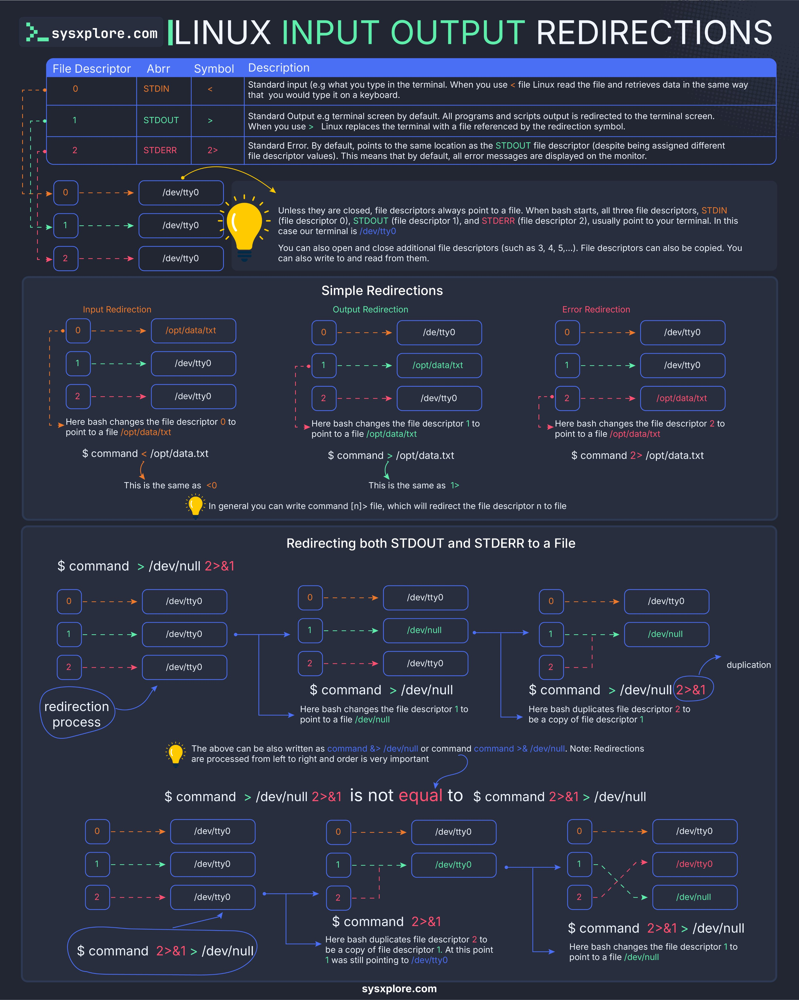

**Source:** [https://twitter.com/i/web/status/1878825004319773077](https://twitter.com/i/web/status/1878825004319773077)
**Original Post Date:** 2025-07-23 06:39:16

# Linux Input/Output Redirection: A Comprehensive Tutorial

## Introduction
Linux input/output (I/O) redirection is a powerful feature that allows users to control the flow of data between commands and files. This tutorial provides an in-depth explanation of how I/O redirection works in Linux, focusing on file descriptors, redirection symbols, and their practical applications. By understanding these concepts, developers and system administrators can better manage command output and error streams.

## File Descriptors

In Linux, file descriptors are used to represent input/output streams. The infographic begins by introducing the concept of file descriptors, which are numerical identifiers assigned to open files or I/O streams in a process.

The table lists three primary file descriptors: STDIN (0), STDOUT (1), and STDERR (2). Each has an abbreviation, symbol, and description. For example, STDIN is represented by the symbol '<' and is used for standard input, which by default refers to terminal input.

- File Descriptor 0 (STDIN): Standard Input, symbol '<', default points to terminal input.
- File Descriptor 1 (STDOUT): Standard Output, symbol '>', default points to terminal screen.
- File Descriptor 2 (STDERR): Standard Error, symbol '2>', default points to the same location as STDOUT.

> **Note/Tip:** Unless closed, file descriptors always point to a file. When Bash starts, the three file descriptors usually point to the terminal (/dev/tty0).

## Default File Descriptor Connections

The infographic shows how these file descriptors are connected by default: STDIN (0), STDOUT (1), and STDERR (2) all point to /dev/tty0, which is the terminal.

A note explains that unless closed, file descriptors always point to a file. When Bash starts, the three file descriptors usually point to the terminal (/dev/tty0).

> **Note/Tip:** It's important to understand these default connections as they form the basis for redirection.

## Simple Redirections

This section explains how to redirect input, output, and error streams using file descriptors.

For example, to redirect the input of a command from the terminal to a file, you would use the syntax: `command < /opt/data.txt`.

- Input Redirection (`<`): Syntax: `command < /opt/data.txt`, Explanation: Redirects input from terminal to file.
- Output Redirection (`>`): Syntax: `command > /opt/data.txt`, Explanation: Redirects output from terminal to file.
- Error Redirection (`2>`): Syntax: `command 2> /opt/data.txt`, Explanation: Redirects error output from terminal to file.

> **Note/Tip:** Understanding these basic redirections is crucial for managing command output and error streams effectively.

## General Redirection Syntax

The infographic provides a general syntax for redirection: `command [n] > file`, which redirects file descriptor n to the specified file.

This syntax is essential for more advanced redirection scenarios.

> **Note/Tip:** Always ensure that the file descriptor number (n) is correct, as incorrect usage can lead to unexpected behavior.

## Redirecting Both STDOUT and STDERR to a File

This section explains how to redirect both standard output and standard error to the same file.

The syntax for this is: `command > /dev/null 2>&1`, where `/dev/null` is a special file that discards any data written to it, often used to suppress output.

- Syntax: `command > /dev/null 2>&1`, Explanation: Redirects STDOUT to `/dev/null` and duplicates STDERR to point to the same location as STDOUT.
- Alternative Syntax: `command &> /dev/null`, which is a shorthand for redirecting both STDOUT and STDERR to `/dev/null`.

> **Note/Tip:** This technique is particularly useful in scripts where you want to suppress output and error messages.

## Order of Redirection

The infographic emphasizes that the order of redirection is important. For example, `command > /dev/null 2>&1` is not the same as `command 2>&1 > /dev/null`.

Understanding this concept ensures that file descriptors are correctly duplicated or redirected.

> **Note/Tip:** Always double-check the order of redirection commands to avoid unexpected results.

## Visual Flow Diagrams

The infographic includes flow diagrams to illustrate how redirection works.

These visual aids make it easier to understand complex concepts like input redirection, output redirection, error redirection, and combined redirection.

> **Note/Tip:** Visual representations can be incredibly helpful for understanding abstract concepts in I/O redirection.

## Key Notes

The infographic concludes with key notes on default behavior, order of redirection, and the use of `/dev/null`.

These notes reinforce important concepts and best practices for using I/O redirection effectively.

- Default Behavior: By default, all three file descriptors (STDIN, STDOUT, STDERR) point to the terminal (/dev/tty0).
- Order Matters: The order of redirection commands is crucial, as it affects how file descriptors are duplicated or redirected.
- /dev/null: A special file that discards any data written to it, often used to suppress output.

> **Note/Tip:** Always keep these key notes in mind when working with I/O redirection in Linux.

## Key Takeaways

- Understanding file descriptors (STDIN, STDOUT, STDERR) is fundamental to mastering I/O redirection.
- The order of redirection commands significantly impacts the behavior of file descriptors.
- /dev/null is a powerful tool for suppressing output and error messages in scripts.
- Visual aids like flow diagrams can greatly enhance understanding of complex concepts in I/O redirection.

## Conclusion
This infographic serves as an educational resource for understanding Linux input/output redirection. It covers the basics of file descriptors, redirection symbols, and practical examples, making it a valuable resource for developers, system administrators, and anyone working with Linux command-line tools.

## External References

- [Linux Documentation on I/O Redirection](https://www.linux.org/docs/books/bash-beginners-guide/html/x11026_ht0.htm)
- [Advanced Bash-Scripting Guide](https://tldp.org/LDP/abs/html/io-redirection.html)

## Media

**Image Description:** This image is a detailed infographic titled **"Linux Input Output Redirections"** from **sysxplorere.com**. It provides a comprehensive explanation of how input, output, and error redirection works in Linux, focusing on file descriptors, redirection symbols, and their practical applications. Below is a detailed breakdown of the image:

---

### **Main Sections and Content**

#### **1. File Descriptors**
The infographic begins by introducing the concept of **file descriptors**, which are used to represent input/output streams in Linux. The table lists the following:

- **File Descriptor 0 (STDIN)**:
  - **Abbreviation**: STDIN
  - **Symbol**: `<`
  - **Description**: Standard Input. By default, it refers to the terminal input (e.g., what you type in the terminal). When you use `< file`, Linux reads the file and retrieves data as if it were typed on a keyboard.

- **File Descriptor 1 (STDOUT)**:
  - **Abbreviation**: STDOUT
  - **Symbol**: `>`
  - **Description**: Standard Output. By default, it refers to the terminal screen. All program outputs are directed here unless redirected.

- **File Descriptor 2 (STDERR)**:
  - **Abbreviation**: STDERR
  - **Symbol**: `2>`
  - **Description**: Standard Error. By default, it points to the same location as STDOUT (the terminal). Error messages are displayed here unless redirected.

#### **2. Default File Descriptor Connections**
The infographic shows how these file descriptors are connected by default:
- **STDIN (0)**: Points to `/dev/tty0` (the terminal).
- **STDOUT (1)**: Points to `/dev/tty0` (the terminal).
- **STDERR (2)**: Points to `/dev/tty0` (the terminal).

A note explains that unless closed, file descriptors always point to a file. When Bash starts, the three file descriptors (STDIN, STDOUT, STDERR) usually point to the terminal (`/dev/tty0`).

#### **3. Simple Redirections**
This section explains how to redirect input, output, and error streams using file descriptors.

- **Input Redirection (`<`)**:
  - Syntax: `command < /opt/data.txt`
  - Explanation: Redirects the input of the command from the terminal to the file `/opt/data.txt`.

- **Output Redirection (`>`)**:
  - Syntax: `command > /opt/data.txt`
  - Explanation: Redirects the output of the command from the terminal to the file `/opt/data.txt`.

- **Error Redirection (`2>`)**:
  - Syntax: `command 2> /opt/data.txt`
  - Explanation: Redirects the error output of the command from the terminal to the file `/opt/data.txt`.

#### **4. General Redirection Syntax**
The infographic provides a general syntax for redirection:
- `command [n] > file`: Redirects file descriptor `n` to the file.

#### **5. Redirecting Both STDOUT and STDERR to a File**
This section explains how to redirect both standard output and standard error to the same file.

- **Syntax**: `command > /dev/null 2>&1`
  - Explanation:
    - `command > /dev/null`: Redirects STDOUT to `/dev/null` (a special file that discards output).
    - `2>&1`: Duplicates file descriptor 2 (STDERR) to point to the same location as file descriptor 1 (STDOUT).

- Alternative Syntax:
  - `command &> /dev/null`: A shorthand for redirecting both STDOUT and STDERR to `/dev/null`.

#### **6. Order of Redirection**
The infographic emphasizes that the order of redirection is important. For example:
- `command > /dev/null 2>&1` is **not** the same as `command 2>&1 > /dev/null`.

#### **7. Visual Flow Diagrams**
The infographic includes flow diagrams to illustrate how redirection works:
- **Input Redirection**: Shows how file descriptor 0 is redirected to a file.
- **Output Redirection**: Shows how file descriptor 1 is redirected to a file.
- **Error Redirection**: Shows how file descriptor 2 is redirected to a file.
- **Combined Redirection**: Demonstrates how both STDOUT and STDERR are redirected to the same file.

#### **8. Key Notes**
- **Default Behavior**: By default, all three file descriptors (STDIN, STDOUT, STDERR) point to the terminal (`/dev/tty0`).
- **Order Matters**: The order of redirection commands is crucial, as it affects how file descriptors are duplicated or redirected.
- **`/dev/null`**: A special file that discards any data written to it, often used to suppress output.

---

### **Design and Layout**
- **Color Coding**:
  - Blue boxes highlight file descriptors and their connections.
  - Yellow lightbulb icons provide additional notes and explanations.
  - Green arrows indicate the flow of data between file descriptors and files.
- **Visual Flow**: The use of arrows and boxes makes the flow of redirection clear and easy to follow.
- **Typography**: Bold and italicized text is used to emphasize important concepts and syntax.

---

### **Purpose**
The infographic serves as an educational resource for understanding Linux input/output redirection. It is particularly useful for developers, system administrators, and anyone working with Linux command-line tools. The visual aids and detailed explanations make complex concepts accessible and easy to grasp.

---

### **Conclusion**
This infographic is a well-structured and visually appealing guide to Linux input/output redirection. It covers the basics of file descriptors, redirection symbols, and practical examples, making it a valuable resource for learning and reference.
