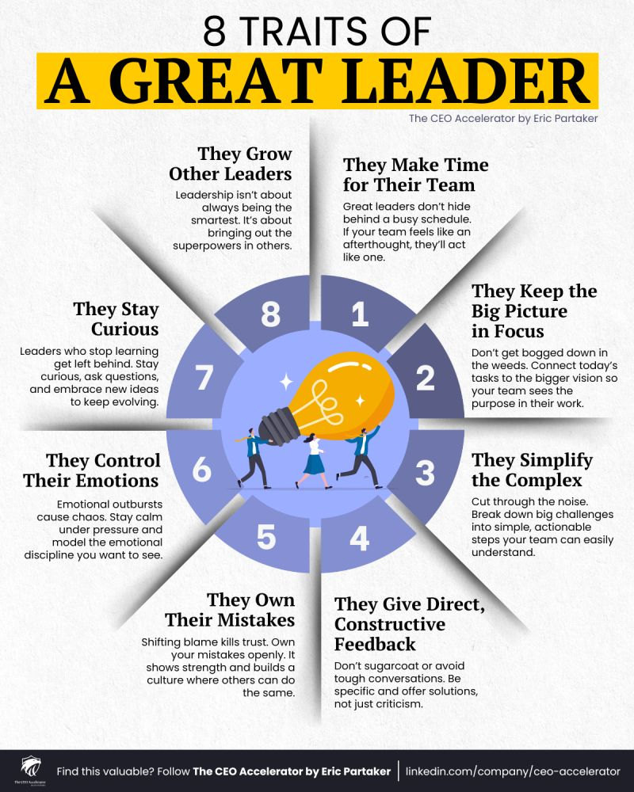

**Source:** [https://twitter.com/i/web/status/1870107961835589702](https://twitter.com/i/web/status/1870107961835589702)
**Original Post Date:** 2025-05-30 10:53:36

# Traits of Great Leaders in Software Engineering Teams

## Introduction
In modern software development environments, technical expertise alone is insufficient. Great leaders must combine their domain knowledge with exceptional interpersonal skills to drive team success. This article examines eight critical leadership traits that elevate engineering teams from good to great.

These principles are essential for both individual contributors seeking advancement and established managers aiming to enhance their effectiveness.

## 1. Time Management: Prioritizing Team Needs

Effective leaders recognize that team success requires dedicated time investment. They avoid using 'busy schedules' as an excuse for neglecting their teams. Regular one-on-ones, stand-ups, and project reviews demonstrate commitment to team members' growth and challenges.

> **Note/Tip:** Allocate at least 30% of your week for direct team interaction

> **Note/Tip:** Schedule protected time blocks for critical team discussions

## 2. Strategic Vision: Beyond the Technical Details

Leaders must balance technical execution with strategic alignment. While engineers focus on implementation details, leaders maintain vision and ensure daily work connects to broader business goals.

> **Note/Tip:** Regularly communicate how each project ties to company objectives

> **Note/Tip:** Use visual roadmaps to connect tactical tasks with long-term strategy

## 3. Complex Problem Simplification

Breaking down technical challenges into manageable components is crucial for team progress. Leaders should translate complex requirements into clear, actionable steps while maintaining architectural integrity.

1. Define clear problem statements
1. Identify core components
1. Create incremental milestones

## 4. Constructive Feedback Mechanisms

Establishing a feedback culture requires direct, actionable communication. Leaders should provide specific technical and behavioral guidance while fostering an environment where team members feel safe to give and receive feedback.

```plaintext
Feedback Template:
- What went well
- Areas for improvement
- Next steps with actionable items
```

## 5. Accountability in Leadership

Taking ownership of failures builds trust within technical teams. Leaders who acknowledge their mistakes create psychological safety and model responsible behavior.

## 6. Emotional Intelligence in Technical Settings

Maintaining composure during high-pressure situations is essential for team stability. Leaders must demonstrate emotional control when facing project setbacks or interpersonal conflicts.

> **Note/Tip:** Practice active listening during tense discussions

> **Note/Tip:** Use structured decision-making frameworks to reduce emotional bias

## 7. Continuous Learning and Adaptation

Technical leaders must stay current with emerging technologies while fostering a culture of curiosity within their teams.

## 8. Developing Future Leaders

Great leaders focus on cultivating technical talent by identifying team members' strengths and creating growth opportunities.

- Assign stretch assignments based on team member strengths
- Provide mentorship opportunities
- Encourage conference participation

## Key Takeaways

- Time investment in teams is non-negotiable for leadership success
- Strategic vision bridges technical execution with business objectives
- Clear communication and feedback mechanisms drive team performance
- Emotional control and accountability build trust within technical teams

## Conclusion
Effective leadership in software engineering requires a balanced approach of technical expertise and interpersonal skills. By embodying these eight traits, leaders can create high-performing teams that deliver results while fostering personal growth.

## External References

- [The CEO Accelerator by Eric Partaker](https://linkedin.com/company/ceo-accelerator)


## Media

**Image Description:** ### Description of the Image

The image is an infographic titled **"8 Traits of a Great Leader"**. It is designed to highlight key characteristics that define effective leadership. The infographic is visually structured around a central circular diagram with eight segments, each representing one of the eight traits. The central theme is emphasized by a large light bulb graphic, symbolizing ideas, innovation, and clarity.

#### **Main Components:**

1. **Title:**
   - The title is prominently displayed at the top in bold, black text on a yellow background: **"8 TRAITS OF A GREAT LEADER"**.
   - Below the title, there is a subtitle in smaller text: **"The CEO Accelerator by Eric Partaker"**, indicating the source or creator of the content.

2. **Central Light Bulb:**
   - At the center of the infographic is a large, stylized light bulb graphic. The light bulb is orange with a white filament, symbolizing ideas, innovation, and clarity. This central element ties together the eight traits, suggesting that leadership is about illuminating the path forward.

3. **Eight Segments:**
   - The infographic is divided into eight triangular segments radiating outward from the central light bulb. Each segment is labeled with a number (1 to 8) and contains a trait of a great leader, along with a brief explanation.

   #### **Detailed Breakdown of Each Segment:**

   - **1. They Make Time for Their Team**
     - **Description:** Great leaders do not hide behind a busy schedule. If the team feels like an afterthought, they will act like one. This emphasizes the importance of prioritizing team members and ensuring they feel valued.
     - **Visual:** The segment is labeled with the number "1" and contains the text.

   - **2. They Keep the Big Picture in Focus**
     - **Description:** Leaders should avoid getting bogged down in details (the "weeds"). Instead, they should connect daily tasks to the bigger vision, ensuring the team sees the purpose in their work.
     - **Visual:** The segment is labeled with the number "2" and contains the text.

   - **3. They Simplify the Complex**
     - **Description:** Leaders should cut through the noise and break down complex challenges into simple, actionable steps that the team can easily understand.
     - **Visual:** The segment is labeled with the number "3" and contains the text.

   - **4. They Give Direct, Constructive Feedback**
     - **Description:** Leaders should provide honest, specific, and actionable feedback rather than sugarcoating or avoiding tough conversations. This builds a culture where others can also give and receive feedback.
     - **Visual:** The segment is labeled with the number "4" and contains the text.

   - **5. They Own Their Mistakes**
     - **Description:** Shifting blame kills trust. Leaders should openly own their mistakes, which shows strength and builds a culture where others can do the same.
     - **Visual:** The segment is labeled with the number "5" and contains the text.

   - **6. They Control Their Emotions**
     - **Description:** Emotional outbursts cause chaos. Leaders should stay calm under pressure, model emotional discipline, and set the tone for the team.
     - **Visual:** The segment is labeled with the number "6" and contains the text.

   - **7. They Stay Curious**
     - **Description:** Leaders who stop learning get left behind. Staying curious, asking questions, and embracing new ideas help leaders keep evolving.
     - **Visual:** The segment is labeled with the number "7" and contains the text.

   - **8. They Grow Other Leaders**
     - **Description:** Leadership is not about always being the smartest but about bringing out the best in others. Great leaders focus on developing the superpowers in others.
     - **Visual:** The segment is labeled with the number "8" and contains the text.

4. **Central Light Bulb Illustration:**
   - The central light bulb is depicted with a filament that resembles a stylized "L" or a lightning bolt, symbolizing leadership and inspiration. The bulb is surrounded by small sparkles, emphasizing the idea of generating ideas and innovation.

5. **People Illustration:**
   - At the base of the central light bulb, there are three small human figures (two men and one woman) holding the bulb together. This visual reinforces the idea of teamwork and collaboration, which are essential components of leadership.

6. **Footer:**
   - At the bottom of the infographic, there is a call-to-action encouraging viewers to follow **The CEO Accelerator by Eric Partaker** on LinkedIn. The text reads:
     - **"Find this valuable? Follow The CEO Accelerator by Eric Partaker"**
     - The LinkedIn URL is provided: **linkedin.com/company/ceo-accelerator**.

#### **Design Elements:**
- **Color Scheme:** The infographic uses a clean and professional color palette:
  - **Yellow:** Used for the title background, providing a bright and attention-grabbing effect.
  - **Black:** Used for the main text, ensuring readability.
  - **Blue:** Used for the central circular diagram, giving a sense of professionalism and trust.
  - **Orange:** Used for the light bulb, symbolizing ideas and innovation.
- **Typography:** The text is clear and concise, using a sans-serif font for readability.
- **Icons and Graphics:** The use of the light bulb and human figures adds a visual element that enhances the message without being overwhelming.

### **Overall Impression:**
The infographic is well-organized, visually appealing, and effectively communicates the key traits of a great leader. The use of a central light bulb as a unifying symbol, along with the clear segmentation of the eight traits, makes the information easy to digest and understand. The design is professional and aligns well with the theme of leadership development.
