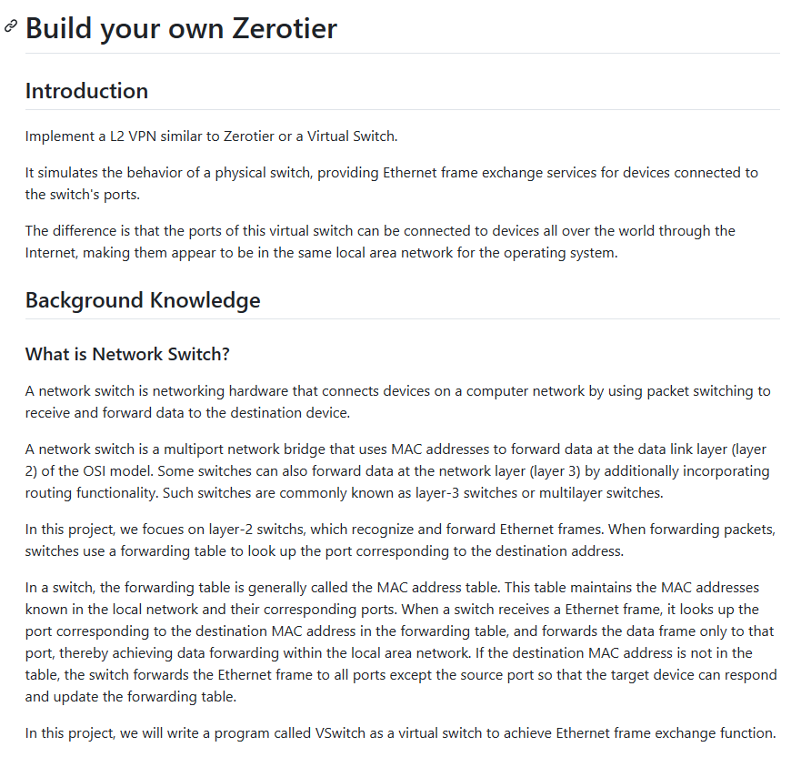

**Source:** [https://twitter.com/i/web/status/1870838148789633295](https://twitter.com/i/web/status/1870838148789633295)
**Original Post Date:** 2025-07-15 12:05:48

# Building a Layer 2 Virtual Switch: A Deep Dive into VSswitch Implementation

## Introduction
This document provides an in-depth guide on building a virtual switch (VSswitch), which simulates the behavior of a physical Layer 2 (L2) network switch. The goal is to create a software-based implementation that connects devices across the Internet, making them appear as if they are on the same local area network (LAN). This guide covers the basics of network switching, the importance of the forwarding table (MAC address table), and the technical aspects of implementing a Layer 2 VPN similar to Zerotier.

## Introduction

The objective of this document is to implement a Layer 2 (L2) Virtual Private Network (VPN) similar to Zerotier or a virtual switch. The goal is to create a virtual switch that can connect devices across the Internet, making them appear as if they are on the same local area network (LAN) from the perspective of the operating system.

The main subject of this document is the development of a virtual switch (VS), which is a software-based implementation of a Layer 2 (L2) Virtual Private Network (VPN). The goal is to create a virtual switch that can connect devices across the Internet, making them appear as if they are on the same local area network (LAN) from the perspective of the operating system.

> **Note/Tip:** The virtual switch simulates the behavior of a physical switch by providing Ethernet frame exchange services for devices connected to its ports.

> **Note/Tip:** Unlike a physical switch, the ports of this virtual switch can connect to devices located anywhere in the world via the Internet, making them appear to be on the same local network.

## Background Knowledge

A network switch is a networking hardware device that connects devices on a computer network using packet switching (Layer 2 of the OSI model). It forwards data frames based on MAC addresses at the data link layer (Layer 2) and can also forward data at the network layer (Layer 3) in some cases (multilayer switches).

The document focuses on Layer 2 switches, which recognize and forward Ethernet frames based on MAC addresses.

## Forwarding Table (MAC Address Table)

The forwarding table (also called the MAC address table) is a key component of a switch. It maintains a mapping of MAC addresses to the corresponding switch ports.

When a switch receives an Ethernet frame, it looks up the destination MAC address in the forwarding table. If the MAC address is found, the frame is forwarded only to the port associated with that MAC address. If the MAC address is not found, the frame is flooded to all ports except the source port.

The switch dynamically updates the forwarding table as it learns new MAC addresses from incoming frames.

## Project Overview

The document describes the development of a program called VSswitch. The purpose of this program is to act as a virtual switch to achieve Ethernet frame exchange functionality.

The implementation will focus on simulating the behavior of a Layer 2 switch, including maintaining a forwarding table and forwarding Ethernet frames based on MAC addresses.

## Technical Details

The switch operates at the data link layer (Layer 2) of the OSI model. It uses MAC addresses to forward Ethernet frames.

The forwarding table maintains a mapping of MAC addresses to switch ports and dynamically updates as the switch learns new MAC addresses from incoming frames.

If the destination MAC address is in the forwarding table, the frame is forwarded only to the corresponding port. If the destination MAC address is not in the table, the frame is flooded to all ports except the source port.

The virtual switch (VSswitch) is a software implementation of a switch that simulates the behavior of a physical switch. It is designed to connect devices across the Internet, making them appear to be on the same local network.

## Visual Structure

The document is formatted with clear headings and subheadings for organization.

The text is written in a technical and instructional style, aimed at readers familiar with networking concepts.

There are no images or diagrams in the visible portion of the document.

## Summary

This document provides an introduction to building a virtual switch (VSswitch) that simulates the behavior of a physical Layer 2 switch.

It covers the basics of network switching, the importance of the forwarding table (MAC address table), and the project's goal of creating a software-based switch to enable Ethernet frame exchange across the Internet.

The focus is on implementing a Layer 2 VPN similar to Zerotier, emphasizing the technical aspects of switch operation and frame forwarding.

## Key Takeaways

- A virtual switch (VSswitch) simulates the behavior of a physical Layer 2 network switch.
- The forwarding table (MAC address table) is crucial for efficient frame forwarding in a switch.
- The virtual switch connects devices across the Internet, making them appear as if they are on the same local network.
- The implementation focuses on simulating Layer 2 switch behavior, including maintaining a forwarding table and forwarding Ethernet frames based on MAC addresses.

## Conclusion
In conclusion, building a virtual switch (VSswitch) involves understanding the basics of network switching, the role of the forwarding table, and the technical aspects of implementing a Layer 2 VPN. The goal is to create a software-based solution that connects devices across the Internet, simulating the behavior of a physical switch.

## External References

- [Zerotier Documentation](https://zerotier.com/docs/)
- [OSI Model Explanation](https://en.wikipedia.org/wiki/OSI_model)

## Media

**Image Description:** The image is a screenshot of a document or webpage titled **"Build your own Zerotier"**. The content is structured into sections, with the main focus being on building a virtual switch (VS) that simulates the behavior of a physical network switch. Below is a detailed breakdown of the content:

---

### **Main Subject**
The main subject of the document is the development of a **virtual switch (VS)**, which is a software-based implementation of a Layer 2 (L2) Virtual Private Network (VPN) similar to **Zerotier**. The goal is to create a virtual switch that can connect devices across the Internet, making them appear as if they are on the same local area network (LAN) from the perspective of the operating system.

---

### **Sections and Content**

#### **1. Introduction**
- **Objective**: The document aims to implement a Layer 2 (L2) VPN similar to Zerotier or a virtual switch.
- **Functionality**: The virtual switch simulates the behavior of a physical switch by providing Ethernet frame exchange services for devices connected to its ports.
- **Key Difference**: Unlike a physical switch, the ports of this virtual switch can connect to devices located anywhere in the world via the Internet, making them appear to be on the same local network.

#### **2. Background Knowledge**
- **What is a Network Switch?**
  - A network switch is a networking hardware device that connects devices on a computer network using packet switching (Layer 2 of the OSI model).
  - It forwards data frames based on MAC addresses at the data link layer (Layer 2) and can also forward data at the network layer (Layer 3) in some cases (multilayer switches).
  - The document focuses on **Layer 2 switches**, which recognize and forward Ethernet frames based on MAC addresses.

#### **3. Forwarding Table (MAC Address Table)**
- **Function**: The forwarding table (also called the MAC address table) is a key component of a switch. It maintains a mapping of MAC addresses to the corresponding switch ports.
- **Operation**:
  - When a switch receives an Ethernet frame, it looks up the destination MAC address in the forwarding table.
  - If the MAC address is found, the frame is forwarded only to the port associated with that MAC address.
  - If the MAC address is not found, the frame is flooded to all ports except the source port.
  - The switch dynamically updates the forwarding table as it learns new MAC addresses.

#### **4. Project Overview**
- **Program Name**: The document describes the development of a program called **VSswitch**.
- **Purpose**: The program will act as a virtual switch to achieve Ethernet frame exchange functionality.
- **Focus**: The implementation will focus on simulating the behavior of a Layer 2 switch, including maintaining a forwarding table and forwarding Ethernet frames based on MAC addresses.

---

### **Technical Details**
1. **Layer 2 (L2) Switching**:
   - The switch operates at the data link layer (Layer 2) of the OSI model.
   - It uses MAC addresses to forward Ethernet frames.

2. **Forwarding Table (MAC Address Table)**:
   - Maintains a mapping of MAC addresses to switch ports.
   - Dynamically updates as the switch learns new MAC addresses from incoming frames.

3. **Frame Forwarding**:
   - If the destination MAC address is in the forwarding table, the frame is forwarded only to the corresponding port.
   - If the destination MAC address is not in the table, the frame is flooded to all ports except the source port.

4. **Virtual Switch (VSswitch)**:
   - A software implementation of a switch that simulates the behavior of a physical switch.
   - Designed to connect devices across the Internet, making them appear to be on the same local network.

---

### **Visual Structure**
- The document is formatted with clear headings and subheadings for organization.
- The text is written in a technical and instructional style, aimed at readers familiar with networking concepts.
- There are no images or diagrams in the visible portion of the document.

---

### **Summary**
The document provides an introduction to building a virtual switch (VSswitch) that simulates the behavior of a physical Layer 2 switch. It covers the basics of network switching, the importance of the forwarding table (MAC address table), and the project's goal of creating a software-based switch to enable Ethernet frame exchange across the Internet. The focus is on implementing a Layer 2 VPN similar to Zerotier, emphasizing the technical aspects of switch operation and frame forwarding. 

---

If you need further clarification or additional details, feel free to ask!
