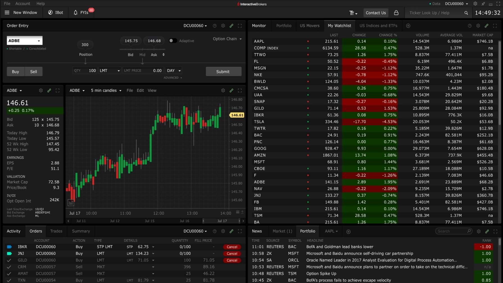

**Source:** [https://twitter.com/i/web/status/1878851674132865404](https://twitter.com/i/web/status/1878851674132865404)
**Original Post Date:** 2025-06-17 09:23:45

# Interactive Brokers (IBKR) Trading Platform Interface: Technical Analysis & Implementation Insights

## Introduction
The Interactive Brokers platform represents a sophisticated trading environment that combines real-time market data processing with advanced order execution capabilities. This technical deep dive explores the system's architecture, key components, and implementation considerations critical for developers working on financial software applications.

## Order Management System Architecture

The platform implements a multi-tiered order management system with real-time price synchronization. The Order Entry Section demonstrates three distinct order types: STP LMT (Stop Limit), LMT (Limit), and MKT (Market) orders, each serving different trading strategies.

Order lifecycle management is handled through state transitions (pending, executed, cancelled). For the ADBE stock example (STP LMT order at 62.75 for 100 shares), the system tracks bid-ask spreads and market conditions to determine execution.

_Basic order class structure demonstrating core components and state management._

```python
class Order:
    def __init__(self, symbol: str, quantity: int, order_type: str, limit_price: float):
        self.symbol = symbol
        self.quantity = quantity
        self.order_type = order_type
        self.limit_price = limit_price
        self.status = 'pending'
        self.price = None
```

> **Note/Tip:** Always validate bid-ask spreads before submitting orders to prevent slippage.

> **Note/Tip:** Implement robust error handling for rejected or expired orders.

## Real-Time Market Data Processing

The platform's market data layer processes streaming updates using a publish-subscribe pattern. The Candlestick Chart component aggregates price and volume data in 5-minute intervals, with color coding (green/red) indicating trend direction.

Market Monitor provides comprehensive overview of multiple securities through columns like Last Price, % Change, and Volume. Color coding enhances visual interpretation: green for positive movement, red for negative.

```python
# Sample market data handler
from datetime import datetime
class MarketDataHandler:
    def process_candle(self, symbol: str, price_data: dict):
        timestamp = datetime.now()
        volume = price_data['volume']
        self.store_market_event(symbol, timestamp, volume)
```

- Implement WebSocket connections for real-time data streaming.
- Use time-series databases for historical chart data storage.
- Apply volume-weighted moving averages for trend analysis.

## News Integration and Event Handling

The News Feed component integrates real-time updates from trusted sources (Reuters, Seeking Alpha). Each news item is tagged with corresponding stock symbols for automated sentiment analysis.

Event-driven architecture processes news feeds to trigger alert systems or adjust trading parameters based on market-moving information.

> **Note/Tip:** Implement rate limiting for news API calls.

> **Note/Tip:** Use natural language processing for real-time sentiment scoring of news articles.

## Key Takeaways

- Order management requires robust state tracking and validation mechanisms.
- Real-time data processing demands efficient event handling and storage solutions.
- Integration with external services (news, market data) should follow asynchronous patterns.
- Visual components must balance information density with usability.

## Conclusion
Understanding the architecture of trading platforms like IBKR is essential for developing reliable financial software. Key considerations include real-time data processing, order management reliability, and integration with multiple external services. Proper implementation requires careful attention to performance optimization, error handling, and user experience design.

## External References

- [Interactive Brokers API Documentation](https://interactivebrokers.github.io/tws-api/)
- [Market Data Integration Best Practices](https://www.interactivebrokers.com/en/index.php?f=3012)


## Media

**Image Description:** The image shows a trading platform interface, specifically from **Interactive Brokers (IBKR)**, displaying a detailed view of stock market data, order entry, and portfolio monitoring. Below is a detailed breakdown of the image:

---

### **Main Sections of the Interface**

#### **1. Order Entry Section (Top Left)**
- **Symbol**: `ADBE` (Adobe Inc.)
- **Order Details**:
  - **Quantity**: 100 shares
  - **Order Type**: `STP LMT` (Stop Limit Order)
  - **Limit Price**: 62.75
  - **Action**: Buy
- **Position Information**:
  - **Current Price**: 146.61
  - **Bid**: 125 x 145.75
  - **Ask**: 10 x 146.68
- **Order Status**:
  - The order is set up but not yet submitted.

#### **2. Candlestick Chart (Center Left)**
- **Symbol**: `ADBE`
- **Timeframe**: 5-minute candles
- **Key Observations**:
  - The chart shows a **bullish trend** with green candles dominating, indicating price increases.
  - The current price is **146.61**, up by **+0.25** or **0.17%**.
  - The chart covers a time range from **July 17, 10:00 AM to 2:00 PM**.
  - **Volume**: The volume bar at the bottom shows trading activity, with higher volume during price increases.

#### **3. Market Monitor (Right Side)**
- **Ticker List**: Displays a list of popular stocks and indices.
- **Columns**:
  - **Symbol**: Includes stocks like `AAPL`, `COMP INDEX`, `TSLA`, `MSFT`, etc.
  - **Last Price**: Current price of each stock.
  - **Change**: Price change since the last trading day.
  - **% Change**: Percentage change.
  - **Volume**: Trading volume.
  - **Average Volume**: Average daily trading volume.
  - **Market Cap**: Market capitalization of the stock.
- **Color Coding**:
  - **Green**: Indicates positive price movement.
  - **Red**: Indicates negative price movement.
- **Highlighted Stocks**:
  - `AAPL` (Apple Inc.) is highlighted with a green background, showing a positive change of **+0.10%**.
  - `TSLA` (Tesla Inc.) is highlighted in red, showing a negative change of **-4.53%**.

#### **4. News Feed (Bottom Right)**
- **Headlines**:
  - Real-time news updates related to stocks.
  - Example:
    - **BAC (Bank of America)**: News about BofA and Goldman Sachs leading banks lower.
    - **MSFT (Microsoft)**: News about Microsoft and Baidu announcing a partnership.
- **Source**: Reuters, SA (Seeking Alpha), etc.
- **Symbol**: Corresponding stock symbols for each news item.

#### **5. Portfolio and Orders (Bottom Left)**
- **Portfolio Overview**:
  - Displays accounts and trades.
  - **Account**: `DCU00060` and `DCU00057` are shown.
- **Orders**:
  - Multiple orders are listed, including:
    - Buy orders for `JNJ`, `GLD`, `CRM`, etc.
    - Sell orders for `CRM`.
  - Order types include `STP LMT`, `LMT`, and `MKT`.
- **Summary**:
  - Provides a summary of account activity, including trades and orders.

#### **6. Toolbar and Menus**
- **Top Menu**:
  - Options like `New Window`, `IBOT`, `FYI`, and other tools.
- **Tabs**:
  - `Monitor`, `Portfolio`, `US Movers`, `My Watchlist`, etc.
- **Time**: The current time displayed is **14:49:32**.

---

### **Technical Details**
1. **Order Types**:
   - **STP LMT**: Stop Limit Order (triggers when the price reaches a certain level and executes at a specified limit price).
   - **LMT**: Limit Order (executes at a specified price or better).
   - **MKT**: Market Order (executes at the current market price).

2. **Candlestick Chart**:
   - **Green Candles**: Indicate periods where the closing price was higher than the opening price.
   - **Red Candles**: Indicate periods where the closing price was lower than the opening price.
   - **Volume Bars**: Represent trading volume at the bottom of the chart.

3. **Market Data**:
   - **Bid/Ask**: The highest price a buyer is willing to pay (bid) and the lowest price a seller is willing to accept (ask).
   - **Last Price**: The most recent trade price.
   - **Change**: Absolute and percentage change from the previous close.

4. **News Integration**:
   - Real-time news feeds from sources like Reuters and Seeking Alpha are integrated into the platform.

---

### **Overall Observations**
- The platform is designed for advanced trading, offering real-time market data, order execution, and news updates.
- The user is actively monitoring `ADBE` and has placed multiple orders for different stocks.
- The interface is highly customizable, with multiple tabs and sections for monitoring portfolios, orders, and market movements.

This setup is typical for professional traders or investors who require detailed market analysis and real-time data for decision-making.
