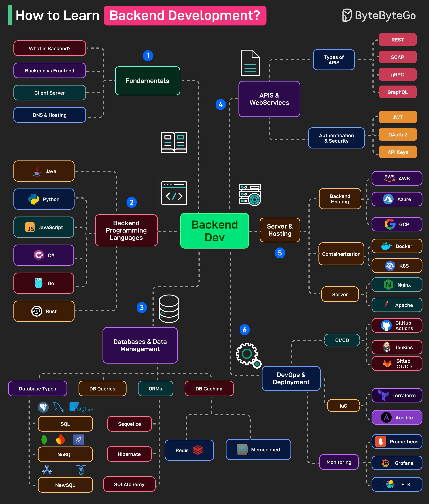

**Source:** [https://twitter.com/i/web/status/1929752914937196744](https://twitter.com/i/web/status/1929752914937196744)
**Original Post Date:** 2025-06-17 10:45:18

# Mastering Backend Development: A Comprehensive Guide to Technologies and Practices

## Introduction
Backend development forms the server-side infrastructure of modern web applications. This comprehensive guide navigates through essential concepts, technologies, and tools required to master backend development. From understanding fundamental architectural principles to implementing scalable solutions using various programming languages, databases, APIs, and deployment strategies, this resource provides a structured learning path for developers at all levels.

## Backend Fundamentals

Backend development encompasses server-side logic, database management, API creation, and business operations. It's crucial to understand how backend interacts with frontend components through client-server communication.

The Domain Name System (DNS) translates domain names into IP addresses, while hosting services provide the infrastructure needed for deploying applications.

- Backend processes user requests and manages application logic
- Handles database interactions and business rules enforcement
- Provides secure APIs for client-side communication

> **Note/Tip:** Always consider security implications in API design and data handling

## Programming Languages & Frameworks

Each backend language offers unique advantages: Java for enterprise solutions, Python for rapid development, JavaScript/Node.js for full-stack capabilities, C# for Microsoft ecosystem integration, Go for high performance, and Rust for systems programming.

_Basic REST API implementation using Python and Flask_

```python
# Flask API Example
from flask import Flask, jsonify
app = Flask(__name__)

@app.route('/api/data', methods=['GET'])
def get_data():
    return jsonify({'message': 'Hello from backend'})
```

## Database Management

Choose between SQL databases (MySQL, PostgreSQL) for structured data or NoSQL solutions (MongoDB) for unstructured data. ORMs like SQLAlchemy can simplify database interactions.

1. Select appropriate DBMS based on use case requirements
1. Implement caching strategies using Redis/Memcached
1. Use connection pooling to optimize performance

## APIs & Web Services

RESTful APIs are the standard for backend services. Implement authentication using JWT tokens and ensure secure data transmission.

```javascript
// Express.js REST API
app.get('/api/users', authenticateToken, (req, res) => {
  const users = await db.getUsers();
  res.json(users);
});
```

## DevOps & Deployment

Implement CI/CD pipelines using GitHub Actions or Jenkins. Use Infrastructure as Code with Terraform to manage cloud resources.

- Deploy applications on AWS, Azure, or GCP
- Use Docker for containerization and Kubernetes for orchestration
- Implement monitoring using Prometheus and Grafana

## Key Takeaways

- Master core backend concepts before diving into specific technologies
- Choose the right programming language based on project requirements
- Implement robust database design with proper indexing and normalization
- Use RESTful practices for API development and ensure security

## External References

- [ByteByteGo Backend Development Series](https://www.bytebytego.com/categories/backend-development)
- [AWS Cloud Documentation](https://aws.amazon.com/documentation/)


## Media

**Image Description:** ### Image Description: "How to Learn Backend Development"

The image is a comprehensive flowchart or mind map titled **"How to Learn Backend Development"**, designed to guide learners through the essential concepts, technologies, and tools required for mastering backend development. The layout is structured in a hierarchical and interconnected manner, with various sections and sub-sections linked by arrows and lines to illustrate the flow of learning. The background is dark, and the text and elements are color-coded for clarity and organization.

---

### **Main Sections and Details**

#### **1. Fundamentals**
- **What is Backend?**
  - Explains the basic concept of backend development, distinguishing it from frontend development.
- **Backend vs Frontend**
  - Highlights the differences between backend and frontend development, emphasizing their roles in web applications.
- **Client-Server**
  - Introduces the client-server model, a fundamental concept in backend development.
- **DNS & Hosting**
  - Covers Domain Name System (DNS) and hosting services, which are crucial for deploying backend applications.

#### **2. Backend Programming Languages**
- **Java**
  - A widely-used language for backend development, known for its robustness and scalability.
- **Python**
  - Popular for its simplicity and extensive libraries, often used in web development and data science.
- **JavaScript**
  - Commonly used for both frontend and backend development, especially with frameworks like Node.js.
- **C#**
  - A versatile language used in backend development, particularly in Microsoft ecosystems.
- **Go**
  - Known for its efficiency and concurrency, often used in building scalable web services.
- **Rust**
  - A modern language with a focus on performance and safety, gaining popularity in systems programming.

#### **3. Databases & Data Management**
- **Database Types**
  - Categorizes databases into SQL (relational) and NoSQL (non-relational) types.
- **DB Queries**
  - Focuses on writing and optimizing database queries using SQL.
- **ORMs (Object-Relational Mappers)**
  - Tools like Sequelize (for JavaScript), Hibernate (for Java), and SQLAlchemy (for Python) are mentioned.
- **DB Caching**
  - Techniques for improving database performance using caching systems like Redis and Memcached.
- **Database Examples**
  - Specific database systems are listed, including SQLite, MySQL, PostgreSQL, MongoDB, and others.

#### **4. APIs & Web Services**
- **Types of APIs**
  - Includes REST, SOAP, gRPC, GraphQL, and more, highlighting different API architectures.
- **Authentication & Security**
  - Covers authentication mechanisms like JWT (JSON Web Tokens), OAuth 2.0, and API Keys.
- **API Development**
  - Focuses on designing and implementing APIs for backend services.

#### **5. Server Hosting & Deployment**
- **Backend Hosting**
  - Cloud providers like AWS, Azure, and GCP are listed as popular hosting options.
- **Containerization**
  - Tools like Docker and Kubernetes (K8s) are highlighted for containerizing applications.
- **Server**
  - Traditional server technologies like Nginx and Apache are mentioned for web serving.

#### **6. DevOps & Deployment**
- **CI/CD (Continuous Integration/Continuous Deployment)**
  - Tools like GitHub Actions, Jenkins, and GitLab CI are listed for automating the development pipeline.
- **IaC (Infrastructure as Code)**
  - Tools like Terraform and Ansible are mentioned for managing infrastructure.
- **Monitoring**
  - Tools like Prometheus and Grafana are listed for monitoring application performance.
- **ELK Stack**
  - Elasticsearch, Logstash, and Kibana are mentioned for logging and analytics.

---

### **Visual Elements**
- **Color Coding**: 
  - Different sections are color-coded for easy differentiation:
    - **Fundamentals**: Green
    - **Backend Programming Languages**: Red
    - **Databases & Data Management**: Purple
    - **APIs & Web Services**: Blue
    - **Server Hosting & Deployment**: Orange
    - **DevOps & Deployment**: Teal
- **Icons**: 
  - Various icons are used to represent concepts, such as a server, database, code, and cloud.
- **Arrows and Lines**: 
  - Arrows and dashed lines connect different sections, illustrating the flow of learning and dependencies between topics.

---

### **Additional Notes**
- The image is part of a series or resource from **ByteByteGo**, as indicated by the logo in the top-right corner.
- The layout is highly organized, making it easy for learners to follow a structured path from foundational concepts to advanced topics.
- The inclusion of specific tools and technologies provides a practical roadmap for developers looking to build real-world backend applications.

---

### **Overall Purpose**
The image serves as a comprehensive guide for anyone interested in learning backend development, breaking down the subject into manageable sections and highlighting key technologies and tools at each stage. It is both educational and practical, catering to beginners and intermediate learners alike.
