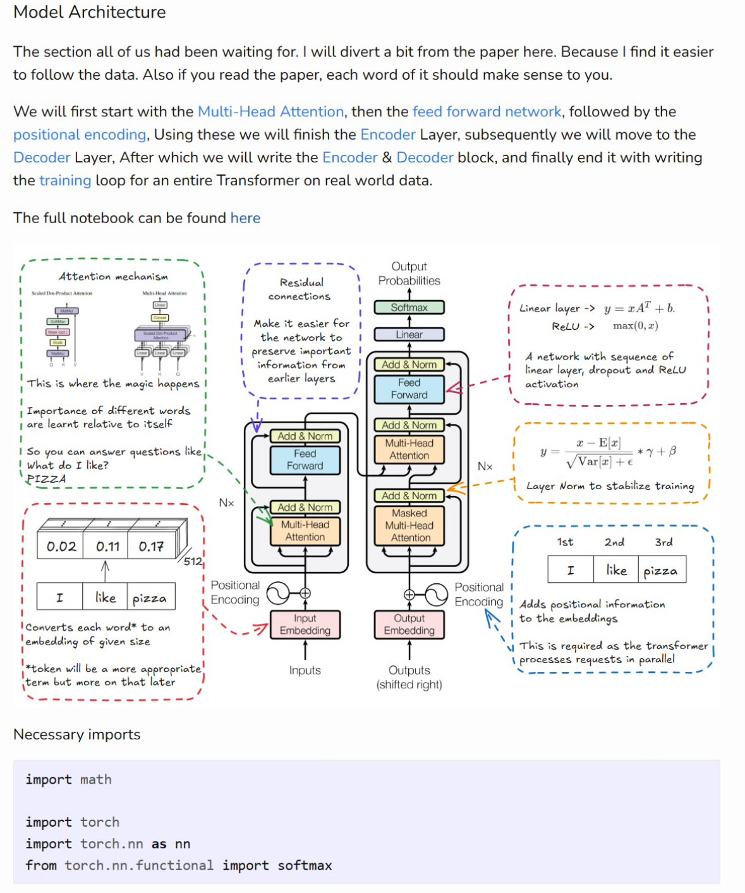

**Source:** [https://twitter.com/i/web/status/1875306553286471871](https://twitter.com/i/web/status/1875306553286471871)
**Original Post Date:** 2025-06-17 12:12:54

# Transformers Explained: Understanding the Core Components of Modern NLP Models

## Introduction
The Transformer architecture has revolutionized natural language processing by introducing a novel approach to sequence modeling. This comprehensive guide explores the core components of Transformers in detail, focusing on their implementation and mathematical foundations.

We'll examine each component's role in the model's data flow, from token embeddings through encoder-decoder layers, while providing code implementations for key concepts.

## Attention Mechanism

The Scaled Dot-Product Attention forms the foundation of the Transformer architecture. It calculates attention scores by computing dot products between query and key vectors, scaled by the square root of the embedding dimension.

Multi-Head Attention extends this concept by running multiple attention operations in parallel, each capturing different aspects of the input sequence.

_Implementation of the scaled dot-product attention mechanism_

```python
def scaled_dot_product_attention(query, key, value):
    scores = torch.matmul(query, key.transpose(-2, -1))
    scaled_scores = scores / math.sqrt(key.size(-1))
    attention_weights = softmax(scaled_scores, dim=-1)
    return torch.matmul(attention_weights, value)
```

1. Calculate query-key pairs using matrix multiplication
1. Scale scores by square root of embedding dimension
1. Apply softmax to get attention weights
1. Multiply weights with value vectors for final output

> **Note/Tip:** The scaling factor prevents gradients from becoming too small in deeper networks

## Positional Encoding

Since Transformers lack inherent sequence information, positional encoding is crucial. It adds sinusoidal functions to embeddings to indicate word positions.

The encoding uses sine and cosine functions of different frequencies for even and odd dimensions respectively.

```python
def get_positional_encoding(pos, d_model):
    pe = torch.zeros(1, d_model)
    for i in range(d_model // 2):
        angle = pos / math.pow(10000, (2*i)/d_model)
        pe[0, 2*i] = math.sin(angle)
        pe[0, 2*i+1] = math.cos(angle)
    return pe
```

## Encoder and Decoder Layers

The encoder processes input sequences through multiple layers of self-attention and feed-forward networks.

Decoders incorporate masked attention to prevent future information leakage during training.

- Encoder uses self-attention over input tokens
- Decoder combines encoder outputs with target embeddings
- Residual connections and layer normalization stabilize training

## Implementation Requirements

The architecture requires specific PyTorch imports for implementation:

```python
import math
import torch
import torch.nn as nn
from torch.nn.functional import softmax
```

## Key Takeaways

- Multi-head attention enables parallel processing of different feature spaces in the input sequence
- Positional encoding preserves sequential information using sinusoidal functions
- Residual connections and layer normalization are crucial for training stability
- Masked attention prevents decoder from accessing future tokens during training

## Conclusion
Understanding these components is essential for implementing and customizing Transformer models. The combination of self-attention, positional encoding, and residual connections forms the backbone of modern NLP architectures.

## External References

- [Attention Is All You Need](https://arxiv.org/abs/1706.03762)


## Media

**Image Description:** The image is a detailed diagram and explanation of the **Transformer model architecture**, a popular neural network architecture widely used in natural language processing (NLP) tasks. The diagram is structured to provide a comprehensive overview of the key components and their interactions, along with some technical details. Below is a detailed breakdown:

---

### **Main Title and Introduction**
- **Title**: "Model Architecture"
- The text introduces the section as the focal point of the discussion, emphasizing that it will follow the data flow through the Transformer model. It mentions that the explanation will diverge slightly from the original paper to make it easier to follow.
- The text outlines the sequence of components that will be covered:
  1. **Multi-Head Attention**
  2. **Feed-Forward Network**
  3. **Positional Encoding**
  4. **Encoder Layer**
  5. **Decoder Layer**
  6. **Encoder & Decoder Block**
  7. **Training Loop**

---

### **Diagram Overview**
The diagram is divided into several sections, each highlighting a specific component of the Transformer architecture. The sections are interconnected to show the flow of data through the model.

#### **1. Attention Mechanism**
- **Description**: This section explains the **Scaled Dot-Product Attention** and **Multi-Head Attention** mechanisms.
  - **Scaled Dot-Product Attention**: A fundamental attention mechanism that computes attention scores between query, key, and value vectors.
  - **Multi-Head Attention**: A parallelized version of the attention mechanism, where multiple attention heads are used to capture different aspects of the input.
- **Visual Representation**:
  - A flowchart showing the computation of attention scores, scaled by the square root of the embedding dimension.
  - The output is a weighted sum of the value vectors, where the weights are the normalized attention scores.

#### **2. Residual Connections and Add & Norm**
- **Description**: This section highlights the importance of **residual connections** and **layer normalization**.
  - **Residual Connections**: These allow the model to preserve information from earlier layers, making it easier for the network to learn and preventing the vanishing gradient problem.
  - **Add & Norm**: After the attention or feed-forward layers, the output is added to the input (residual connection) and then normalized using **Layer Normalization**.
- **Visual Representation**:
  - A flowchart showing the addition of the input to the output of the attention or feed-forward layer, followed by normalization.

#### **3. Feed-Forward Network**
- **Description**: This section explains the **feed-forward network**, which consists of two linear layers with a ReLU activation function in between.
  - The first linear layer projects the input to a higher-dimensional space.
  - The ReLU activation introduces non-linearity.
  - The second linear layer projects the output back to the original dimension.
- **Visual Representation**:
  - A flowchart showing the sequence of operations: linear layer → ReLU → linear layer.

#### **4. Positional Encoding**
- **Description**: This section explains how **positional encoding** is used to provide positional information to the model, as the Transformer does not have inherent knowledge of word order.
  - The positional encoding is added to the token embeddings to indicate their position in the sequence.
  - The encoding is computed using sine and cosine functions of different frequencies, which allows the model to learn relative positions.
- **Visual Representation**:
  - A flowchart showing the addition of positional encoding to the token embeddings.
  - A formula is provided for the positional encoding:
    \[
    PE_{(pos, 2i)} = \sin\left(\frac{pos}{10000^{2i/d_{\text{model}}}}\right)
    \]
    \[
    PE_{(pos, 2i+1)} = \cos\left(\frac{pos}{10000^{2i/d_{\text{model}}}}\right)
    \]
  - An example sequence is shown: "I like pizza," with positional encoding added to each token.

#### **5. Encoder Layer**
- **Description**: This section outlines the structure of the **Encoder Layer**, which consists of:
  1. **Multi-Head Attention** (self-attention over the input sequence).
  2. **Residual Connection** and **Layer Normalization** after the attention layer.
  3. **Feed-Forward Network** with residual connection and layer normalization.
- **Visual Representation**:
  - A flowchart showing the sequence of operations in the Encoder Layer:
    - Input → Multi-Head Attention → Add & Norm → Feed-Forward → Add & Norm → Output.

#### **6. Decoder Layer**
- **Description**: This section explains the **Decoder Layer**, which is similar to the Encoder Layer but includes an additional **Masked Multi-Head Attention** layer to prevent the model from looking at future tokens during training.
  - The Decoder Layer consists of:
    1. **Masked Multi-Head Attention** (to ensure the model only attends to previous tokens).
    2. **Residual Connection** and **Layer Normalization**.
    3. **Multi-Head Attention** (to attend to the Encoder's output).
    4. **Residual Connection** and **Layer Normalization**.
    5. **Feed-Forward Network** with residual connection and layer normalization.
- **Visual Representation**:
  - A flowchart showing the sequence of operations in the Decoder Layer:
    - Input → Masked Multi-Head Attention → Add & Norm → Multi-Head Attention → Add & Norm → Feed-Forward → Add & Norm → Output.

#### **7. Encoder & Decoder Block**
- **Description**: This section ties together the Encoder and Decoder Layers to form the complete Transformer model.
  - The Encoder processes the input sequence and produces a context vector.
  - The Decoder uses this context vector along with its own input to generate the output sequence.
- **Visual Representation**:
  - A flowchart showing the interaction between the Encoder and Decoder Layers.

#### **8. Training Loop**
- **Description**: This section briefly mentions the training loop for the Transformer model, which involves optimizing the model parameters using backpropagation and a loss function.
- **Visual Representation**: Not explicitly shown in the diagram but mentioned in the text.

---

### **Additional Notes**
- **Token Embeddings**: The diagram explains that tokens are converted into embeddings of a given size (e.g., 512 dimensions).
- **Layer Normalization**: The formula for Layer Normalization is provided:
  \[
  y = \frac{x - \mathbb{E}[x]}{\sqrt{\text{Var}[x] + \epsilon}} * \gamma + \beta
  \]
  - This helps stabilize training by normalizing the inputs to each layer.
- **Residual Connections**: These are emphasized as crucial for maintaining information flow and enabling deeper networks.

---

### **Necessary Imports**
At the bottom of the image, there is a section listing the necessary Python imports for implementing the Transformer model:
```python
import math
import torch
import torch.nn as nn
from torch.nn.functional import softmax
```

---

### **Overall Structure**
The diagram is highly detailed and structured to provide a clear understanding of the Transformer architecture. It uses a combination of text, flowcharts, and mathematical formulas to explain each component. The flow of data is emphasized, making it easier to follow the model's operation from input to output.

---

### **Key Technical Details**
1. **Multi-Head Attention**: Parallel attention heads to capture different aspects of the input.
2. **Residual Connections**: Add & Norm to preserve information and stabilize training.
3. **Positional Encoding**: Sine and cosine functions to encode positional information.
4. **Layer Normalization**: Formula provided to normalize inputs.
5. **Feed-Forward Network**: Two linear layers with ReLU activation.
6. **Masked Multi-Head Attention**: Prevents the Decoder from looking at future tokens.

This image serves as an excellent resource for understanding the Transformer model's architecture and its key components.
