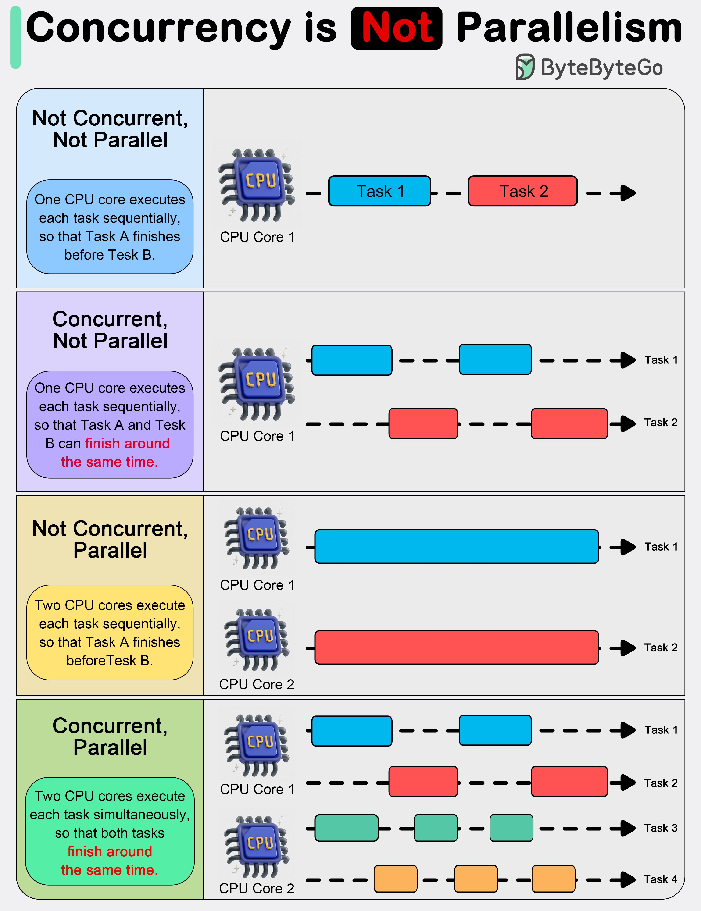

Concurrency and parallelism are two related but distinct concepts in software engineering that aim to improve system performance by maximizing CPU utilization. While often used interchangeably, they have different implications for system design and implementation. This entry delves into the definitions, importance, and differences between concurrency and parallelism, providing insights into how they contribute to optimal system performance.

## Technical Content
### Concurrency
Concurrency refers to the ability of multiple tasks or processes to be executed simultaneously, sharing resources such as CPU time, memory, or I/O devices. This does not necessarily mean that these tasks are executing at the same instant but rather that their execution can overlap in time. Concurrency is essential for improving system responsiveness and throughput by ensuring that no single task monopolizes system resources.

#### Example: Concurrent Execution
Consider a web server handling multiple client requests concurrently. Each request is processed as a separate task, allowing the server to handle numerous requests simultaneously without blocking. This concurrency improves the server's responsiveness and ability to handle a high volume of requests.

### Not Concurrent, Not Parallel
In scenarios where tasks are executed one after the other without any overlap in time, neither concurrency nor parallelism is achieved. This sequential execution can lead to underutilization of system resources and decreased performance.

#### Illustration: Sequential Execution
A simple diagram showing Task A being completed before Task B starts illustrates this scenario. There's no overlap or sharing of resources between tasks, resulting in inefficient use of system capabilities.

### Concurrent, Not Parallel
Concurrency without parallelism occurs when multiple tasks are executed using shared resources but not simultaneously due to limitations such as synchronization issues or resource constraints. This scenario highlights that concurrency does not automatically imply parallel execution.

#### Example: Task Sharing a Resource
Imagine two database queries being executed concurrently on the same connection. While they share the resource (the database connection), their execution might be serialized due to transactional consistency requirements, preventing true parallel execution.

### Parallelism
Parallelism is the ability to perform multiple tasks simultaneously using separate resources or threads. This achieves true concurrent execution and significantly improves system performance by fully utilizing available processing power.

#### Importance of Parallelism
Parallelism is crucial for applications that require high computational throughput, such as scientific simulations, data analytics, and machine learning model training. By executing tasks in parallel, these applications can achieve significant speedups compared to sequential execution.

### Concurrency is Not Parallelism
The distinction between concurrency and parallelism is critical because achieving concurrency does not guarantee parallel execution. Synchronization issues, resource sharing, and other constraints can prevent tasks from running truly in parallel even when they are concurrent.

#### Example: Concurrent Tasks with Synchronization
Consider two tasks that need to access a shared data structure concurrently. Even though these tasks execute within the same time frame (concurrently), synchronization mechanisms (like locks) might enforce their execution sequentially to maintain data integrity, thereby preventing parallelism.

## Key Takeaways and Best Practices
- **Understand the Difference**: Recognize that concurrency refers to overlapping execution of tasks, while parallelism requires simultaneous execution using separate resources.
- **Assess Resource Constraints**: Evaluate the limitations imposed by shared resources and synchronization needs when designing concurrent systems.
- **Optimize for Parallelism**: Where possible, design systems to take advantage of true parallel execution to maximize performance benefits.
- **Monitor and Adjust**: Continuously monitor system performance under various loads and adjust concurrency and parallelism strategies as needed.

## References
This entry has discussed concepts related to software engineering and performance optimization without referencing specific tools or technologies. However, for practical implementation, developers can explore programming models like POSIX threads (pthreads) for C/C++, Java Concurrency Utilities, or Python's asyncio library, among others, which provide mechanisms for achieving concurrency and parallelism in software applications.

By grasping the nuances between concurrency and parallelism and applying best practices in system design, developers can create more efficient, scalable, and responsive software systems.
## Source

- Original Tweet: [https://twitter.com/i/web/status/1891170983114875313](https://twitter.com/i/web/status/1891170983114875313)
- Date: 2025-02-20 17:02:29

## Media

### Media 1

**Description:** The image presents a comprehensive overview of concurrency concepts, focusing on parallelism and its limitations. It illustrates various scenarios where concurrency is not parallelism, providing a clear visual representation to help readers understand these complex concepts.

* **Concurrency**
	+ Definition: The ability of multiple tasks or processes to be executed simultaneously.
	+ Importance: Concurrency is essential for improving system performance by maximizing CPU utilization.
* **Not Concurrent, Not Parallel**
	+ Description: A scenario where two tasks are executed one after the other without any overlap in time.
	+ Illustration: A simple diagram showing a single task being performed sequentially, with no concurrent execution.
* **Concurrent, Not Parallel**
	+ Description: A scenario where multiple tasks are executed simultaneously using a shared resource or thread.
	+ Illustration: A diagram depicting two tasks sharing a common thread, illustrating the concept of concurrency without parallelism.
* **Parallelism**
	+ Definition: The ability to perform multiple tasks simultaneously using separate resources or threads.
	+ Importance: Parallelism is crucial for achieving true concurrent execution and improving system performance.
* **Concurrency is Not Parallelism**
	+ Description: An explanation of why concurrency does not necessarily imply parallelism, highlighting the need for careful resource management.
	+ Illustration: A diagram showing how two tasks can be executed concurrently using a shared resource, but not in parallel due to synchronization issues.

In summary, the image effectively communicates the distinction between concurrency and parallelism, emphasizing that concurrency alone is insufficient to achieve true parallel execution. By illustrating different scenarios and highlighting their limitations, the image provides valuable insights into the complexities of concurrent programming and the importance of proper resource management for optimal system performance.

*Last updated: 2025-02-20 17:02:29*