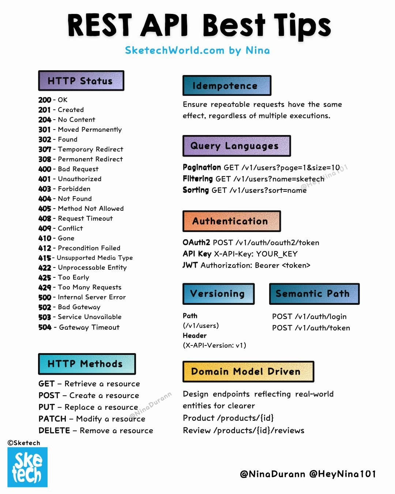

**Source:** [https://twitter.com/i/web/status/1878309179439616041](https://twitter.com/i/web/status/1878309179439616041)
**Original Post Date:** 2025-07-12 21:45:24

# REST API Best Practices: Comprehensive Guide to Designing Efficient APIs

## Introduction
Designing efficient and scalable RESTful APIs requires adherence to best practices that ensure consistency, security, and performance. This guide covers key concepts such as HTTP status codes, idempotency, query parameters for filtering and sorting, authentication mechanisms like OAuth2 and JWT, HTTP methods, versioning strategies, semantic paths, and domain model-driven design. These principles are crucial for building robust APIs that meet modern development standards.

## HTTP Status Codes

HTTP status codes are essential indicators of the success or failure of an API request. They are categorized into groups such as 2xx (success), 3xx (redirection), 4xx (client errors), and 5xx (server errors). Understanding these codes helps in diagnosing issues and ensuring proper communication between client and server.

For example, a 200 status code indicates a successful request, while a 404 indicates that the requested resource was not found. Other important codes include 201 (Created), 301 (Moved Permanently), 401 (Unauthorized), and 500 (Internal Server Error).

- 2xx - Success: 200 OK, 201 Created, 204 No Content
- 3xx - Redirection: 301 Moved Permanently, 302 Found, 307 Temporary Redirect, 308 Permanent Redirect
- 4xx - Client Errors: 400 Bad Request, 401 Unauthorized, 403 Forbidden, 404 Not Found, 405 Method Not Allowed, 408 Request Timeout, 409 Conflict, 410 Gone, 412 Precondition Failed, 415 Unsupported Media Type, 422 Unprocessable Entity, 425 Too Early, 429 Too Many Requests
- 5xx - Server Errors: 500 Internal Server Error, 502 Bad Gateway, 503 Service Unavailable, 504 Gateway Timeout

> **Note/Tip:** Always use the appropriate HTTP status code to convey the exact state of the request.

> **Note/Tip:** Client errors (4xx) should be handled gracefully on the client side with user-friendly messages.

## Idempotency

Idempotency is a critical principle in REST APIs, ensuring that repeatable requests have the same effect regardless of how many times they are executed. This consistency is essential for maintaining data integrity and user experience.

For example, if a client sends multiple POST requests to create a resource, idempotency ensures that only one instance of the resource is created, even if the request is sent multiple times.

> **Note/Tip:** Design your API endpoints to be idempotent where possible.

> **Note/Tip:** Use unique identifiers or tokens for requests that need to be idempotent.

## Query Languages

Query parameters are powerful tools for filtering, sorting, and paginating data in REST APIs. They allow clients to retrieve specific subsets of data efficiently.

For example, you can use query parameters like `page`, `size`, `name`, and `sort` to implement pagination, filtering, and sorting respectively.

- Pagination: GET /v1/users?page=1&size=10
- Filtering: GET /v1/users?name=sketech
- Sorting: GET /v1/users?sort=name

> **Note/Tip:** Always validate and sanitize query parameters to prevent injection attacks.

> **Note/Tip:** Document the available query parameters for each endpoint.

## Authentication

Authentication mechanisms are crucial for securing REST APIs. Common methods include OAuth2, API keys, and JSON Web Tokens (JWT). Each method has its own strengths and use cases.

For example, OAuth2 is ideal for delegating authentication to third-party providers, while JWT is useful for stateless authentication.

- OAuth2: POST /v1/auth/oauth2/token
- API Key: X-API-Key: YOUR_KEY
- JWT (JSON Web Token): Authorization: Bearer <token>

> **Note/Tip:** Always use HTTPS to protect authentication credentials in transit.

> **Note/Tip:** Implement proper token expiration and refresh mechanisms.

## HTTP Methods

HTTP methods define the action to be performed on a resource. The most common methods are GET (retrieve), POST (create), PUT (replace), PATCH (modify), and DELETE (remove). Understanding these methods is essential for designing RESTful APIs.

For example, use GET to retrieve a resource, POST to create it, PUT to replace it, PATCH to modify specific fields, and DELETE to remove it.

- GET: Retrieve a resource
- POST: Create a resource
- PUT: Replace a resource
- PATCH: Modify a resource
- DELETE: Remove a resource

> **Note/Tip:** Use the appropriate HTTP method for each operation to ensure consistency and predictability.

> **Note/Tip:** Document the expected behavior of each HTTP method for your API endpoints.

## Versioning

API versioning is essential for managing changes over time. Common strategies include header-based versioning (e.g., X-API-Version: v1) and path-based versioning (e.g., /v1/users). Each approach has its own advantages and trade-offs.

For example, path-based versioning is more explicit and easier to document, while header-based versioning allows for more flexibility in changing the API without breaking clients.

- Header Versioning: X-API-Version: v1
- Path Versioning: /v1/users

> **Note/Tip:** Choose a versioning strategy that best fits your use case and development workflow.

> **Note/Tip:** Communicate version changes clearly to API consumers.

## Semantic Path

Semantic paths are essential for designing intuitive and discoverable RESTful APIs. They should reflect real-world entities and relationships, making the API easier to understand and use.

For example, /products/{id}/reviews associates reviews with a specific product, while /v1/auth/login handles user authentication.

- Login: POST /v1/auth/login
- Token: POST /v1/auth/token
- Product: POST /v1/products/{id}
- Review: POST /v1/products/{id}/reviews

> **Note/Tip:** Use nouns for resources and verbs for actions in your API paths.

> **Note/Tip:** Keep paths as short and intuitive as possible.

## Domain Model-Driven Design

Designing API endpoints that reflect real-world entities is crucial for clarity and usability. This approach, known as domain model-driven design, ensures that the API aligns with business logic and user expectations.

For example, associating reviews with products through /products/{id}/reviews makes it clear that reviews belong to specific products.

> **Note/Tip:** Map your API endpoints to real-world entities and relationships.

> **Note/Tip:** Document the domain model to help API consumers understand the structure of your data.

## Key Takeaways

- Understand and use appropriate HTTP status codes for accurate request state communication.
- Ensure idempotency in API endpoints to maintain data integrity and user experience.
- Implement query parameters effectively for filtering, sorting, and pagination.
- Secure your API using robust authentication mechanisms like OAuth2 and JWT.
- Use the correct HTTP methods (GET, POST, PUT, PATCH, DELETE) for each operation.
- Choose a suitable versioning strategy to manage API changes over time.
- Design semantic paths that reflect real-world entities and relationships.
- Adopt domain model-driven design to align your API with business logic.

## Conclusion
By adhering to these best practices, you can design RESTful APIs that are efficient, scalable, secure, and user-friendly. Always document your API thoroughly and communicate changes clearly to ensure a smooth experience for both developers and end-users.

## Media

**Image Description:** The image is a detailed infographic titled **"REST API Best Tips Tips"**, created by **Nina** and hosted on **SketechTechWorld.com**. It provides a comprehensive overview of best practices and key concepts related to RESTful API design. The infographic is visually organized into several sections, each highlighting a specific aspect of REST API development. Below is a detailed breakdown of the content:

---

### **1. HTTP Status Codes**
- **Section Title:** HTTP Status
- **Description:** This section lists common HTTP status codes and their meanings, categorized into different groups:
  - **2xx - Success:**
    - 200 - OK
    - 201 - Created
    - 204 - No Content
  - **3xx - Redirection:**
    - 301 - Moved Permanently
    - 302 - Found
    - 307 - Temporary Redirect
    - 308 - Permanent Redirect
  - **4xx - Client Errors:**
    - 400 - Bad Request
    - 401 - Unauthorized
    - 403 - Forbidden
    - 404 - Not Found
    - 405 - Method Not Allowed
    - 408 - Request Timeout
    - 409 - Conflict
    - 410 - Gone
    - 412 - Precondition Failed
    - 415 - Unsupported Media Type
    - 422 - Unprocessable Entity
    - 425 - Too Early
    - 429 - Too Many Requests
  - **5xx - Server Errors:**
    - 500 - Internal Server Error
    - 502 - Bad Gateway
    - 503 - Service Unavailable
    - 504 - Gateway Timeout

---

### **2. Idempotency**
- **Section Title:** Idempotence
- **Description:** This section explains the concept of idempotency in REST APIs. It states that repeatable requests should have the same effect, regardless of how many times they are executed. This is a critical principle for ensuring consistency in API behavior.

---

### **3. Query Languages**
- **Section Title:** Query Languages
- **Description:** This section outlines how to use query parameters for filtering, sorting, and pagination in REST APIs:
  - **Pagination:** `GET /v1/users?page=1&size=10`
  - **Filtering:** `GET /v1/users?name=sketech`
  - **Sorting:** `GET /v1/users?sort=name`

---

### **4. Authentication**
- **Section Title:** Authentication
- **Description:** This section covers various authentication mechanisms used in REST APIs:
  - **OAuth2:** `POST /v1/auth/oauth2/token`
  - **API Key:** `X-API-Key: YOUR_KEY`
  - **JWT (JSON Web Token):** `Authorization: Bearer <token>`

---

### **5. HTTP Methods**
- **Section Title:** HTTP Methods
- **Description:** This section lists the common HTTP methods and their purposes:
  - **GET:** Retrieve a resource
  - **POST:** Create a resource
  - **PUT:** Replace a resource
  - **PATCH:** Modify a resource
  - **DELETE:** Remove a resource

---

### **6. Versioning**
- **Section Title:** Versioning
- **Description:** This section explains how to version APIs using headers or paths:
  - **Header Versioning:** `X-API-Version: v1`
  - **Path Versioning:** `/v1/users`

---

### **7. Semantic Path**
- **Section Title:** Semantic Path
- **Description:** This section provides examples of RESTful API endpoints with semantic paths:
  - **Login:** `POST /v1/auth/login`
  - **Token:** `POST /v1/auth/token`
  - **Product:** `POST /v1/products/{id}`
  - **Review:** `POST /v1/products/{id}/reviews`

---

### **8. Domain Model-Driven Design**
- **Section Title:** Domain Model-Driven
- **Description:** This section emphasizes designing API endpoints that reflect real-world entities for clarity:
  - Example: `/products/{id}/reviews` for associating reviews with products.

---

### **Visual Design**
- The infographic uses a clean, organized layout with distinct sections separated by colored headers.
- Each section is visually distinct, with headers in different colors (e.g., purple, blue, orange, yellow) to make the content easy to scan.
- The text is concise and uses bullet points and examples to convey information effectively.
- The overall design is minimalistic, with a focus on readability and clarity.

---

### **Footer and Branding**
- The infographic includes branding elements:
  - **Logo:** "SkeTech" in the bottom-left corner.
  - **Social Media Handles:** `@NinaDurann` and `@HeyNina101` in the bottom-right corner.
  - **Website:** `SketechTechWorld.com` at the top.

---

### **Purpose**
The infographic serves as a quick reference guide for developers working with RESTful APIs. It covers essential concepts such as HTTP status codes, idempotency, query parameters, authentication, HTTP methods, versioning, semantic paths, and domain-driven design. The visual organization and concise explanations make it a valuable resource for both beginners and experienced developers.

---

This detailed breakdown ensures that the image's content is fully captured and explained in a structured manner.
