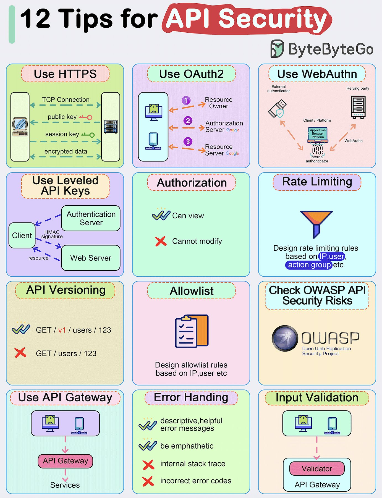

API security is a critical aspect of software engineering, as it ensures the protection of sensitive data and prevents unauthorized access to application programming interfaces (APIs). In this article, we will explore 12 essential tips for securing your APIs, including the use of HTTPS, OAuth2, WebAuthn, and more.

## Technical Content
### 1. Use HTTPS
Hypertext Transfer Protocol Secure (HTTPS) is a must-have for any API. It encrypts data in transit, preventing eavesdropping and tampering attacks. To implement HTTPS, obtain an SSL/TLS certificate from a trusted Certificate Authority (CA) and configure your server to use it.

### 2. Use OAuth2
OAuth2 is an industry-standard authorization framework that enables secure delegation of access to APIs. It provides a robust mechanism for clients to request access tokens, which can be used to authenticate and authorize API requests.

### 3. Use WebAuthn
WebAuthn is a web authentication protocol that provides strong, phishing-resistant authentication. It allows users to register and authenticate with their devices, providing an additional layer of security for APIs.

### 4. Use Leveled API Keys
Leveled API keys provide a fine-grained access control mechanism, enabling administrators to assign different levels of access to clients based on their roles or permissions. This helps prevent unauthorized access to sensitive data and functionality.

### 5. Authorization
Authorization is the process of determining whether a client has the necessary permissions to access an API. Implement role-based access control (RBAC) or attribute-based access control (ABAC) to ensure that only authorized clients can access your APIs.

### 6. Rate Limiting
Rate limiting helps prevent brute-force attacks, denial-of-service (DoS) attacks, and other types of abuse. Set rate limits on API requests based on client IP addresses, user IDs, or other identifying factors.

### 7. API Versioning
API versioning enables you to manage changes to your APIs over time, ensuring that clients can continue to access older versions while you introduce new features or updates. Use techniques like URI-based versioning or header-based versioning to implement API versioning.

### 8. Whitelisting
Whitelisting involves specifying a list of trusted clients or IP addresses that are allowed to access your APIs. This helps prevent unauthorized access and reduces the attack surface of your APIs.

### 9. Check OWASP API Security Risks
The Open Web Application Security Project (OWASP) provides a comprehensive guide to API security risks. Regularly review the OWASP API Security Top 10 list to identify potential vulnerabilities in your APIs.

### 10. Use API Gateway
An API gateway acts as an entry point for clients to access your APIs, providing features like authentication, rate limiting, and caching. Use an API gateway to simplify API management and improve security.

### 11. Error Handling
Proper error handling is essential for maintaining the security and integrity of your APIs. Implement robust error handling mechanisms that provide informative error messages without revealing sensitive information.

### 12. Input Validation
Input validation helps prevent attacks like SQL injection, cross-site scripting (XSS), and command injection. Validate all input data to ensure it conforms to expected formats and ranges.

## Key Takeaways and Best Practices
* Implement HTTPS to encrypt data in transit
* Use OAuth2 for authorization and WebAuthn for authentication
* Leveled API keys provide fine-grained access control
* Rate limiting prevents brute-force attacks and abuse
* API versioning ensures backward compatibility
* Whitelisting restricts access to trusted clients or IP addresses
* Regularly review OWASP API Security Risks to identify vulnerabilities

## References
* [OWASP API Security Top 10](https://owasp.org/www-project-api-security/)
* [OAuth2 Specification](https://tools.ietf.org/html/rfc6749)
* [WebAuthn Specification](https://w3c.github.io/webauthn/)
* [ByteByteGo Blog](https://blog.bytebytego.com/)
## Source

- Original Tweet: [https://twitter.com/i/web/status/1884479345584136603](https://twitter.com/i/web/status/1884479345584136603)
- Date: 2025-02-24 12:23:18

## Media

### Media 1

**Description:** The infographic, titled "12 Tips for API Security," presents a comprehensive guide to securing APIs. The title is prominently displayed at the top of the image, with the ByteByteGo logo situated in the upper right-hand corner.

The infographic is divided into 12 rectangular boxes, each containing a distinct tip for API security. These tips are organized in three rows of four boxes and include:

* Using HTTPS
* Utilizing OAuth2
* Leveraging WebAuthn
* Implementing rate limiting
* Checking OWASP API Security Risks
* Validating input data

Each box features a unique color scheme, with the first row consisting of green, purple, pink, and light blue. The second row is composed of yellow, mint green, dark blue, and orange, while the third row consists of peach, brown, and pale green.

The infographic provides a concise and visually appealing overview of API security best practices, making it an effective resource for individuals seeking to enhance their knowledge in this area.

*Last updated: 2025-02-24 12:23:18*