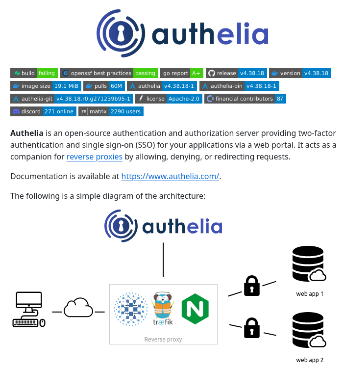

# Auth Server

## Description
Open-source auth and SSO server...

## Content
Open-source auth and SSO server

## Category Information

- Main Category: software_engineering
- Sub Category: security
- Item Name: auth_server

## Source

- Original Tweet: [https://twitter.com/i/web/status/1878731182965248452](https://twitter.com/i/web/status/1878731182965248452)
- Date: 2025-02-20 15:36:34

## Media

### Media 1

**Description:** The infographic is an advertisement for Authelia, a two-factor authentication tool. The image features a white background with black text and various icons.

* **Authelia logo**: 
	+ Located at the top of the page
	+ Blue color scheme
	+ Features a stylized letter "A" made up of small circles
* **Color-coded table**:
	+ Lists various programming languages used in Authelia's development
	+ Languages include Java, Python, and Go
	+ Each language is represented by a different colored bar
* **Description of Authelia**:
	+ Briefly describes what Authelia does
	+ States that it is an open-source authentication tool
* **Key features**:
	+ Two-factor authentication
	+ Single sign-on (SSO) capabilities
	+ Support for multiple protocols, including OAuth and OpenID Connect
* **Benefits of using Authelia**:
	+ Improved security through two-factor authentication
	+ Convenience of single sign-on
	+ Flexibility in supporting multiple protocols
* **Call to action**:
	+ Encourages viewers to learn more about Authelia by visiting its website

Overall, the infographic effectively communicates the key features and benefits of Authelia, making it an attractive option for those looking for a robust authentication solution.

*Last updated: 2025-02-20 15:36:34*