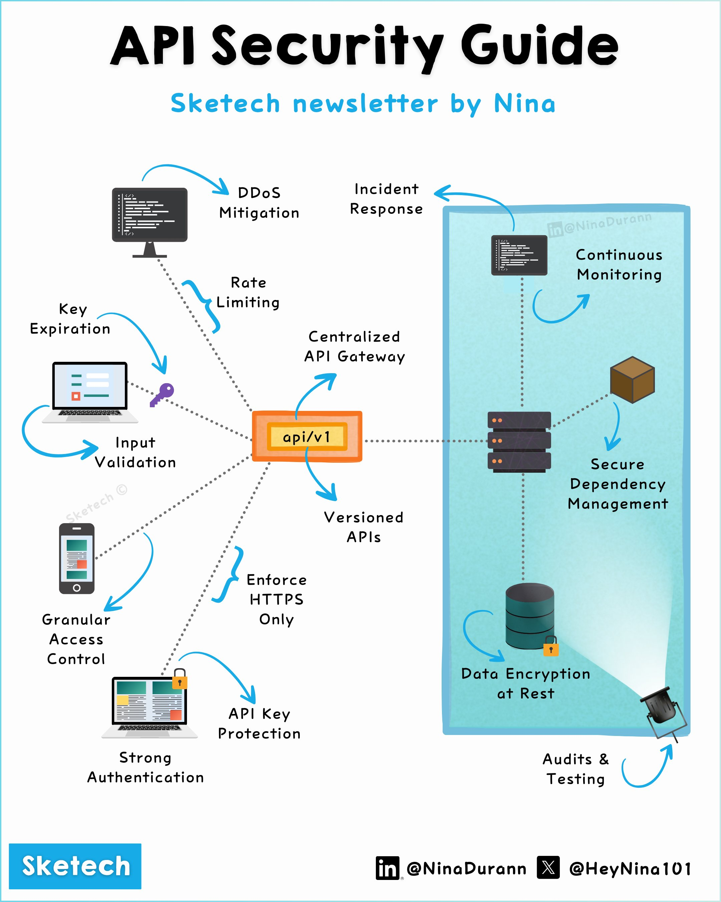

### Description

This comprehensive guide provides a detailed checklist of best practices for securing your Application Programming Interfaces (APIs). It covers essential aspects of API security, including authentication and authorization, data protection, traffic management, monitoring, dependency management, API versioning, development security, and incident response.

### Technical Content

#### 1. Authentication & Authorization

To ensure that only authorized entities access your APIs, implement the following:

* **OpenID Connect and OAuth 2.0**: Use standardized protocols for authentication and authorization.
* **Access Control**: Apply Role-Based Access Control (RBAC) or Attribute-Based Access Control (ABAC) to restrict access to sensitive resources.
* **API Keys**: Store API keys securely using secrets managers, such as HashiCorp's Vault or AWS Secrets Manager.
* **Token Rotation**: Automate token expiration and revocation to minimize the impact of compromised tokens.

Example: Use OAuth 2.0 with JWT (JSON Web Tokens) to authenticate and authorize users. When a user requests access to a protected resource, verify their identity using an authentication server and issue a JWT token that contains their claims (e.g., username, role).

#### 2. Data Protection

Protect sensitive data at rest and in transit by implementing:

* **Data Encryption**: Use encryption algorithms like AES (Advanced Encryption Standard) to protect data stored in databases or files.
* **HTTPS**: Enforce Hypertext Transfer Protocol Secure (HTTPS) with HSTS (HTTP Strict Transport Security) to encrypt data in transit.
* **Input Validation**: Validate user input to prevent SQL injection and cross-site scripting (XSS) attacks.
* **Key Rotation**: Automate key updates to minimize the impact of compromised keys.

Example: Use a web application firewall (WAF) like AWS WAF or Cloudflare to detect and prevent common web attacks, such as SQL injection and XSS.

#### 3. Traffic Management

Ensure stable API performance by implementing:

* **Rate Limiting**: Control request frequency to prevent abuse.
* **DDoS Mitigation**: Use Web Application Firewalls (WAFs) like AWS WAF or Cloudflare to protect against Distributed Denial-of-Service (DDoS) attacks.
* **API Gateway**: Centralize routing using API gateways like AWS API Gateway or Google Cloud Endpoints.
* **Timeouts**: Avoid resource exhaustion by setting timeouts for requests.

Example: Use a rate limiting algorithm like the token bucket algorithm to limit the number of requests from a single IP address within a certain time frame.

#### 4. Monitoring

Detect and respond to security threats in real-time by implementing:

* **Continuous Monitoring**: Use monitoring tools like Prometheus or Datadog to collect metrics and logs.
* **Audit Trails**: Log anomalies and security-related events.
* **Alerts**: Detect traffic spikes and unusual activity using alerting tools like PagerDuty or Splunk.

Example: Use a Security Information and Event Management (SIEM) system like Splunk or ELK Stack to collect, monitor, and analyze security-related data from various sources.

#### 5. Dependency Management

Reduce dependency-related risks by:

* **Updating Libraries**: Regularly update dependencies to ensure you have the latest security patches.
* **Secure Configs**: Enforce security policies using configuration management tools like Ansible or Terraform.
* **Secrets Management**: Avoid hardcoding credentials and use secrets managers instead.

Example: Use a dependency management tool like npm (Node Package Manager) or pip (Python Package Installer) to keep track of dependencies and update them regularly.

#### 6. API Versioning

Enable seamless version transitions by:

* **Versioned APIs**: Avoid breaking changes by using versioned APIs.
* **Deprecation Policies**: Announce changes early to give consumers time to adapt.

Example: Use a versioning strategy like semantic versioning (e.g., v1.2.3) to indicate major, minor, and patch updates.

#### 7. Development Security

Build secure APIs from the start by:

* **Shift-Left Security**: Integrate security into your Continuous Integration/Continuous Deployment (CI/CD) pipeline.
* **API Testing**: Use tools like OWASP ZAP, Burp Suite, or Postman for penetration testing, vulnerability scanning, and functional validation.

Example: Use a static application security testing (SAST) tool like SonarQube or Veracode to detect vulnerabilities in your codebase.

#### 8. Incident Response

Minimize breach impact by:

* **Playbooks**: Define response plans for common incident scenarios.
* **Drills**: Test readiness using regular drills and exercises.

Example: Use an incident response framework like NIST (National Institute of Standards and Technology) or ISO 27035 to guide your incident response efforts.

### Key Takeaways and Best Practices

1. **Implement authentication and authorization** using standardized protocols like OpenID Connect and OAuth 2.0.
2. **Protect sensitive data** at rest and in transit using encryption, HTTPS, and input validation.
3. **Manage traffic effectively** by implementing rate limiting, DDoS mitigation, and API gateways.
4. **Monitor continuously** using tools like Prometheus or Datadog to detect security threats.
5. **Keep dependencies up-to-date** using dependency management tools like npm or pip.
6. **Use versioned APIs** to enable seamless version transitions.
7. **Integrate security into CI/CD** using shift-left security and API testing tools.
8. **Prepare for incidents** by defining response plans and conducting regular drills.

### References

* [OWASP ZAP](https://www.zaproxy.org/)
* [Burp Suite](https://portswigger.net/burp)
* [Postman](https://www.postman.com/)
* [Prometheus](https://prometheus.io/)
* [Datadog](https://www.datadoghq.com/)
* [NIST Incident Response Framework](https://nvlpubs.nist.gov/nistpubs/SpecialPublications/NIST.SP.800-61r2.pdf)
* [ISO 27035 Incident Response Standard](https://www.iso.org/standard/44435.html)
## Source

- Original Tweet: [https://twitter.com/i/web/status/1872396449209553107](https://twitter.com/i/web/status/1872396449209553107)
- Date: 2025-02-20 21:25:58

## Media

### Media 1

**Description:** The image is a flowchart titled "API Security Guide" and subtitled "Sketech newsletter by Nina." The chart illustrates the various components of API security, including:

*   **DDoS Mitigation**: This section highlights the importance of protecting against Distributed Denial-of-Service (DDoS) attacks, which can overwhelm an application or service with traffic.
*   **Rate Limiting**: This section explains how rate limiting helps prevent abuse by limiting the number of requests that can be made to an API within a certain time frame.
*   **Incident Response**: This section discusses the importance of having a plan in place for responding to security incidents, including identifying and containing the incident, notifying affected parties, and conducting a post-incident review.
*   **Continuous Monitoring**: This section emphasizes the need for continuous monitoring of API traffic and logs to detect potential security threats.
*   **Secure Dependency Management**: This section highlights the importance of managing dependencies securely, including using secure protocols for communication and ensuring that dependencies are up-to-date with the latest security patches.
*   **Data Encryption at Rest**: This section explains how data encryption helps protect sensitive information from unauthorized access, even if an attacker gains access to the underlying infrastructure.
*   **Audits & Testing**: This section discusses the importance of regular audits and testing to identify vulnerabilities and ensure that APIs are secure.

Overall, the flowchart provides a comprehensive overview of the key components of API security, highlighting the importance of each element in ensuring the integrity and confidentiality of sensitive data.

*Last updated: 2025-02-20 21:25:58*