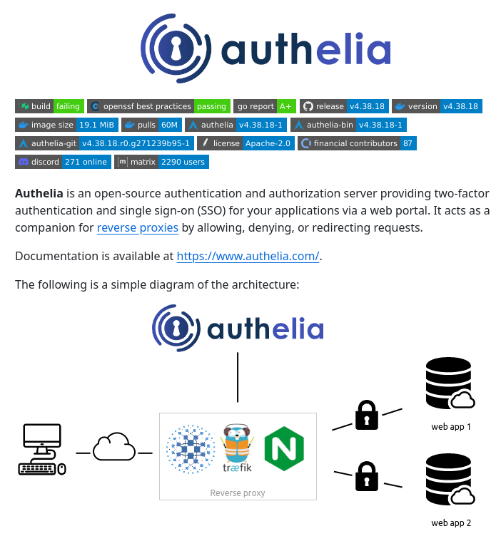

Authelia is an open-source authentication server that provides two-factor authentication and single sign-on (SSO) capabilities, supporting multiple protocols such as OAuth and OpenID Connect.

#### Technical Overview
Authelia is designed to be a robust and flexible authentication solution for applications. At its core, it allows users to authenticate using various methods, including passwords and two-factor authentication. The SSO feature enables users to access multiple applications with a single set of credentials, streamlining the login process and improving user experience.

The development of Authelia involves several programming languages, including:
- Java
- Python
- Go

Each of these languages contributes to different aspects of Authelia's functionality, such as backend logic, API integrations, and frontend interactions. The support for multiple languages reflects Authelia's open-source nature, allowing developers from various backgrounds to contribute and customize the tool according to their needs.

#### Key Features
1. **Two-Factor Authentication**: Enhances security by requiring a second form of verification, in addition to a password, to access applications.
2. **Single Sign-On (SSO)**: Allows users to log in once and access multiple applications without needing to re-enter credentials.
3. **Multi-Protocol Support**: Supports OAuth, OpenID Connect, and other authentication protocols, making it adaptable to different application ecosystems.

#### Benefits
The use of Authelia can significantly improve an application's security posture by implementing robust authentication mechanisms. Additionally, the convenience of SSO enhances user experience, potentially leading to higher adoption rates of secured applications.

#### Examples and Use Cases
- **Secure Web Applications**: Implementing Authelia in web applications to protect user data with two-factor authentication.
- **Microservices Architecture**: Using Authelia as an SSO solution in microservices environments where multiple services require secure authentication.

#### Key Takeaways and Best Practices
1. **Implement Robust Authentication**: Use tools like Authelia to enhance application security through strong authentication practices.
2. **Adopt SSO for Convenience**: Implement SSO to improve user experience across multiple applications, reducing the need for multiple logins.
3. **Stay Updated with Security Patches**: Regularly update Authelia and other security tools to ensure you have the latest security patches.

#### References
- [Authelia Official Website](https://www.authelia.com/)
- OAuth 2.0 Specification: [https://datatracker.ietf.org/doc/html/rfc6749](https://datatracker.ietf.org/doc/html/rfc6749)
- OpenID Connect Specification: [https://openid.net/specs/openid-connect-core-1_0.html](https://openid.net/specs/openid-connect-core-1_0.html)

#### Conclusion
Authelia offers a powerful, open-source solution for authentication and SSO needs. Its flexibility, security features, and support for multiple protocols make it an attractive option for developers looking to secure their applications with robust authentication mechanisms. By following best practices and staying updated with the latest developments in authentication technologies, developers can effectively utilize Authelia to enhance application security and user experience.
## Source

- Original Tweet: [https://twitter.com/i/web/status/1878731182965248452](https://twitter.com/i/web/status/1878731182965248452)
- Date: 2025-02-20 15:51:00

## Media

### Media 1

**Description:** The infographic is an advertisement for Authelia, a two-factor authentication tool. The image features a white background with black text and various icons.

* **Authelia logo**: 
	+ Located at the top of the page
	+ Blue color scheme
	+ Features a stylized letter "A" made up of small circles
* **Color-coded table**:
	+ Lists various programming languages used in Authelia's development
	+ Languages include Java, Python, and Go
	+ Each language is represented by a different colored bar
* **Description of Authelia**:
	+ Briefly describes what Authelia does
	+ States that it is an open-source authentication tool
* **Key features**:
	+ Two-factor authentication
	+ Single sign-on (SSO) capabilities
	+ Support for multiple protocols, including OAuth and OpenID Connect
* **Benefits of using Authelia**:
	+ Improved security through two-factor authentication
	+ Convenience of single sign-on
	+ Flexibility in supporting multiple protocols
* **Call to action**:
	+ Encourages viewers to learn more about Authelia by visiting its website

Overall, the infographic effectively communicates the key features and benefits of Authelia, making it an attractive option for those looking for a robust authentication solution.

*Last updated: 2025-02-20 15:51:00*