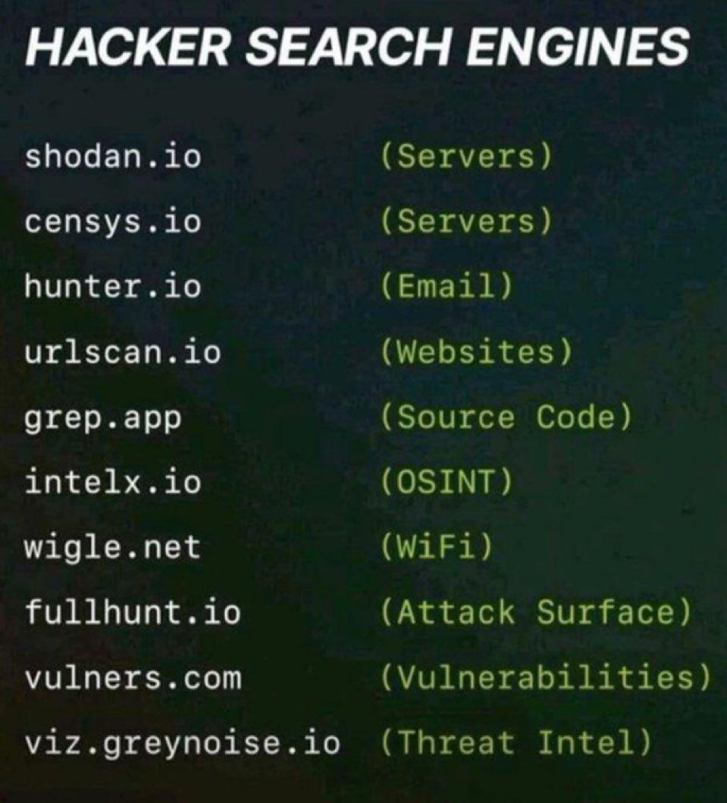

# Hacker Search Engines

## Description
Hacker Search Engines...

## Content
Hacker Search Engines

## Category Information

- Main Category: software_engineering
- Sub Category: security
- Item Name: hacker_search_engines

## Source

- Original Tweet: [https://twitter.com/i/web/status/1878002570192368073](https://twitter.com/i/web/status/1878002570192368073)
- Date: 2025-02-20 15:36:34

## Media

### Media 1

**Description:** The image presents a list of hacker search engines, with the title "HACKER SEARCH ENGINES" at the top. The purpose of the image is to provide a comprehensive overview of various search engines used by hackers.

Here are the key features of the image:

* **List of Search Engines:**
	+ shodan.io
	+ censys.io
	+ hunter.io
	+ urlscan.io
	+ grep.app
	+ intelx.io
	+ wigle.net
	+ fullhunt.io
	+ vulners.com
	+ viz.greynoise.io

The image provides a concise and informative list of hacker search engines, allowing users to quickly access the relevant information. The use of a dark background with white text creates a clean and modern aesthetic, making it easy to read and understand the content. Overall, the image effectively communicates the importance of being aware of these search engines in the context of cybersecurity.

*Last updated: 2025-02-20 15:36:34*