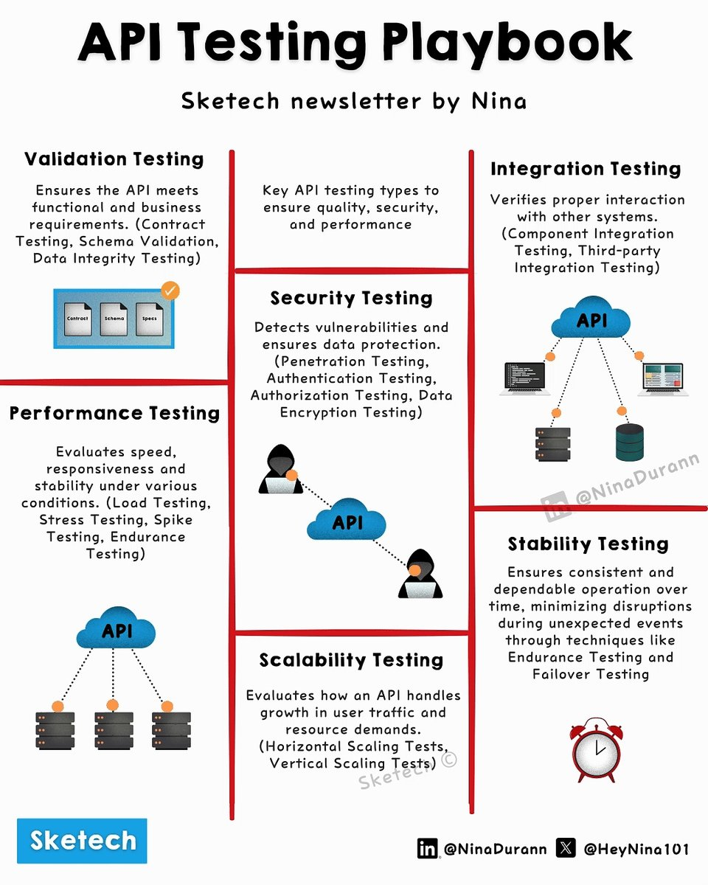

# Api Testing Guide

## Description
API Testing Guide Clearly Explained 

 Validation Testing → Ensures functionality meets requirements (Contract, Schema, Data Integrity Testing).

 Integration Testing → Validates system interactions (...

## Content
API Testing Guide Clearly Explained 

 Validation Testing → Ensures functionality meets requirements (Contract, Schema, Data Integrity Testing).

 Integration Testing → Validates system interactions (Component, Third-party Integration).

 Security Testing → Identifies vulnerabilities (Penetration, Authentication, Authorization, Data Encryption).

 Performance Testing → Measures speed and stability (Load, Stress, Spike, Endurance Testing).

 Stability Testing → Ensures consistent performance (Endurance, Failover Testing).

 Scalability Testing → Assesses scalability (Horizontal, Vertical Scaling).

 Want to see more of these bold, high-energy visuals? Follow 
@HeyNina101
  & 
@SketechWorld

## Category Information

- Main Category: software_engineering
- Sub Category: testing
- Item Name: api_testing_guide

## Source

- Original Tweet: [https://twitter.com/i/web/status/1891767901830472082](https://twitter.com/i/web/status/1891767901830472082)
- Date: 2025-02-20 15:36:34

## Media

### Media 1

**Description:** The infographic, titled "API Testing Playbook," is a comprehensive guide to API testing techniques. It features seven distinct sections, each highlighting a different aspect of API testing.

*   **Validation Testing**: Ensures that APIs meet functional requirements.
    *   Validates contract compliance
    *   Verifies schema validation
    *   Conducts data integrity checks
*   **Performance Testing**: Evaluates an API's ability to handle high traffic and performance demands.
    *   Measures load testing, stress testing, spike testing, and endurance testing
*   **Security Testing**: Identifies vulnerabilities in an API's security posture.
    *   Detects penetration testing, authentication testing, authorization testing, and data encryption testing
*   **Scalability Testing**: Assesses an API's ability to handle increased traffic without compromising performance.
    *   Evaluates horizontal scaling, vertical scaling, and resource allocation
*   **Stability Testing**: Ensures that an API remains stable under various conditions.
    *   Conducts consistent operation testing and minimizes disruptions
*   **Integration Testing**: Verifies that APIs integrate correctly with other systems.
    *   Tests component integration, third-party integration, and system integration
*   **API Testing**: A broad category encompassing all aspects of API testing.

The infographic provides a detailed overview of the various techniques used in API testing, from validation to stability. By understanding these different approaches, developers can ensure that their APIs are robust, secure, and performant.

*Last updated: 2025-02-20 15:36:34*