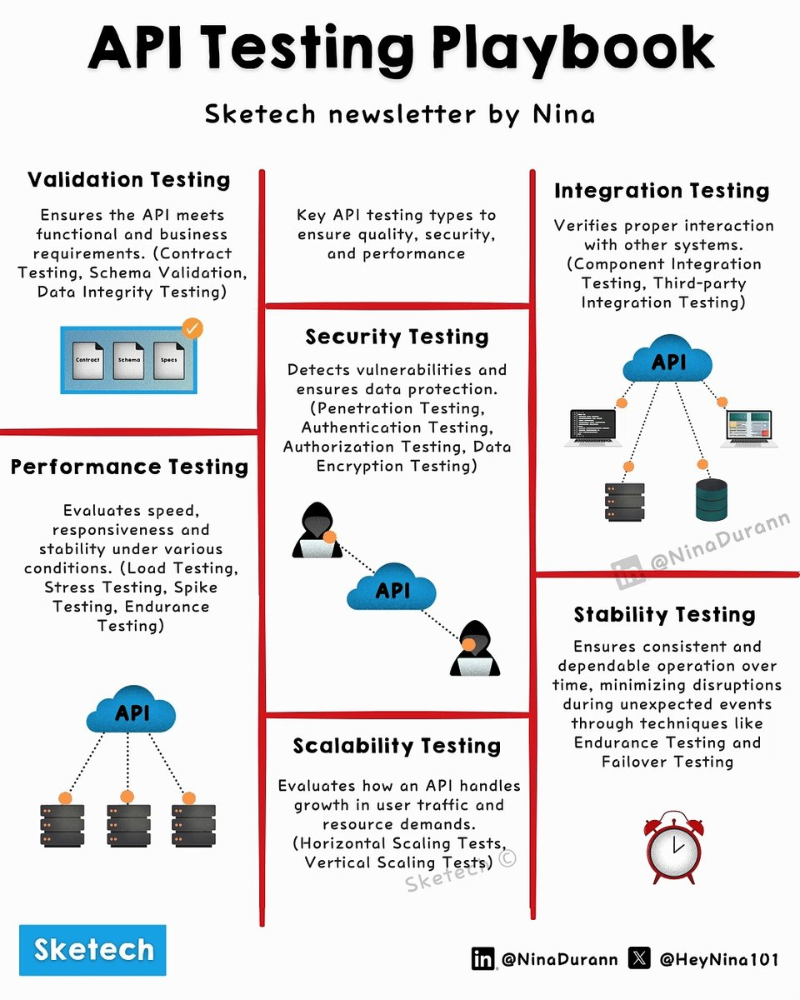

API testing is a critical aspect of software engineering that ensures APIs are robust, secure, and performant. This guide provides a detailed overview of various API testing techniques, including validation testing, integration testing, security testing, performance testing, stability testing, and scalability testing.

#### Technical Content
API testing involves a range of activities designed to validate the functionality, performance, and security of Application Programming Interfaces (APIs). The following sections outline key aspects of API testing:

##### Validation Testing
Validation testing ensures that APIs meet functional requirements. This includes:
* **Contract Compliance**: Verifying that APIs adhere to their defined contracts or specifications.
* **Schema Validation**: Checking that APIs conform to their expected schema or data structure.
* **Data Integrity Checks**: Validating the accuracy and consistency of data exchanged through APIs.

Example: Using tools like Swagger or API Blueprint to define and validate API contracts.

##### Integration Testing
Integration testing verifies that APIs integrate correctly with other systems. This includes:
* **Component Integration**: Testing how individual components within an API interact.
* **Third-party Integration**: Validating integrations with external services or libraries.
* **System Integration**: Ensuring seamless interaction between different subsystems.

Example: Using mock servers to simulate third-party API interactions during testing.

##### Security Testing
Security testing identifies vulnerabilities in an API's security posture. This includes:
* **Penetration Testing**: Simulating attacks on APIs to uncover potential entry points.
* **Authentication Testing**: Verifying that only authorized users can access API resources.
* **Authorization Testing**: Ensuring that users can only perform actions they are permitted to do.
* **Data Encryption Testing**: Validating the encryption of sensitive data in transit and at rest.

Example: Utilizing tools like OWASP ZAP for penetration testing and vulnerability assessment.

##### Performance Testing
Performance testing evaluates an API's ability to handle high traffic and performance demands. This includes:
* **Load Testing**: Measuring how APIs perform under expected usage conditions.
* **Stress Testing**: Pushing APIs beyond their normal operational limits to identify breaking points.
* **Spike Testing**: Simulating sudden, extreme increases in traffic to assess resilience.
* **Endurance Testing**: Ensuring consistent performance over extended periods.

Example: Using Apache JMeter for load testing and identifying performance bottlenecks.

##### Stability Testing
Stability testing ensures that an API remains stable under various conditions. This includes:
* **Consistent Operation Testing**: Verifying that APIs behave predictably across different scenarios.
* **Failover Testing**: Ensuring that backup systems or redundancy mechanisms activate correctly during failures.

Example: Implementing circuit breakers to prevent cascading failures in microservice architectures.

##### Scalability Testing
Scalability testing assesses an API's ability to handle increased traffic without compromising performance. This includes:
* **Horizontal Scaling**: Adding more resources (e.g., servers) to distribute the load.
* **Vertical Scaling**: Increasing the power of existing resources (e.g., upgrading server hardware).
* **Resource Allocation**: Efficiently managing and allocating system resources.

Example: Using cloud services like AWS Auto Scaling for dynamic resource allocation based on demand.

#### Key Takeaways and Best Practices
- **Comprehensive Testing**: Ensure that your testing strategy covers all aspects of API functionality, performance, security, and scalability.
- **Automate Testing**: Leverage automation tools to reduce the burden of repetitive tests and improve test reliability.
- **Continuous Integration/Continuous Deployment (CI/CD)**: Integrate testing into your CI/CD pipeline to catch issues early in the development cycle.
- **Monitor and Analyze Performance**: Use monitoring tools to identify bottlenecks and areas for optimization in production environments.

#### References
- **Tools Mentioned**:
  - Swagger
  - API Blueprint
  - OWASP ZAP
  - Apache JMeter
  - AWS Auto Scaling
- **Technologies**:
  - Microservice Architecture
  - Cloud Computing (AWS)
- **Recommended Reading**:
  - OWASP API Security Top 10
  - API Design Principles (e.g., RESTful APIs)
## Source

- Original Tweet: [https://twitter.com/i/web/status/1891767901830472082](https://twitter.com/i/web/status/1891767901830472082)
- Date: 2025-02-20 16:47:12

## Media

### Media 1

**Description:** The infographic, titled "API Testing Playbook," is a comprehensive guide to API testing techniques. It features seven distinct sections, each highlighting a different aspect of API testing.

*   **Validation Testing**: Ensures that APIs meet functional requirements.
    *   Validates contract compliance
    *   Verifies schema validation
    *   Conducts data integrity checks
*   **Performance Testing**: Evaluates an API's ability to handle high traffic and performance demands.
    *   Measures load testing, stress testing, spike testing, and endurance testing
*   **Security Testing**: Identifies vulnerabilities in an API's security posture.
    *   Detects penetration testing, authentication testing, authorization testing, and data encryption testing
*   **Scalability Testing**: Assesses an API's ability to handle increased traffic without compromising performance.
    *   Evaluates horizontal scaling, vertical scaling, and resource allocation
*   **Stability Testing**: Ensures that an API remains stable under various conditions.
    *   Conducts consistent operation testing and minimizes disruptions
*   **Integration Testing**: Verifies that APIs integrate correctly with other systems.
    *   Tests component integration, third-party integration, and system integration
*   **API Testing**: A broad category encompassing all aspects of API testing.

The infographic provides a detailed overview of the various techniques used in API testing, from validation to stability. By understanding these different approaches, developers can ensure that their APIs are robust, secure, and performant.

*Last updated: 2025-02-20 16:47:12*