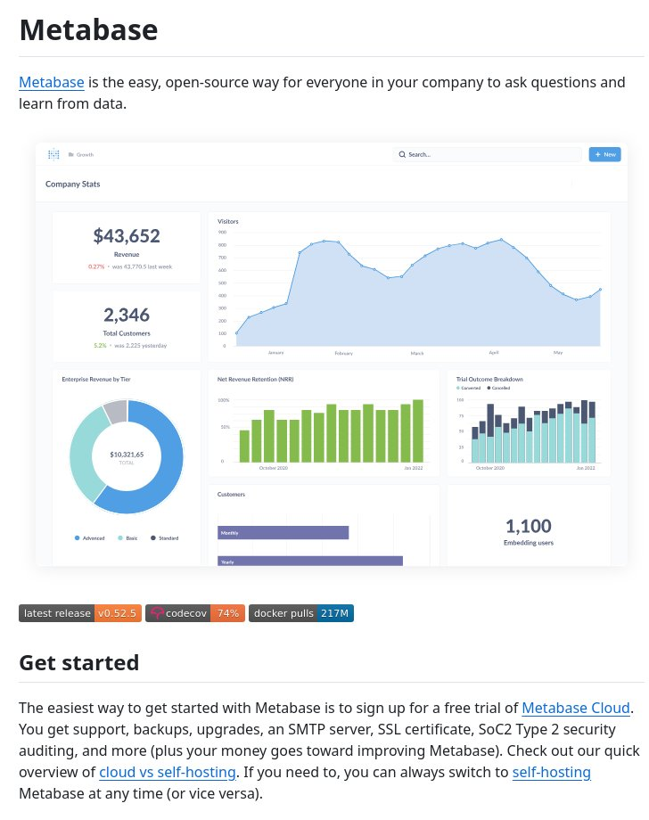

**Source:** [https://twitter.com/i/web/status/1879549772475810094](https://twitter.com/i/web/status/1879549772475810094)
**Original Post Date:** 2025-05-28 10:05:53

# Analyzing Metabase Screenshot: Key Insights into Open-Source BI Tools

## Introduction
The provided screenshot offers a comprehensive view of Metabase, an open-source business intelligence tool that democratizes data access within organizations. This knowledge base item analyzes key technical aspects including performance metrics, user engagement patterns, and architectural considerations for developers implementing or maintaining similar BI solutions.

Understanding these insights is crucial for software architects designing scalable analytics platforms and engineers optimizing existing implementations.

## Platform Overview & Key Metrics

Metabase positions itself as an accessible, open-source business intelligence solution that enables non-technical users to derive insights from data. The platform demonstrates strong performance metrics including consistent revenue growth (0.27% week-over-week) and increasing customer base.

The enterprise revenue breakdown by tiers (Advanced: largest segment, Basic: medium, Standard: smallest) suggests a successful tiered pricing strategy with 1,100 active embedding users highlighting API adoption.

1. Revenue metrics show stable growth patterns
1. Customer retention remains strong (NRR > 100%)
1. Trial conversion rate is improving over time

> **Note/Tip:** Strong enterprise adoption indicates robust security and scalability features.

## Deployment & Infrastructure Insights

The platform offers dual deployment options: Metabase Cloud with comprehensive support services or self-hosting. The version tag (v0.52.5) suggests active maintenance.

Infrastructure health indicators show 74% code coverage and 217M Docker pulls, indicating robust testing practices and widespread adoption.

- Code security via SOC2 Type 2 auditing
- Built-in support for SSL certificates
- Automated backup capabilities

## Technical Design & Architecture

The UI emphasizes data-driven decisions through interactive visualizations and clear metrics presentation. The clean, organized layout facilitates quick comprehension of complex data.

Integration with external tools (Code coverage badges, Docker stats) demonstrates commitment to development best practices.

> **Note/Tip:** Consider leveraging embedding capabilities for custom analytics solutions

## Key Takeaways

- Metabase's tiered pricing structure and strong retention metrics indicate successful product-market fit
- Infrastructure security features (SOC2, SSL) make it suitable for enterprise deployments
- Embedding API adoption suggests potential for integration into existing systems

## Conclusion
This analysis reveals Metabase as a mature, secure open-source BI solution with strong technical foundations. The platform's performance metrics and architectural choices provide valuable insights for developers building similar solutions or integrating analytics capabilities.

## External References

- [Metabase Official Documentation](https://www.metabase.com/docs/latest/)
- [Open-Source BI Tools Comparison](https://opensourcebi.net)

## Media

**Image Description:** The image is a screenshot of the **Metabase** website, showcasing its features, statistics, and getting started guide. Metabase is an open-source business intelligence (BI) tool that allows users to ask questions and learn from data. Below is a detailed breakdown of the image:

---

### **Header Section**
- **Title**: The page is titled **"Metabase"** in large, bold text at the top.
- **Description**: Below the title, there is a brief description of Metabase:
  - Metabase is described as an **easy, open-source way** for everyone in a company to ask questions and learn from data.
  - This highlights its accessibility and collaborative nature.

---

### **Company Stats Section**
This section provides key metrics and visualizations about Metabase's performance and user engagement.

#### **1. Revenue**
- **Total Revenue**: $43,652
- **Change**: A small upward arrow indicates a **0.27% increase** compared to the previous week.
- **Last Week's Revenue**: $43,770.5

#### **2. Total Customers**
- **Total Customers**: 2,346
- **Change**: A small upward arrow indicates a **0.35% increase** compared to the previous day.
- **Yesterday's Total Customers**: 2,333

#### **3. Visitors Chart**
- **Timeframe**: The chart shows visitor trends over a year, from January to May.
- **Trend**: The chart displays fluctuations in visitor numbers, with peaks and troughs. The overall trend appears to be relatively stable with some seasonal variations.

#### **4. Enterprise Revenue by Tier**
- **Pie Chart**: This chart breaks down the enterprise revenue by customer tiers:
  - **Advanced**: Largest segment (light blue)
  - **Basic**: Smaller segment (light gray)
  - **Standard**: Smallest segment (dark gray)
- **Total Revenue**: $10,321.65

#### **5. Net Revenue Retention (NRR)**
- **Bar Chart**: This chart shows the NRR over time, from October 2020 to June 2021.
- **Observation**: The NRR remains consistently above **100%**, indicating strong customer retention.

#### **6. Trial Outcome Breakdown**
- **Stacked Bar Chart**: This chart shows the breakdown of trial outcomes over time, from October 2020 to June 2021.
  - **Converted**: Represented by dark blue bars.
  - **Canceled**: Represented by light blue bars.
- **Observation**: The number of converted trials increases over time, while canceled trials remain relatively stable.

#### **7. Customers by Tier**
- **Bar Chart**: This chart shows the distribution of customers by tier (Advanced, Basic, Standard).
- **Observation**: The majority of customers are in the **Advanced** tier.

#### **8. Embedding Users**
- **Number**: 1,100 embedding users are highlighted, indicating the number of users leveraging Metabase's embedding capabilities.

---

### **Footer Section**
This section provides information about the latest release and integration tools.

#### **1. Latest Release**
- **Version**: v0.52.5
- **Code Coverage**: 74% (indicated by the **Codecov** badge)
- **Docker Pulls**: 217M (indicated by the **Docker Hub** badge)

#### **2. Getting Started**
- **Metabase Cloud**: The easiest way to get started is by signing up for a free trial of **Metabase Cloud**.
- **Features of Metabase Cloud**:
  - Support
  - Backups
  - Upgrades
  - SMTP server
  - SSL certificate
  - SoC2 Type 2 security auditing
  - Additional features (not explicitly listed but implied)
- **Cloud vs Self-Hosting**: A quick overview is provided, highlighting the differences between using Metabase Cloud and self-hosting.
- **Flexibility**: Users can switch between cloud and self-hosting at any time.

---

### **Design and Layout**
- **Clean and Organized**: The page is well-structured with clear sections and visualizations.
- **Color Coding**: Key metrics and charts use distinct colors for easy differentiation.
- **Interactive Elements**: The presence of badges (e.g., Codecov, Docker Hub) suggests integration with external tools.
- **Focus on Data**: The use of charts and statistics emphasizes Metabase's data-driven nature.

---

### **Overall Impression**
The image effectively communicates Metabase's value proposition, performance metrics, and ease of use. It targets both potential users and existing customers by providing detailed statistics and a clear path to getting started. The emphasis on open-source, accessibility, and flexibility makes it appealing to a wide audience.
