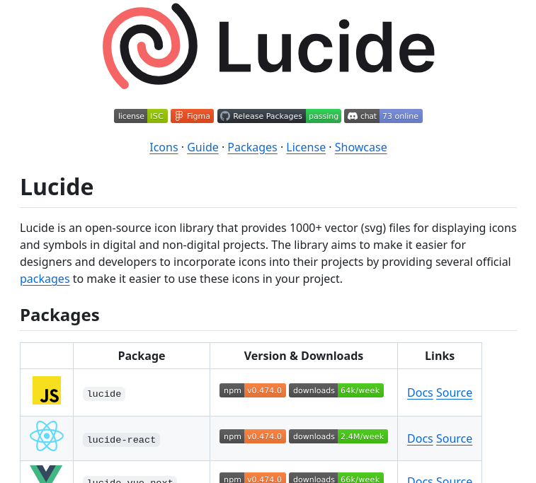

**Source:** [https://twitter.com/i/web/status/1886636635527278756](https://twitter.com/i/web/status/1886636635527278756)
**Original Post Date:** 2025-06-17 12:28:10

# Lucide Icon Library: Technical Analysis and Integration Guide

## Introduction
Lucide represents a significant advancement in open-source icon libraries, offering over 1000 vector-based SVG icons for both digital and non-digital projects. This analysis explores its technical architecture, integration capabilities across major frameworks, and community ecosystem. Understanding Lucide's structure and usage patterns is crucial for modern web development workflows.

## Technical Architecture Overview

Lucide's foundation lies in its SVG-based icon system, optimized for performance and flexibility across different platforms. The library leverages a consistent design language while maintaining lightweight package sizes, crucial for modern web applications.

The core architecture supports multiple integration methods through specialized packages for JavaScript, React, Vue.js, and Vuetify frameworks, each designed to maintain compatibility with their respective ecosystems.

> **Note/Tip:** Always check version compatibility when integrating Lucide packages into existing projects

## Package Ecosystem Analysis

The package ecosystem demonstrates significant adoption across major frameworks, with React leading at 2.4M weekly downloads. The consistent versioning (v0.474.0) across packages ensures synchronized updates and maintains API consistency.

1. React: lucide-react package for seamless React integration
1. Vue.js: lucide-vue-next for Vue 3 compatibility
1. JavaScript: lucide base package for vanilla JS usage
1. Vuetify: lucide-vuetify for Material Design compliance

> **Note/Tip:** Choose framework-specific packages to leverage native component optimizations

## Design and Integration Considerations

The library's minimalist design approach uses a limited color palette (red, black, gray) with strategic use of accent colors for readability. This visual hierarchy ensures icons remain distinguishable across different contexts.

Integration workflows are streamlined through Figma integration and comprehensive documentation, reducing the learning curve for developers.

```javascript
// Basic React Integration
import { LucideReact } from '@lucide/react';
const IconComponent = () => (
  <LucideReact.icon name='example' />
);
```

## Community and Ecosystem Support

With 73 active users in the chat channel, Lucide maintains an engaged community. The ISC license facilitates unrestricted usage while encouraging contributions.

The presence of badges indicating passing builds and package availability demonstrates commitment to code quality and dependency management.

## Key Takeaways

- Lucide's modular architecture supports efficient integration across major frameworks with consistent versioning
- React package shows highest adoption, making it ideal for React-centric projects
- Figma integration simplifies design handoff workflows in collaborative environments

## Conclusion
Lucide offers a robust solution for icon management in modern web applications. Its well-maintained packages, active community support, and efficient architecture make it an excellent choice for both developers and designers seeking scalable icon solutions.

## External References

- [Official Lucide Documentation](https://lucide.dev)
- [React Package on npm](https://www.npmjs.com/package/lucide-react)


## Media

**Image Description:** The image is a screenshot of the **Lucide** website, which is an open-source icon library. Below is a detailed description of the image, focusing on the main subject and relevant technical details:

### **Header Section**
1. **Logo and Branding**:
   - The top-left corner features the **Lucide logo**, which consists of a stylized, abstract design in red and black. The logo is accompanied by the word **"Lucide"** in bold, black text.
   - The logo and text are prominently displayed, serving as the focal point of the header.

2. **Social and Technical Badges**:
   - Below the logo, there is a row of badges indicating various technical and community-related aspects:
     - **License**: Indicates the project is licensed under the ISC license.
     - **Figma**: Suggests integration or availability of icons in Figma, a popular design tool.
     - **Release Packages**: Indicates the project's release packages are managed and available.
     - **Passing**: Likely refers to passing tests or build status, indicating the project is stable.
     - **Chat**: Shows the number of users online (73 online), suggesting an active community or support channel.

### **Main Content**
1. **Navigation Links**:
   - Below the header, there is a navigation bar with links to different sections of the website:
     - **Icons**: Likely leads to the main collection of icons.
     - **Guide**: Provides documentation or instructions for using the icons.
     - **Packages**: Lists available packages for integrating Lucide into projects.
     - **License**: Details the licensing terms.
     - **Showcase**: Displays examples or use cases of the icons.

2. **Introduction to Lucide**:
   - The main section begins with a heading: **"Lucide"** in bold, large text.
   - Below the heading, there is a brief description of Lucide:
     - **Lucide** is an **open-source icon library**.
     - It provides **1000+ vector (SVG) files** for displaying icons and symbols.
     - The library is designed for use in **digital and non-digital projects**.
     - The goal is to make it easier for designers and developers to incorporate icons into their projects.
     - Several **official packages** are available to simplify integration.

3. **Packages Section**:
   - A table is presented under the heading **"Packages"**, listing different packages available for integrating Lucide into projects:
     - **Columns**:
       - **Language/Icon**: Indicates the programming language or framework associated with the package.
       - **Package**: The name of the package.
       - **Version & Downloads**: Shows the version number and download statistics.
       - **Links**: Provides links to documentation and source code.

### **Table Details**
1. **Rows in the Table**:
   - Each row represents a different package:
     - **JavaScript (JS)**:
       - **Package**: `lucide`
       - **Version**: `v0.474.0`
       - **Downloads**: `64k/week`
       - **Links**: Links to **Docs** and **Source**.
     - **React**:
       - **Package**: `lucide-react`
       - **Version**: `v0.474.0`
       - **Downloads**: `2.4M/week`
       - **Links**: Links to **Docs** and **Source**.
     - **Vue.js**:
       - **Package**: `lucide-vue-next`
       - **Version**: `v0.474.0`
       - **Downloads**: `66k/week`
       - **Links**: Links to **Docs** and **Source**.
     - **Vuetify**:
       - **Package**: `lucide-vuetify`
       - **Version**: `v0.474.0`
       - **Downloads**: `6k/week`
       - **Links**: Links to **Docs** and **Source**.

### **Design and Layout**
- The layout is clean and organized, with clear sections and headings.
- The use of color is minimal but effective:
  - **Red** for the logo.
  - **Black** for text and icons.
  - **Gray** for background and subtle elements.
  - **Yellow** and **Blue** for highlighting specific elements like programming languages.
- The table uses a grid layout with alternating row colors for readability.

### **Technical Details**
- **Open-Source**: The project is open-source, as indicated by the license badge and the availability of source code links.
- **Cross-Platform**: Lucide supports multiple frameworks and languages, including JavaScript, React, Vue.js, and Vuetify.
- **High Usage**: The download statistics indicate high usage, especially for the React package (`2.4M/week`).
- **Community Engagement**: The chat badge shows active community engagement with 73 users online.

### **Overall Impression**
The image effectively communicates the purpose and features of the Lucide icon library, highlighting its open-source nature, extensive icon collection, and ease of integration into various projects. The design is user-friendly, with clear navigation and detailed information about the available packages.
