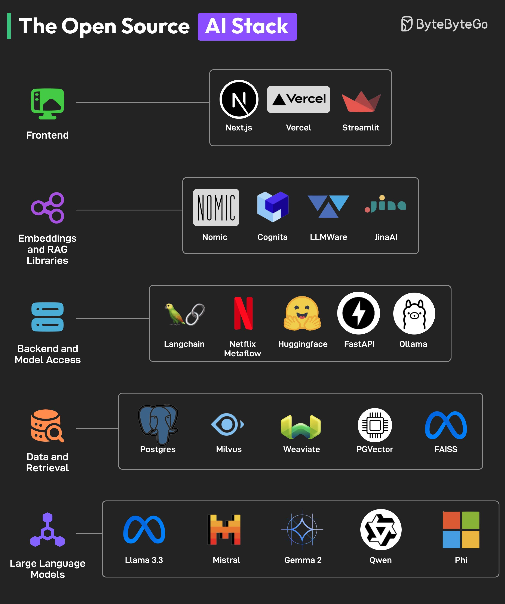

**Source:** [https://twitter.com/i/web/status/1878846182962962551](https://twitter.com/i/web/status/1878846182962962551)
**Original Post Date:** 2025-07-20 09:32:55

# Open Source AI Stack: Comprehensive Analysis

## Introduction
The Open Source AI Stack infographic by ByteByteByteGo provides a comprehensive overview of various open-source tools and technologies used to build AI applications. This analysis breaks down the stack into six main sections, each representing a different layer of the AI stack. The infographic is structured with distinct icons for each section, making it visually appealing and easy to understand.

## Frontend

The frontend section focuses on tools for building user interfaces and deploying web applications. It includes Next.js, Vercel, and Streamlit, which are popular frameworks and platforms for developing and deploying AI-powered web applications.

- Next.js: A React framework for building web applications.
- Vercel: A platform for deploying and scaling web applications.
- Streamlit: A Python library for building web applications for machine learning and data science.

> **Note/Tip:** Next.js is particularly useful for creating server-side rendered or static websites with React.

> **Note/Tip:** Vercel provides a seamless experience for deploying Next.js applications.

> **Note/Tip:** Streamlit is ideal for quickly prototyping and deploying machine learning models as web applications.

## Embeddings and RAG (Retrieval Augmented Generation) Libraries

This section covers tools that facilitate the integration of embeddings and retrieval-augmented generation in AI applications. These tools are essential for building AI models that can retrieve relevant information from large datasets.

- Nomic: A platform for building and deploying AI applications.
- Cognita: A tool for building AI-powered applications.
- LLMWare: A platform for building and deploying large language models.
- JinaAI: A framework for building AI applications with a focus on multimodal data.

> **Note/Tip:** Nomic is particularly useful for developers looking to build end-to-end AI applications.

> **Note/Tip:** Cognita provides tools for managing and orchestrating complex AI workflows.

> **Note/Tip:** LLMWare is designed specifically for large language models, making it a valuable tool for NLP tasks.

## Backend and Model Access

The backend section focuses on tools for managing backend infrastructure and accessing large language models. It includes Langchain, Netflix Metaflow, Huggingface, FastAPI, and Ollama, which are essential for building scalable AI applications.

- Langchain: A framework for developing applications powered by language models.
- Netflix Metaflow: A platform for managing and orchestrating data science workflows.
- Huggingface: A platform for building and deploying machine learning models.
- FastAPI: A modern, fast web framework for building APIs with Python.
- Ollama: A tool for running large language models locally.

> **Note/Tip:** Langchain is particularly useful for developers looking to build applications that leverage the power of language models.

> **Note/Tip:** Netflix Metaflow provides a robust platform for managing and orchestrating complex data science workflows.

> **Note/Tip:** Huggingface offers a wide range of pre-trained models and tools for building and deploying machine learning models.

## Data and Retrieval

This section covers tools for storing, managing, and retrieving data, including vector databases for similarity search. These tools are essential for building AI applications that require efficient data retrieval and management.

- Postgres: A powerful, open-source relational database system.
- Milvus: A high-performance vector database for similarity search.
- Weaviate: A vector database for building AI applications.
- PGVector: A PostgreSQL extension for vector similarity search.
- FAISS: A library for efficient similarity search and clustering of dense vectors.

> **Note/Tip:** Postgres is a versatile relational database that can be extended with PGVector for vector similarity search.

> **Note/Tip:** Milvus is particularly useful for applications requiring high-performance similarity search on large datasets.

> **Note/Tip:** Weaviate provides a comprehensive platform for building AI applications with vector search capabilities.

## Large Language Models

This section covers a collection of popular open-source and proprietary large language models. These models are essential for building AI applications that require advanced natural language processing capabilities.

- Llama 3.3: A large language model developed by Meta.
- Mistral: A large language model developed by Mistral AI.
- Gemama 2: A large language model developed by Alibaba Cloud.
- Qwen: A large language model developed by Alibaba Cloud.
- Phi: A large language model developed by ByteDance.

> **Note/Tip:** Llama 3.3 is particularly useful for developers looking to leverage the power of Meta's advanced language models.

> **Note/Tip:** Mistral provides a robust platform for building AI applications with advanced NLP capabilities.

> **Note/Tip:** Gemama 2 and Qwen are valuable tools for developers working on AI applications in the Chinese market.

## Key Takeaways

- The Open Source AI Stack infographic provides a comprehensive overview of various open-source tools and technologies used to build AI applications.
- The stack is divided into six main sections: frontend, embeddings & RAG libraries, backend & model access, data & retrieval, and large language models.
- Each section covers specific tools and technologies essential for building scalable and efficient AI applications.
- The infographic serves as a valuable resource for developers and data scientists looking to build AI applications using open-source tools.

## Conclusion
In conclusion, the Open Source AI Stack infographic by ByteByteByteGo provides a comprehensive guide for developers and data scientists looking to build AI applications. It highlights key components of an AI stack, from frontend development to large language models, offering a roadmap for assembling a complete AI solution.

## External References

- [ByteByteByteGo's Open Source AI Stack Infographic](https://bytebytego.com)
- [Next.js Documentation](https://nextjs.org/docs)
- [Streamlit Documentation](https://streamlit.io/docs)

## Media

**Image Description:** ### Image Description: The Open Source AI Stack

The image is a visually organized infographic titled **"The Open Source AI Stack"**, created by **ByteByteByteGo**. It provides an overview of various open-source tools and technologies that can be used to build AI applications. The infographic is structured into six main sections, each representing a different layer of the AI stack. Below is a detailed breakdown of each section:

---

### **1. Frontend**
- **Icon**: A green monitor icon.
- **Tools**:
  - **Next.js**: A popular React framework for building web applications.
  - **Vercel**: A platform for deploying and scaling web applications.
  - **Streamlit**: A Python library for building web applications for machine learning and data science.

---

### **2. Embeddings and RAG (Retrieval Augmented Generation) Libraries**
- **Icon**: A purple interconnected nodes icon.
- **Tools**:
  - **Nomic**: A platform for building and deploying AI applications.
  - **Cognita**: A tool for building AI-powered applications.
  - **LLMWare**: A platform for building and deploying large language models.
  - **JinaAI**: A framework for building AI applications with a focus on multimodal data.

---

### **3. Backend and Model Access**
- **Icon**: A blue equalizer icon.
- **Tools**:
  - **Langchain**: A framework for developing applications powered by language models.
  - **Netflix Metaflow**: A platform for managing and orchestrating data science workflows.
  - **Huggingface**: A platform for building and deploying machine learning models.
  - **FastAPI**: A modern, fast (high-performance) web framework for building APIs with Python.
  - **Ollama**: A tool for running large language models locally.

---

### **4. Data and Retrieval**
- **Icon**: An orange database icon with a magnifying glass.
- **Tools**:
  - **Postgres**: A powerful, open-source relational database system.
  - **Milvus**: A high-performance vector database for similarity search.
  - **Weaviate**: A vector database for building AI applications.
  - **PGVector**: A PostgreSQL extension for vector similarity search.
  - **FAISS**: A library for efficient similarity search and clustering of dense vectors.

---

### **5. Large Language Models**
- **Icon**: A purple interconnected nodes icon.
- **Tools**:
  - **Llama 3.3**: A large language model developed by Meta.
  - **Mistral**: A large language model developed by Mistral AI.
  - **Gemama 2**: A large language model developed by Alibaba Cloud.
  - **Qwen**: A large language model developed by Alibaba Cloud.
  - **Phi**: A large language model developed by ByteDance.

---

### **Overall Layout and Design**
- **Color Scheme**: The infographic uses a dark background with bright, contrasting colors for icons and text, making it visually appealing and easy to read.
- **Icons**: Each section is represented by a distinct icon that symbolizes its purpose (e.g., a monitor for frontend, a database for data retrieval).
- **Organization**: The tools are grouped into logical categories, making it easy to understand the role of each component in the AI stack.
- **Branding**: The logo of **ByteByteByteGo** is present in the top-right corner, indicating the creator of the infographic.

---

### **Key Technical Details**
1. **Frontend**: Focuses on tools for building user interfaces and deploying web applications.
2. **Embeddings and RAG Libraries**: Tools for integrating embeddings and retrieval-augmented generation in AI applications.
3. **Backend and Model Access**: Tools for managing backend infrastructure and accessing large language models.
4. **Data and Retrieval**: Tools for storing, managing, and retrieving data, including vector databases for similarity search.
5. **Large Language Models**: A collection of popular open-source and proprietary large language models.

---

### **Purpose**
The infographic serves as a comprehensive guide for developers and data scientists looking to build AI applications using open-source tools. It highlights the key components of an AI stack, from frontend development to large language models, providing a roadmap for assembling a complete AI solution.

---

This structured and detailed breakdown should help anyone understand the image and its technical implications.
