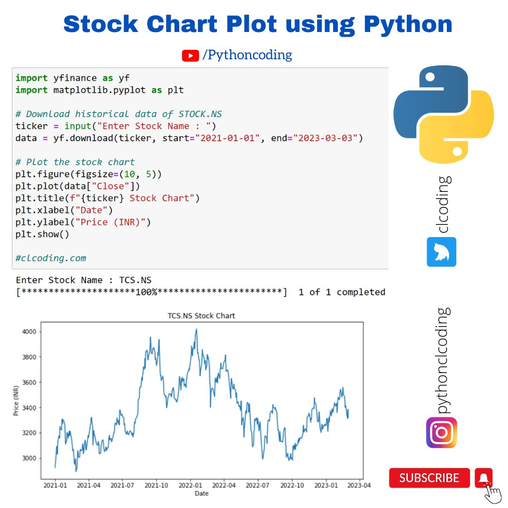

**Source:** [https://twitter.com/i/web/status/1872069818872132032](https://twitter.com/i/web/status/1872069818872132032)
**Original Post Date:** 2025-06-17 09:06:19

# Plotting Real-Time Stock Charts with Python's yfinance and Matplotlib

## Introduction
Stock market analysis requires efficient visualization tools to understand price movements over time. This article demonstrates how to leverage Python's powerful data processing and visualization capabilities through the yfinance and matplotlib libraries. You'll learn to fetch historical stock data from Yahoo Finance, process it, and create informative line charts that highlight key trends in real-time.

## Environment Setup and Prerequisites

Before creating stock visualizations, ensure Python is installed (3.7+ recommended). Install the required libraries using pip:

yfinance for accessing Yahoo Finance data and matplotlib for visualization are essential components of this workflow.

```bash
pip install yfinance matplotlib
```

## Fetching Historical Stock Data with yfinance

The yfinance library provides direct access to Yahoo Finance's extensive historical data. The following code demonstrates how to retrieve and process stock price information.

The download function accepts a ticker symbol, start date, and end date as parameters.

```python
import yfinance as yf
ticker = input("Enter Stock Name: ")
data = yf.download(ticker, start="2021-01-01", end="2023-03-03")
```

## Creating Interactive Stock Charts with Matplotlib

Matplotlib's plotting capabilities allow for creating informative visualizations that highlight stock price trends.

The figure size, axis labels, and title are customizable to match specific visualization requirements.

```python
import matplotlib.pyplot as plt
plt.figure(figsize=(10, 5))
plt.plot(data["Close"])
plt.title(f"{ticker} Stock Chart")
plt.xlabel("Date")
plt.ylabel("Price (INR)")
plt.show()
```

## Best Practices and Optimization

Implement proper error handling for invalid ticker symbols or date ranges.

Consider using the figure's savefig method to store visualizations locally.

- Use try-except blocks when fetching data
- Validate input dates before processing
- Configure appropriate figure sizes for different display requirements

## Key Takeaways

- yfinance simplifies access to historical stock data from Yahoo Finance
- Matplotlib provides flexible charting options for financial visualization
- Customizing axis labels and titles improves data comprehension
- Error handling ensures robust code execution

## Conclusion
Combining yfinance and matplotlib enables efficient creation of professional-looking stock charts in Python. This foundation can be extended with additional features like moving averages, volume indicators, or interactive elements for more comprehensive financial analysis.

## External References

- [yfinance Documentation](https://pypi.org/project/yfinance/)
- [Matplotlib Documentation](https://matplotlib.org/stable/api/index.html)


## Media

**Image Description:** ### Image Description

The image is a tutorial or demonstration of how to plot a stock chart using Python. It combines code snippets, a stock chart visualization, and various design elements to guide the viewer through the process. Below is a detailed breakdown:

---

#### **Header Section**
- **Title**: The title at the top reads:
  ```
  Stock Chart Chart Plot Plot using using Python Python
  ```
  The repetition of words like "Chart" and "Plot" is likely a stylistic choice or an error in the text.
- **YouTube Channel Link**: Below the title, there is a YouTube logo followed by the text:
  ```
  /Pythoncodingcoding
  ```
  This suggests the content is associated with a YouTube channel named "Pythoncodingcoding."

---

#### **Python Code Snippet**
The main part of the image contains a Python code snippet designed to download historical stock data and plot a stock chart. Here is a detailed breakdown of the code:

1. **Imports**:
   ```python
   import yfinance as yf
   import matplotlib.pyplot as plt
   ```
   - `yfinance` is used to fetch stock data from Yahoo Finance.
   - `matplotlib.pyplot` is used for plotting the chart.

2. **Downloading Historical Stock Data**:
   ```python
   ticker = input("Enter Stock Stock Name Name : ")
   data = yf.download(ticker, start="2021-01-01", end="2023-03-03")
   ```
   - The user is prompted to enter a stock ticker symbol (e.g., `TCS.NS`).
   - The `yf.download` function retrieves historical stock data for the specified ticker between the dates `2021-01-01` and `2023-03-03`.

3. **Plotting the Stock Chart**:
   ```python
   plt.figure(figsize=(10, 5))
   plt.plot(data["Close"])
   plt.title(f"{ticker} Stock Chart")
   plt.xlabel("Date")
   plt.ylabel("Price (INR)")
   plt.show()
   ```
   - A figure with a size of `(10, 5)` is created using `plt.figure`.
   - The closing prices (`data["Close"]`) are plotted against the dates.
   - The chart is titled with the stock ticker name.
   - The x-axis is labeled as "Date," and the y-axis is labeled as "Price (INR)."
   - The chart is displayed using `plt.show()`.

4. **Additional Text**:
   - A comment at the bottom of the code snippet:
     ```
     # clcoding.com
     ```
     This suggests the code might be sourced from or related to the website `clcoding.com`.

---

#### **User Input and Progress Bar**
- **User Input**:
  ```
  Enter Stock Stock Name Name : TCS.NS
  ```
  The user has entered `TCS.NS` as the stock ticker symbol. This is likely the ticker for Tata Consultancy Services (TCS) on the National Stock Exchange (NSE) in India.

- **Progress Bar**:
  ```
  [*********************100%**********************] 1 of 1 completed
  ```
  This indicates that the data download process has been completed successfully.

---

#### **Stock Chart Visualization**
- **Title**: The chart is titled:
  ```
  TCS.NS Stock Chart
  ```
- **Axes**:
  - **X-axis**: Labeled as "Date," with dates ranging from `2021-01` to `2023-04`.
  - **Y-axis**: Labeled as "Price (INR)," with values ranging from approximately 3000 to 4000.
- **Data Representation**: The chart shows a line plot of the closing prices of the stock over time. The line is blue, and it exhibits fluctuations typical of stock market data.

---

#### **Design Elements**
- **Python Logo**: A blue and yellow Python logo is present in the top-right corner.
- **Social Media Icons**: Icons for YouTube, Instagram, and a "Subscribe" button are included in the bottom-right corner, encouraging viewers to engage with the content creator's platforms.
- **Color Scheme**: The background is white, and the text and code are presented in a clean, readable format with syntax highlighting for the code.

---

#### **Overall Purpose**
The image serves as an educational resource, demonstrating how to use Python (with libraries like `yfinance` and `matplotlib`) to fetch and visualize stock data. It is likely part of a tutorial or a YouTube video aimed at teaching programming concepts related to financial data analysis.

---

### Key Technical Details
1. **Libraries Used**:
   - `yfinance`: For fetching stock data.
   - `matplotlib.pyplot`: For plotting the chart.
2. **Data Source**: Yahoo Finance (via `yfinance`).
3. **Visualization**: A line chart showing closing stock prices over time.
4. **User Interaction**: The code includes an input prompt for the stock ticker, making it interactive.

This image effectively combines code, visualization, and design elements to convey its message.
