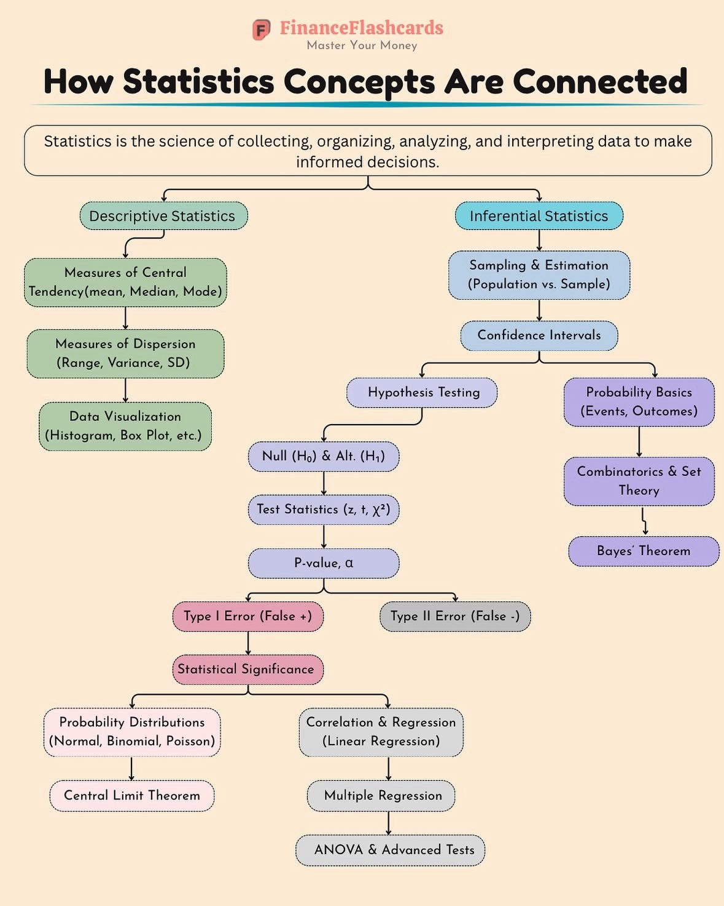

**Source:** [https://twitter.com/i/web/status/1933121946717163763](https://twitter.com/i/web/status/1933121946717163763)
**Original Post Date:** 2025-06-17 14:41:33

# Statistical Concepts Flowchart: A Technical Analysis of Financial Statistics Structure

## Introduction
This knowledge item analyzes the 'How Statistics Concepts Are Connected' flowchart by FinanceFlashcards, providing a technical breakdown of its structure and content. The flowchart presents a hierarchical organization of statistical concepts specifically tailored for financial analysis, from basic descriptive statistics through advanced inferential techniques. This analysis explores both the conceptual framework and practical applications within software engineering contexts.

## Structural Analysis of Statistical Branches

The flowchart employs a binary branching structure with two primary trunks: Descriptive Statistics (green) and Inferential Statistics (blue). This design choice effectively separates data summarization techniques from population inference methods, creating clear conceptual boundaries while maintaining visual connections.

The hierarchical progression follows foundational concepts at the top, flowing into more complex methodologies. For example, measures of central tendency naturally lead to dispersion metrics, which then support visualization techniques.

1. Descriptive Statistics branch emphasizes data summarization and visualization
1. Inferential Statistics extends to population inference and hypothesis testing
1. Probability foundations provide the theoretical underpinning

> **Note/Tip:** Color coding (green/blue) serves both aesthetic and functional purposes in distinguishing concept categories

## Technical Implementation of Statistical Concepts

The flowchart's structure mirrors software engineering principles, particularly in hierarchical design patterns. Each branch represents a modular component that can be implemented independently while maintaining connections to the broader system.

Concept dependencies are clearly visualized through directional arrows, indicating prerequisite relationships between statistical methods.

```pseudocode
function calculateConfidenceInterval(sample_data) {
  validateData()
  computeStandardError()
  applyTTest()
  return intervalBounds
}
// Implements flow from descriptive to inferential statistics
```

- Measures of Central Tendency: Mean, Median, Mode
- Statistical Significance Testing: p-value calculation and alpha threshold determination

## Advanced Concept Integration

The integration of advanced concepts (ANOVA, regression) builds upon foundational elements through clear hierarchical progression. This structure suggests a systematic approach to statistical analysis implementation in software systems.

Bayesian probability and combinatorial principles form the theoretical foundation supporting inferential methods.

## Key Takeaways

- Hierarchical organization of statistical concepts enables modular implementation in financial software systems
- Color-coded branches facilitate visual understanding of concept relationships and dependencies
- Flowchart structure provides a blueprint for systematic statistical analysis implementation

## Conclusion
The flowchart effectively organizes complex statistical concepts into a logical hierarchy, supporting both educational purposes and practical software development. Its design principles align with modern software architecture practices, emphasizing modularity and clear dependency management.

## External References

- [Bayesian Statistics in Financial Engineering](https://example.com/bayesian-stats)
- [Advanced Statistical Methods for Finance](https://example.com/advanced-methods)


## Media

**Image Description:** The image is a detailed flowchart titled **"How Statistics Concepts Are Connected"**, created by **FinanceFlashcards**. The flowchart visually organizes and connects various statistical concepts, illustrating their relationships and hierarchical structure. Below is a detailed description of the image, focusing on its main subject and technical details:

### **Title and Theme**
- The title, **"How Statistics Concepts Are Connected"**, is prominently displayed at the top in bold black text.
- The subtitle, **"Master Your Money"**, suggests that the content is tailored for financial applications of statistics.
- The logo of **FinanceFlashcards** is present in the top-right corner, indicating the source of the content.

### **Main Structure**
The flowchart is divided into two main branches:
1. **Descriptive Statistics**
2. **Inferential Statistics**

### **Descriptive Statistics Branch**
This branch focuses on summarizing and visualizing data. It is represented in **green boxes** and includes the following concepts:
- **Measures of Central Tendency**: 
  - Mean, Median, Mode
- **Measures of Dispersion**: 
  - Range, Variance, Standard Deviation (SD)
- **Data Visualization**: 
  - Histograms, Box Plots, etc.

### **Inferential Statistics Branch**
This branch deals with making inferences about populations based on sample data. It is represented in **blue boxes** and includes:
- **Sampling & Estimation**: 
  - Population vs. Sample
- **Confidence Intervals**
- **Hypothesis Testing**: 
  - Null Hypothesis (\(H_0\)) and Alternative Hypothesis (\(H_1\))
  - Test Statistics (\(z\), \(t\), \(\chi^2\))
  - P-value, \(\alpha\)
  - Type I Error (False Positive) and Type II Error (False Negative)
- **Statistical Significance**

### **Probability and Theoretical Foundations**
This section, represented in **purple boxes**, provides the foundational concepts necessary for inferential statistics:
- **Probability Basics**: 
  - Events, Outcomes
- **Combinatorics & Set Theory**
- **Bayes' Theorem**

### **Advanced Statistical Concepts**
This section, represented in **pink and gray boxes**, builds upon the foundational concepts and includes:
- **Probability Distributions**: 
  - Normal, Binomial, Poisson
- **Correlation & Regression**: 
  - Linear Regression, Multiple Regression
- **Central Limit Theorem**
- **ANOVA (Analysis of Variance)** and **Advanced Tests**

### **Flowchart Design**
- **Arrows**: The flowchart uses arrows to indicate the flow of concepts and their relationships. For example, "Measures of Central Tendency" leads to "Measures of Dispersion," which then leads to "Data Visualization."
- **Color Coding**: Different sections are color-coded to distinguish between descriptive, inferential, foundational, and advanced concepts.
- **Hierarchical Structure**: The flowchart is organized hierarchically, with foundational concepts at the top and more advanced concepts branching out below.

### **Key Concepts Highlighted**
1. **Descriptive Statistics**: Focuses on summarizing data through measures of central tendency and dispersion, as well as visualizing data.
2. **Inferential Statistics**: Involves making inferences about populations using sample data, hypothesis testing, and confidence intervals.
3. **Probability and Theoretical Foundations**: Provides the mathematical underpinnings necessary for inferential statistics.
4. **Advanced Statistical Concepts**: Explores more complex topics like probability distributions, regression analysis, and ANOVA.

### **Overall Purpose**
The flowchart serves as an educational tool to help learners understand the interconnectedness of statistical concepts, particularly in the context of finance. It provides a clear visual representation of how foundational concepts build up to more advanced statistical techniques.

### **Technical Details**
- **Typography**: The text is clear and legible, with a mix of bold and regular fonts to emphasize key terms.
- **Color Scheme**: The use of distinct colors (green, blue, purple, pink, gray) helps differentiate between concept categories.
- **Arrows and Connections**: The arrows are used effectively to show the flow and relationships between concepts, making the chart easy to follow.

### **Conclusion**
The flowchart is a well-organized and visually appealing representation of statistical concepts, emphasizing their interconnectedness and hierarchical structure. It is particularly useful for learners seeking to understand how different statistical tools and theories fit together in the context of financial analysis.
