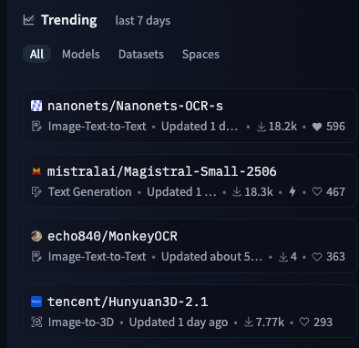

**Source:** [https://twitter.com/i/web/status/1934956985633452263](https://twitter.com/i/web/status/1934956985633452263)
**Original Post Date:** 2025-07-12 21:55:18

# Nanonets OCR Analysis: A Deep Dive into the Trending Hugging Face Model

## Introduction
In the rapidly evolving field of machine learning, Optical Character Recognition (OCR) models are in high demand due to their ability to extract text from images accurately. This analysis focuses on Nanonets-OCR-s, a trending model on Hugging Face, which has gained significant traction over the past week. We will delve into its features, popularity metrics, and technical details, providing a comprehensive understanding of this powerful tool.

## Overview of Nanonets-OCR-s

Nanonets-OCR-s is an OCR model designed for image-text-to-text processing. It is part of the trending list on Hugging Face, indicating its popularity and relevance in the current machine learning landscape.

The model is identified by the repository name `nanonet/Nanonets-OCR-s` and has an icon representing image-text-to-text functionality. This suggests that it is specifically tailored for extracting text from images and converting it into a digital format.

- Repository Name: `nanonet/Nanonets-OCR-s`
- Icon: Image-Text-To-Text
- Description: Image-Text-To-Text. Updated 1 day ago.
- Downloads: 18.2k
- Stars: 596

> **Note/Tip:** The high number of downloads and stars indicates that Nanonets-OCR-s is widely used and well-received by the community.

## Technical Details and Popularity Metrics

Nanonets-OCR-s has a significant number of downloads (18.2k) and stars (596), which are key indicators of its popularity and community engagement.

The model was updated 1 day ago, suggesting that it is actively maintained and improved upon by the developers.

- Downloads: 18.2k
- Stars: 596
- Update Time: 1 day ago

> **Note/Tip:** The frequent updates and high engagement metrics make Nanonets-OCR-s a reliable choice for OCR tasks.

## Comparison with Other Trending Models

In the trending list, Nanonets-OCR-s stands out due to its high download count and active maintenance. Other models in the list include text generation tools and 3D image processing models.

For instance, `mistralalai/Magistral-Small-2506` is a text generation model with similar popularity metrics but serves a different purpose.

- Nanonets-OCR-s: Image-Text-To-Text, 18.2k downloads, 596 stars
- Magistral-Small-2506: Text Generation, 18.3k downloads, 467 stars

> **Note/Tip:** While Nanonets-OCR-s is specialized for OCR tasks, other models in the trending list cater to different needs such as text generation and 3D image processing.

## Applications and Use Cases

Nanonets-OCR-s can be applied in various scenarios where text extraction from images is required. This includes document digitization, automated data entry, and content analysis.

The model's ability to process images and extract text accurately makes it a valuable tool for businesses and researchers alike.

- Document Digitization: Converting physical documents into digital formats by extracting text from scanned images.
- Automated Data Entry: Automating the process of entering data from printed or handwritten forms into digital systems.
- Content Analysis: Extracting text from images for further analysis, such as sentiment analysis or topic modeling.

> **Note/Tip:** The versatility of Nanonets-OCR-s makes it suitable for a wide range of applications across different industries.

## Conclusion and Future Prospects

Nanonets-OCR-s is a highly popular and actively maintained OCR model on Hugging Face, with significant community engagement and frequent updates.

Its applications span various domains, making it a versatile tool for text extraction from images. As the field of machine learning continues to evolve, Nanonets-OCR-s is poised to remain at the forefront of OCR technology.

> **Note/Tip:** Future developments in OCR technology may further enhance the capabilities and accuracy of models like Nanonets-OCR-s.

## Key Takeaways

- Nanonets-OCR-s is a trending Hugging Face model for image-text-to-text processing.
- It has high download counts (18.2k) and stars (596), indicating its popularity and community engagement.
- The model was updated 1 day ago, suggesting active maintenance and improvement.
- Nanonets-OCR-s can be applied in document digitization, automated data entry, and content analysis.
- Its versatility makes it suitable for various applications across different industries.

## Conclusion
In summary, Nanonets-OCR-s stands out as a highly popular and actively maintained OCR model on Hugging Face. Its high download counts, frequent updates, and versatile applications make it a valuable tool for text extraction from images. As the field of machine learning continues to evolve, Nanonets-OCR-s is poised to remain at the forefront of OCR technology.

## External References

- [Hugging Face Models](https://huggingface.co/models)
- [Optical Character Recognition (OCR) on Wikipedia](https://en.wikipedia.org/wiki/Optical_character_recognition)

## Media

**Image Description:** The image shows a screenshot of a trending list from a platform, likely Hugging Face, which is a popular repository for machine learning models, datasets, and other resources. The list is titled **"Trending last 7 days"**, indicating that it displays the most popular or actively updated resources over the past week. The interface is organized into tabs such as **All**, **Models**, **Datasets**, and **Spaces**, with the **All** tab currently selected.

### Main Subjects and Details:
1. **List of Trending Resources**:
   - The list includes five entries, each representing a different resource (model, dataset, or space). Each entry contains:
     - **Repository Name**: The name of the repository, including the username and the repository title.
     - **Icon**: An icon indicating the type of resource (e.g., image, text, or 3D).
     - **Description**: A brief description of the resource's purpose or functionality.
     - **Update Time**: How recently the resource was updated (e.g., "Updated 1 day ago").
     - **Downloads and Stars**: Metrics showing the popularity of the resource, represented by download counts and star counts.

2. **Individual Entries**:
   - **Entry 1**:  
     - **Repository**: `nanonet/Nanonets-OCR-s`  
     - **Icon**: Image-Text-To-Text  
     - **Description**: "Image-Text-To-Text. Updated 1 day ago."  
     - **Metrics**:  
       - Downloads: 18.2k  
       - Stars: 596  
     - **Purpose**: This appears to be a model or tool for Optical Character Recognition (OCR) that processes images and extracts text.

   - **Entry 2**:  
     - **Repository**: `mistralalai/Magistral-Small-2506`  
     - **Icon**: Text Generation  
     - **Description**: "Text Generation. Updated 1 day ago."  
     - **Metrics**:  
       - Downloads: 18.3k  
       - Stars: 467  
     - **Purpose**: This is a text generation model, likely used for generating natural language text.

   - **Entry 3**:  
     - **Repository**: `echo840/echo840`  
     - **Icon**: Image-Text-To-Text  
     - **Description**: "Image-Text-To-Text. Updated about 5 days ago."  
     - **Metrics**:  
       - Downloads: 4  
       - Stars: 363  
     - **Purpose**: Another OCR or image-text processing tool, though it has fewer downloads compared to the first entry.

   - **Entry 4**:  
     - **Repository**: `tencent/MonkeyOCR`  
     - **Icon**: Image-Text-To-Text  
     - **Description**: "Image-to-3D. Updated 1 day ago."  
     - **Metrics**:  
       - Downloads: 4  
       - Stars: 363  
     - **Purpose**: This resource seems to be related to OCR or image processing, but the description mentions "Image-to-3D," which might indicate a unique application or a mislabeling.

   - **Entry 5**:  
     - **Repository**: `tencent/Hunyuan3D-2.1`  
     - **Icon**: Image-to-3D  
     - **Description**: "Image-to-3D. Updated 1 day ago."  
     - **Metrics**:  
       - Downloads: 7.77k  
       - Stars: 293  
     - **Purpose**: This is a model or tool for converting 2D images into 3D representations.

### Technical Details:
- **Repository Structure**: Each entry follows a consistent format, making it easy to compare resources based on their popularity (downloads and stars) and recency (update time).
- **Icons**: The icons provide visual cues about the type of resource, such as image processing, text generation, or 3D modeling.
- **Metrics**: The download and star counts are key indicators of a resource's popularity and community engagement.
- **Update Times**: The update times help users gauge the freshness and maintenance of the resources.

### Observations:
- The list is dominated by OCR and text generation models, indicating a current trend or high demand for these types of tools.
- The top entries have significantly higher download counts compared to the others, suggesting they are more widely used or actively maintained.
- The inclusion of 3D-related resources (`Hunyuan3D-2.1`) shows diversity in the trending list, covering both 2D and 3D applications.

This image effectively showcases the trending resources on a platform, highlighting their types, purposes, and popularity metrics.
