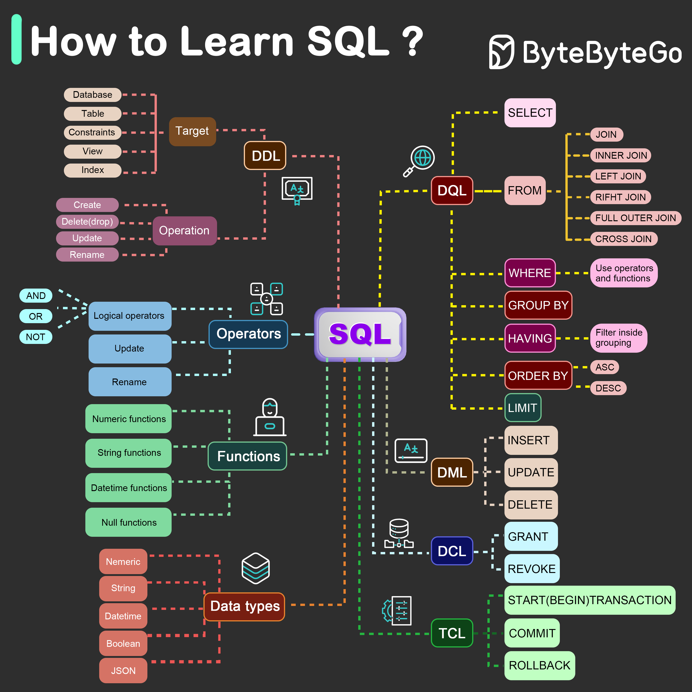

**Source:** [https://twitter.com/i/web/status/1868522704263106632](https://twitter.com/i/web/status/1868522704263106632)
**Original Post Date:** 2025-05-28 03:26:22

# Comprehensive SQL Learning Roadmap: Core Components and Command Structure

## Introduction
SQL (Structured Query Language) serves as the foundational language for database management, essential for modern software development. This comprehensive learning roadmap provides a systematic approach to mastering SQL's core components, syntax, and command structures. The guide covers everything from basic data manipulation commands to complex joins and transactions, making it an invaluable resource for developers at any level.

## SQL Core Components

SQL is organized into five main language categories: DDL (Data Definition Language), DML (Data Manipulation Language), DQL (Data Query Language), DCL (Data Control Language), and TCL (Transaction Control Language). Each category serves a distinct purpose in database management.

The diagram employs color-coding to distinguish between these categories, with brown for DDL, red for DML, yellow for DQL, blue for DCL, and green for TCL.

_Demonstrates basic DDL and DML operations for table creation and data insertion_

```sql
-- DDL Example
CREATE TABLE employees (
    id INT PRIMARY KEY,
    name VARCHAR(50),
    salary DECIMAL(10,2)
);
-- DML Example
INSERT INTO employees (id, name, salary) VALUES (1, 'John Doe', 75000);
```

- DDL commands modify database structure (CREATE, ALTER, DROP)
- DML commands manipulate data within tables (INSERT, UPDATE, DELETE)
- DQL commands retrieve data using SELECT statements

> **Note/Tip:** Always use appropriate constraints in DDL to maintain data integrity

> **Note/Tip:** Backup data before executing DML operations that modify existing records

## Data Types and Functions

SQL supports various data types categorized into numeric, string, datetime, boolean, and JSON. Understanding these types is crucial for designing efficient database schemas.

Functions enhance query capabilities with operations on numbers, strings, dates, and handling null values.

_Demonstrates string manipulation using CONCAT and SUBSTRING_

```sql
-- String functions example
SELECT CONCAT(first_name, ' ', last_name) AS full_name,
       SUBSTRING(email, 1, POSITION('@' IN email) - 1) AS username
FROM users;
```

1. VARCHAR(50) for variable-length strings up to 50 characters
1. DATE for storing calendar dates (YYYY-MM-DD)
1. DECIMAL(10,2) for precise decimal numbers

## Database Structure and Relations

The database structure encompasses databases, tables, constraints, views, and indexes. Tables are the primary data storage units with relationships defined through keys.

Constraints ensure data integrity by enforcing rules on columns and rows.

```sql
-- Table relationship example
CREATE TABLE orders (
    order_id INT PRIMARY KEY,
    customer_id INT REFERENCES customers(id)
);
```

## Advanced SQL Concepts

Advanced topics include transaction management, complex joins, and subqueries.

Understanding transactions (TCL) is crucial for maintaining data consistency in multi-step operations.

```sql
-- Transaction example
BEGIN TRANSACTION;
    UPDATE accounts SET balance = balance - 100 WHERE id = 1;
    INSERT INTO transactions VALUES (DEFAULT, 1, 'Withdrawal', 100);
COMMIT;
```

## Key Takeaways

- Master SQL categories (DDL/DML/DQL) to understand database operations
- Properly use data types and functions for efficient query processing
- Implement constraints and relationships for robust database design

## Conclusion
This roadmap provides a structured approach to learning SQL, from basic commands to advanced concepts. By following this path and practicing with real examples, developers can build a strong foundation in SQL that serves as the basis for effective database management.

## External References

- [PostgreSQL Documentation](https://www.postgresql.org/docs/)
- [MySQL Reference Manual](https://dev.mysql.com/doc/refman/8.0/en/)


## Media

**Image Description:** The image is a comprehensive visual guide titled **"How to Learn SQL"**, created by **ByteByteGo**. It provides an organized and structured overview of the key concepts, components, and syntax of SQL (Structured Query Language). The diagram is color-coded and uses various shapes and lines to illustrate relationships between different SQL elements. Below is a detailed breakdown of the image:

---

### **Main Subject: SQL**
The central focus of the image is the **SQL** box, which is highlighted in purple. SQL is the main subject, and the diagram branches out to explain its various components, including DDL, DML, DQL, DCL, and TCL, along with other related concepts.

---

### **Key Sections and Components**

#### 1. **SQL Core Components**
   - **SQL** (Central Box): The main subject, representing the SQL language.
   - **Operators**: A section that includes logical operators (`AND`, `OR`, `NOT`) and other operators used in SQL queries.
   - **Functions**: A section detailing various functions, such as:
     - **Numeric functions** (e.g., `SUM`, `AVG`, `MAX`, `MIN`).
     - **String functions** (e.g., `CONCAT`, `SUBSTRING`).
     - **Datetime functions** (e.g., `NOW`, `DATE`).
     - **Null functions** (e.g., `IS NULL`, `COALESCE`).

#### 2. **Data Types**
   - A section labeled **Data Types** is shown in red, listing the types of data that can be used in SQL:
     - **Numeric** (e.g., `INT`, `FLOAT`).
     - **String** (e.g., `VARCHAR`, `TEXT`).
     - **Datetime** (e.g., `DATE`, `TIMESTAMP`).
     - **Boolean** (e.g., `TRUE`, `FALSE`).
     - **JSON** (for handling JSON data).

#### 3. **Database Structure**
   - A section on the left side explains the **Database Structure**, which includes:
     - **Database**: The top-level container for data.
     - **Table**: The primary unit of data storage.
     - **Constraints**: Rules applied to columns (e.g., `NOT NULL`, `UNIQUE`).
     - **View**: A virtual table based on a query.
     - **Index**: Used to speed up data retrieval.
     - **Constraints**: Rules applied to columns or tables (e.g., `PRIMARY KEY`, `FOREIGN KEY`).

#### 4. **SQL Commands**
   - The diagram categorizes SQL commands into five main groups:
     - **DDL (Data Definition Language)**: Used to define the structure of the database.
       - **CREATE**: Creates new databases, tables, or other objects.
       - **ALTER**: Modifies existing databases or tables.
       - **DROP**: Deletes databases, tables, or other objects.
     - **DML (Data Manipulation Language)**: Used to manipulate data within the database.
       - **INSERT**: Adds new records to a table.
       - **UPDATE**: Modifies existing records.
       - **DELETE**: Removes records from a table.
     - **DQL (Data Query Language)**: Used to retrieve data from the database.
       - **SELECT**: Retrieves data from one or more tables.
       - **FROM**: Specifies the table(s) to retrieve data from.
       - **JOIN**: Combines rows from two or more tables based on a related column.
         - Types of joins:
           - `INNER JOIN`
           - `LEFT JOIN`
           - `RIGHT JOIN`
           - `FULL OUTER JOIN`
           - `CROSS JOIN`
       - **WHERE**: Filters rows based on a condition.
       - **GROUP BY**: Groups rows that have the same values in specified columns.
       - **HAVING**: Filters groups based on a condition.
       - **ORDER BY**: Sorts the result set in ascending (`ASC`) or descending (`DESC`) order.
       - **LIMIT**: Limits the number of rows returned.
     - **DCL (Data Control Language)**: Used to control access to the database.
       - **GRANT**: Grants permissions to users.
       - **REVOKE**: Revokes permissions from users.
     - **TCL (Transaction Control Language)**: Used to manage transactions.
       - **START TRANSACTION**: Begins a transaction.
       - **COMMIT**: Saves the changes made during a transaction.
       - **ROLLBACK**: Undoes changes made during a transaction.

#### 5. **Visual Relationships**
   - The diagram uses lines and arrows to show relationships between different components:
     - **Dashed lines** connect related concepts (e.g., `Data Types` to `Tables`).
     - **Solid lines** indicate direct connections (e.g., `SELECT` to `FROM`).
     - **Color-coded boxes** differentiate between categories (e.g., DDL in brown, DML in red, DQL in yellow).

#### 6. **Icons and Symbols**
   - **Icons** are used to represent specific concepts:
     - A database icon represents the database structure.
     - A globe icon represents the SQL query execution.
     - A user icon represents the user interacting with SQL.
     - A gear icon represents transaction control.

#### 7. **Color Coding**
   - The diagram uses a color-coded system to categorize SQL components:
     - **DDL**: Brown.
     - **DML**: Red.
     - **DQL**: Yellow.
     - **DCL**: Blue.
     - **TCL**: Green.
     - **Data Types**: Red.
     - **Functions**: Green.
     - **Operators**: Blue.

---

### **Overall Structure**
The diagram is highly organized, with a top-down flow that starts from the database structure and moves through SQL commands and their subcomponents. It provides a clear visual hierarchy, making it easy to understand the relationships between different SQL elements.

---

### **Purpose**
This image serves as an educational tool, designed to help learners understand the fundamental concepts of SQL in a structured and visually appealing manner. It is particularly useful for beginners who want to grasp the core components and syntax of SQL.

---

### **Summary**
The image is a detailed and well-organized visual guide to learning SQL. It covers all essential SQL components, including DDL, DML, DQL, DCL, and TCL, along with data types, functions, and operators. The use of color coding, icons, and clear relationships makes it an effective learning resource for understanding SQL's structure and functionality.
