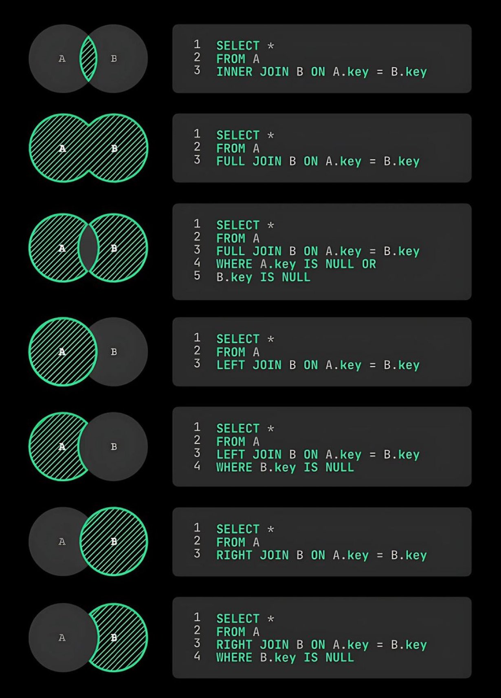

**Source:** [https://twitter.com/i/web/status/1931264358824460386](https://twitter.com/i/web/status/1931264358824460386)
**Original Post Date:** 2025-06-17 11:09:38

# SQL Join Operations: Comprehensive Guide with Code Examples

## Introduction
Understanding SQL JOIN operations is fundamental to effectively querying relational databases. This guide provides a comprehensive overview of all major join types using clear visual representations (Venn diagrams) alongside executable code examples. Whether you're aggregating data across tables or filtering specific result sets, this reference covers the essential knowledge required for efficient database queries.

From basic INNER JOINs to complex filtered OUTER joins, each operation is explained with precise SQL syntax and practical use cases.

## Inner Join Operations

An Inner Join retrieves only matching records between two tables. The result set contains rows where keys match in both Table A and Table B.

_Returns only the intersection of both tables_

```sql
SELECT * FROM A INNER JOIN B ON A.key = B.key
```

## Outer Join Operations

Outer Joins preserve all records from at least one table, filling in NULL values where matches don't exist.

Three variants: LEFT, RIGHT, and FULL OUTER JOINs.

```sql
SELECT * FROM A FULL JOIN B ON A.key = B.key
```

```sql
SELECT * FROM A LEFT JOIN B ON A.key = B.key WHERE B.key IS NULL
```

1. LEFT JOIN preserves all rows from Table A
1. RIGHT JOIN preserves all rows from Table B
1. FULL JOIN preserves all rows from both tables

## Filtered Join Results

Combining OUTER joins with WHERE clauses allows targeting specific subsets of data.

Useful for finding unmatched records in either table.

```sql
SELECT * FROM A FULL JOIN B ON A.key = B.key WHERE A.key IS NULL OR B.key IS NULL
```

## General Observations and Best Practices

Understanding Venn diagrams helps visualize how different joins affect result sets.

SQL syntax remains consistent across all join types, differing only in the join keyword.

> **Note/Tip:** Always consider NULL values when working with OUTER joins

> **Note/Tip:** Use explicit JOIN syntax for better readability over implicit comma-separated tables

## Key Takeaways

- INNER JOIN retrieves matching records from both tables only
- OUTER JOINs preserve all data from at least one specified table
- Filtered joins enable targeted results by excluding matched or unmatched rows
- Venn diagrams provide visual clarity for understanding join operations

## Conclusion
Mastering SQL join operations is crucial for efficient database queries. Whether you need matching records (INNER JOIN) or all possible combinations including unmatched data (OUTER JOINs), these techniques form the backbone of relational database manipulation. Understanding both the syntax and their visual representations helps in writing more effective and maintainable database code.


## Media

**Image Description:** The image is a visual representation of SQL join operations, specifically focusing on the relationships between two tables, **A** and **B**, and the corresponding SQL queries for each type of join. The image is divided into sections, each illustrating a different type of join operation with both a Venn diagram and the corresponding SQL query. Below is a detailed breakdown:

---

### **1. Inner Join**
- **Venn Diagram**: 
  - Two overlapping circles labeled **A** and **B**.
  - The overlapping region is highlighted in green, representing the intersection of the two tables.
- **SQL Query**:
  ```sql
  SELECT *
  FROM A
  INNER JOIN B ON A.key = B.key
  ```
- **Explanation**: 
  - An inner join retrieves only the rows where there is a match between the two tables based on the specified condition (`A.key = B.key`).
  - The result includes only the common data between the two tables.

---

### **2. Full Outer Join**
- **Venn Diagram**:
  - Two overlapping circles labeled **A** and **B**.
  - The entire area of both circles is highlighted in green, including the overlapping region and the non-overlapping parts.
- **SQL Query**:
  ```sql
  SELECT *
  FROM A
  FULL JOIN B ON A.key = B.key
  ```
- **Explanation**:
  - A full outer join retrieves all rows from both tables, including the matching rows and the non-matching rows from both tables.
  - Non-matching rows from either table will have `NULL` values in the columns of the other table.

---

### **3. Full Outer Join with Filtering**
- **Venn Diagram**:
  - Two overlapping circles labeled **A** and **B**.
  - The entire area of both circles is highlighted in green, including the overlapping region and the non-overlapping parts.
- **SQL Query**:
  ```sql
  SELECT *
  FROM A
  FULL JOIN B ON A.key = B.key
  WHERE A.key IS NULL OR B.key IS NULL
  ```
- **Explanation**:
  - This query performs a full outer join but filters the result to include only the rows where one of the tables has no matching record.
  - The result includes only the non-overlapping parts of the Venn diagram.

---

### **4. Left Outer Join**
- **Venn Diagram**:
  - Two overlapping circles labeled **A** and **B**.
  - The entire area of circle **A** is highlighted in green, including the overlapping region and the non-overlapping part of **A**.
- **SQL Query**:
  ```sql
  SELECT *
  FROM A
  LEFT JOIN B ON A.key = B.key
  ```
- **Explanation**:
  - A left outer join retrieves all rows from the left table (**A**) and the matching rows from the right table (**B**).
  - If there is no match in **B**, the result will include `NULL` values for the columns of **B**.

---

### **5. Left Outer Join with Filtering**
- **Venn Diagram**:
  - Two overlapping circles labeled **A** and **B**.
  - The non-overlapping part of circle **A** is highlighted in green.
- **SQL Query**:
  ```sql
  SELECT *
  FROM A
  LEFT JOIN B ON A.key = B.key
  WHERE B.key IS NULL
  ```
- **Explanation**:
  - This query performs a left outer join but filters the result to include only the rows where there is no match in the right table (**B**).
  - The result includes only the non-overlapping part of **A**.

---

### **6. Right Outer Join**
- **Venn Diagram**:
  - Two overlapping circles labeled **A** and **B**.
  - The entire area of circle **B** is highlighted in green, including the overlapping region and the non-overlapping part of **B**.
- **SQL Query**:
  ```sql
  SELECT *
  FROM A
  RIGHT JOIN B ON A.key = B.key
  ```
- **Explanation**:
  - A right outer join retrieves all rows from the right table (**B**) and the matching rows from the left table (**A**).
  - If there is no match in **A**, the result will include `NULL` values for the columns of **A**.

---

### **7. Right Outer Join with Filtering**
- **Venn Diagram**:
  - Two overlapping circles labeled **A** and **B**.
  - The non-overlapping part of circle **B** is highlighted in green.
- **SQL Query**:
  ```sql
  SELECT *
  FROM A
  RIGHT JOIN B ON A.key = B.key
  WHERE A.key IS NULL
  ```
- **Explanation**:
  - This query performs a right outer join but filters the result to include only the rows where there is no match in the left table (**A**).
  - The result includes only the non-overlapping part of **B**.

---

### **General Observations**
1. **Venn Diagrams**:
   - Each Venn diagram visually represents the relationship between the two tables (**A** and **B**) for the corresponding join type.
   - The overlapping region represents the intersection of the two tables, while the non-overlapping regions represent the unique data in each table.

2. **SQL Queries**:
   - The queries are written in standard SQL syntax.
   - The `ON` clause specifies the condition for matching rows between the two tables (`A.key = B.key`).
   - The `WHERE` clause is used in some queries to filter the results further.

3. **Color Coding**:
   - The overlapping regions and the relevant parts of the Venn diagrams are highlighted in green to emphasize the data included in the result set for each join type.

---

### **Overall Purpose**
The image serves as an educational tool to illustrate the differences between various SQL join operations, combining visual representations (Venn diagrams) with the corresponding SQL queries. This helps in understanding how each join type affects the result set based on the relationships between the two tables.
