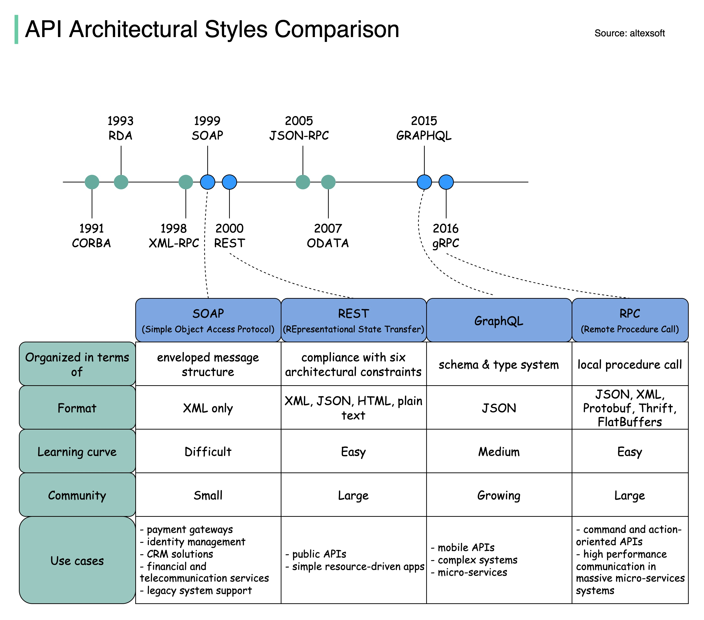

### Description

The API architectural style refers to the design and structure of an application programming interface (API). Different styles have evolved over time, each with its strengths and weaknesses. This article provides a comprehensive comparison of various API architectural styles, including CORBA, RDA, XML-RPC, SOAP, REST, JSON-RPC, ODATA, and GraphQL.

### Introduction to API Architectural Styles

The first API architectural style was CORBA (Common Object Request Broker Architecture), introduced in 1991. Since then, several other styles have emerged, including RDA (Remote Data Access) in 1993, XML-RPC in 1998, SOAP (Simple Object Access Protocol) in 1999, REST (Representational State of Resource) in 2000, JSON-RPC in 2005, ODATA (Open Data Protocol) in 2007, and GraphQL in 2015.

### Comparison of API Architectural Styles

The following table compares the key characteristics of each API architectural style:

| API Architectural Style | Organized in terms of | Format | Learning Curve | Community Size |
| --- | --- | --- | --- | --- |
| CORBA | Enveloped message structure | XML only | Difficult | Small |
| RDA | Simple object access protocol | JSON, XML, Protobuf, Thrift, FlatBuffers | Easy | Growing |
| XML-RPC | XML-based request and response format | JSON, XML, Protobuf, Thrift, FlatBuffers | Medium | Large |
| SOAP | Protocol-based messaging | XML, JSON | Medium | Large |
| REST | Resource-based architecture | JSON, XML, CSV | Easy | Very Large |
| JSON-RPC | JSON-based request and response format | JSON | Easy | Large |
| ODATA | Query-based data access | JSON, XML | Easy | Growing |
| GraphQL | Query-based data access | JSON | Medium | Growing |

### Key Features of Each API Architectural Style

* **CORBA**:
	+ Enveloped message structure
	+ XML-only format
	+ Difficult learning curve
	+ Small community size
* **RDA**:
	+ Simple object access protocol
	+ JSON, XML, Protobuf, Thrift, FlatBuffers formats
	+ Easy learning curve
	+ Large community size
* **XML-RPC**:
	+ XML-based request and response format
	+ JSON, XML, Protobuf, Thrift, FlatBuffers formats
	+ Medium learning curve
	+ Large community size
* **SOAP**:
	+ Protocol-based messaging
	+ XML, JSON formats
	+ Medium learning curve
	+ Large community size
* **REST**:
	+ Resource-based architecture
	+ JSON, XML, CSV formats
	+ Easy learning curve
	+ Very large community size
* **JSON-RPC**:
	+ JSON-based request and response format
	+ JSON format
	+ Easy learning curve
	+ Large community size
* **ODATA**:
	+ Query-based data access
	+ JSON, XML formats
	+ Easy learning curve
	+ Growing community size
* **GraphQL**:
	+ Query-based data access
	+ JSON format
	+ Medium learning curve
	+ Growing community size

### Examples and Use Cases

* **CORBA**: Used in legacy systems that require a high degree of complexity and flexibility.
* **RDA**: Used in applications that require simple object access and a variety of data formats.
* **XML-RPC**: Used in applications that require XML-based request and response formatting.
* **SOAP**: Used in applications that require protocol-based messaging and XML or JSON formatting.
* **REST**: Used in web applications that require resource-based architecture and JSON, XML, or CSV formatting.
* **JSON-RPC**: Used in applications that require JSON-based request and response formatting.
* **ODATA**: Used in applications that require query-based data access and JSON or XML formatting.
* **GraphQL**: Used in applications that require query-based data access and JSON formatting.

### Key Takeaways and Best Practices

* Choose an API architectural style that aligns with your project requirements and goals.
* Consider the learning curve, community size, and format support when selecting an API style.
* Use CORBA for legacy systems, RDA for simple object access, XML-RPC for XML-based formatting, SOAP for protocol-based messaging, REST for resource-based architecture, JSON-RPC for JSON-based formatting, ODATA for query-based data access, and GraphQL for query-based data access with JSON formatting.

### References

* [CORBA](https://www.corba.org/)
* [RDA](https://en.wikipedia.org/wiki/Remote_Data_Access)
* [XML-RPC](https://www.xmlrpc.com/)
* [SOAP](https://www.w3.org/TR/soap/)
* [REST](https://restfulapi.net/)
* [JSON-RPC](https://www.jsonrpc.org/)
* [ODATA](https://www.odata.org/)
* [GraphQL](https://graphql.org/)
## Source

- Original Tweet: [https://twitter.com/i/web/status/1891527731944235385](https://twitter.com/i/web/status/1891527731944235385)
- Date: 2025-02-20 17:09:27

## Media

### Media 1

**Description:** The infographic compares various API Architectural Styles, providing a comprehensive overview of their characteristics and applications.

**Title:** "API Architectural Styles Comparison"

**Timeline:**

* 1991: CORBA
* 1993: RDA
* 1998: XML-RPC
* 1999: SOAP
* 2000: REST
* 2005: JSON-RPC
* 2007: ODATA
* 2015: GraphQL

**Comparison Table:**

| API Architectural Style | Organized in terms of | Format | Learning Curve | Community Size |
| --- | --- | --- | --- | --- |
| CORBA | Enveloped message structure | XML only | Difficult | Small |
| RDA | Simple object access protocol | JSON, XML, Protobuf, Thrift, FlatBuffers | Easy | Growing |
| XML-RPC | XML-based request and response format | JSON, XML, Protobuf, Thrift, FlatBuffers | Medium | Large |

**Key Features:**

* CORBA:
	+ Enveloped message structure
	+ XML-only format
	+ Difficult learning curve
	+ Small community size
* RDA:
	+ Simple object access protocol
	+ JSON, XML, Protobuf, Thrift, FlatBuffers formats
	+ Easy learning curve
	+ Large community size

**Conclusion:**

The infographic provides a clear and concise comparison of various API Architectural Styles, highlighting their key features and applications. By examining the characteristics of each style, developers can choose the most suitable approach for their project needs.

**Answer:** The infographic compares CORBA, RDA, XML-RPC, SOAP, REST, JSON-RPC, ODATA, and GraphQL, providing a comprehensive overview of their characteristics and applications.

*Last updated: 2025-02-20 17:09:27*