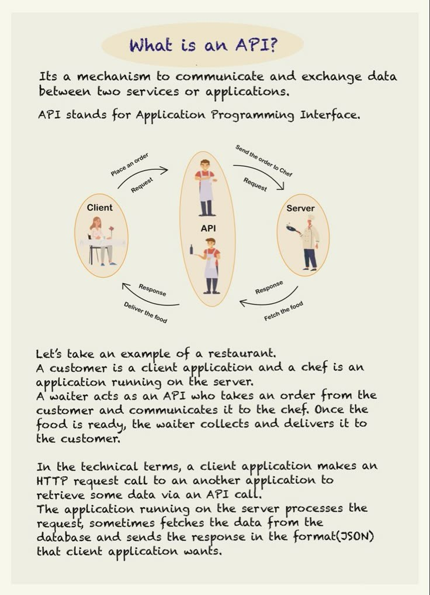

An Application Programming Interface (API) is a mechanism that enables communication and data exchange between two services or applications. This technical knowledge base entry provides an overview of APIs, including their definition, process, and examples.

## What is an API?
An API is a set of defined rules that enable different software systems to communicate with each other. It allows a client (e.g., a web application) to send requests to a server and receive responses in return. The API acts as an intermediary between the client and server, facilitating the exchange of data.

### API Process
The API process involves three main entities:
* **Client**: The entity that sends a request to the server through the API.
* **Server**: The entity that processes the request and returns a response back to the client via the API.
* **API**: The intermediary that enables communication between the client and server.

Here's an example of how this process works:

1. A client (e.g., a web application) sends an HTTP request to the server through the API.
2. The server processes the request and generates a response in a format such as JSON.
3. The server returns the response to the client via the API.

### Example of an API
To illustrate this concept, consider a real-life scenario:

When you order food at a restaurant, your request is sent to the kitchen through the waiter (API). The kitchen processes your request and returns the prepared meal back to you via the waiter (API).

In this example:
* You are the client.
* The kitchen is the server.
* The waiter is the API.

### Technical Terms
Some key technical terms related to APIs include:

* **HTTP Request**: A call made by a client to a server to retrieve or send data. Common HTTP request methods include GET, POST, PUT, and DELETE.
* **JSON Response**: A format used for sending data from a server to a client. JSON (JavaScript Object Notation) is a lightweight, human-readable format that is widely used in API responses.

## Key Takeaways and Best Practices
When working with APIs, keep the following best practices in mind:

* Use standardized API protocols such as REST (Representational State of Resource) or GraphQL.
* Ensure proper error handling and logging mechanisms are in place.
* Implement security measures to protect sensitive data, such as authentication and encryption.

## References
This technical knowledge base entry references the following tools and technologies:
* **HTTP**: Hypertext Transfer Protocol, a standard protocol for transferring data over the web.
* **JSON**: JavaScript Object Notation, a lightweight data interchange format.
* **REST**: Representational State of Resource, an architectural style for designing networked applications.
* **GraphQL**: A query language for APIs that allows clients to specify exactly what data they need.
## Source

- Original Tweet: [https://twitter.com/i/web/status/1888049786525302925](https://twitter.com/i/web/status/1888049786525302925)
- Date: 2025-02-20 16:58:43

## Media

### Media 1

**Description:** The image is an infographic that explains what an API (Application Programming Interface) is and how it works.

*   **What is an API?**
    *   The top of the image has a title "What is an API?" in blue text.
    *   Below the title, there is a paragraph explaining that an API is a mechanism to communicate and exchange data between two services or applications.
    *   It also states that API stands for Application Programming Interface.
*   **API Process**
    *   The main part of the image shows a diagram illustrating how an API works.
    *   The diagram consists of three oval shapes, each representing a different entity involved in the process: Client, Server, and API.
    *   Each entity has a role to play in the communication process:
        *   The Client sends a request to the Server through the API.
        *   The Server processes the request and returns a response back to the Client via the API.
*   **Example of an API**
    *   Below the diagram, there is an example of how an API works in real-life scenarios.
    *   It explains that when you order food at a restaurant, your request is sent to the kitchen through the waiter (API).
    *   The kitchen processes your request and returns the prepared meal back to you via the waiter (API).
*   **Technical Terms**
    *   At the bottom of the image, there are some technical terms related to APIs explained:
        *   HTTP request: a call made by a client to a server to retrieve or send data.
        *   JSON response: a format used for sending data from a server to a client.

In summary, the infographic provides a clear and concise explanation of what an API is and how it works. It uses a simple diagram to illustrate the process and includes examples to help readers understand the concept better. Additionally, it defines some technical terms related to APIs to provide further clarity. Overall, the infographic is a useful resource for anyone looking to learn about APIs and how they facilitate communication between different systems or applications.

*Last updated: 2025-02-20 16:58:43*