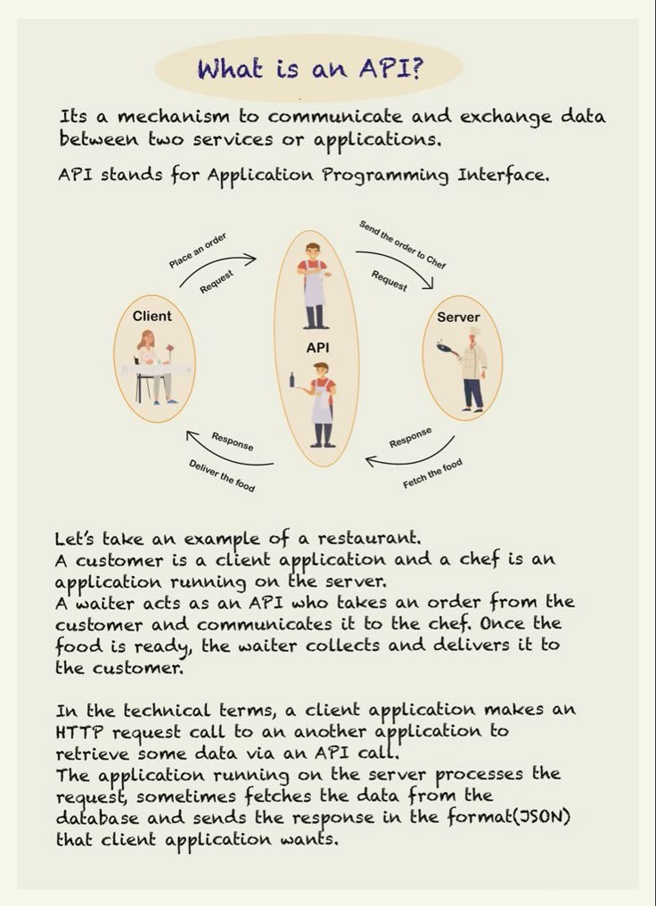

# Api Basics

## Description
What's an API?...

## Content
What's an API?

## Category Information

- Main Category: system_design
- Sub Category: api_design
- Item Name: api_basics

## Source

- Original Tweet: [https://twitter.com/i/web/status/1888049786525302925](https://twitter.com/i/web/status/1888049786525302925)
- Date: 2025-02-20 15:36:34

## Media

### Media 1

**Description:** The image is an infographic that explains what an API (Application Programming Interface) is and how it works.

*   **What is an API?**
    *   The top of the image has a title "What is an API?" in blue text.
    *   Below the title, there is a paragraph explaining that an API is a mechanism to communicate and exchange data between two services or applications.
    *   It also states that API stands for Application Programming Interface.
*   **API Process**
    *   The main part of the image shows a diagram illustrating how an API works.
    *   The diagram consists of three oval shapes, each representing a different entity involved in the process: Client, Server, and API.
    *   Each entity has a role to play in the communication process:
        *   The Client sends a request to the Server through the API.
        *   The Server processes the request and returns a response back to the Client via the API.
*   **Example of an API**
    *   Below the diagram, there is an example of how an API works in real-life scenarios.
    *   It explains that when you order food at a restaurant, your request is sent to the kitchen through the waiter (API).
    *   The kitchen processes your request and returns the prepared meal back to you via the waiter (API).
*   **Technical Terms**
    *   At the bottom of the image, there are some technical terms related to APIs explained:
        *   HTTP request: a call made by a client to a server to retrieve or send data.
        *   JSON response: a format used for sending data from a server to a client.

In summary, the infographic provides a clear and concise explanation of what an API is and how it works. It uses a simple diagram to illustrate the process and includes examples to help readers understand the concept better. Additionally, it defines some technical terms related to APIs to provide further clarity. Overall, the infographic is a useful resource for anyone looking to learn about APIs and how they facilitate communication between different systems or applications.

*Last updated: 2025-02-20 15:36:34*