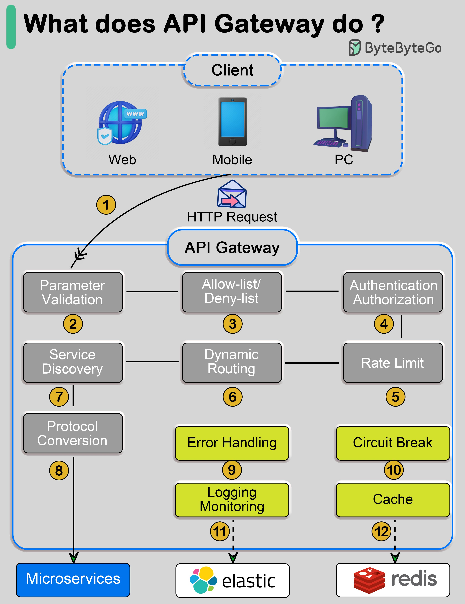

An API gateway is a crucial component in modern software architecture, acting as an entry point for clients to access various services and microservices. It plays a vital role in managing and securing API traffic, ensuring that incoming requests are validated, authenticated, and routed correctly.

#### Technical Content
The primary functions of an API gateway can be categorized into several key areas:

##### 1. **Parameter Validation**
API gateways validate incoming request parameters to ensure they conform to expected formats and ranges. This helps prevent common web vulnerabilities such as SQL injection and cross-site scripting (XSS).

##### 2. **Service Discovery**
The API gateway is responsible for discovering available services and microservices, allowing it to route requests to the appropriate endpoint.

##### 3. **Allow-List/Deny-List**
API gateways maintain allow-lists and deny-lists to control access to specific resources based on client IP addresses, user identities, or other criteria.

##### 4. **Authentication/Authorization**
The API gateway authenticates incoming requests using various mechanisms such as JSON Web Tokens (JWT), OAuth, or basic authentication. It also authorizes access to protected resources based on user roles and permissions.

##### 5. **Rate Limiting**
To prevent abuse and denial-of-service (DoS) attacks, API gateways enforce rate limits on incoming requests from clients.

##### 6. **Dynamic Routing**
The API gateway dynamically routes requests to appropriate services or microservices based on factors such as request headers, query parameters, or payload content.

##### 7. **Error Handling**
API gateways handle errors and exceptions gracefully, providing meaningful error messages and redirecting clients to error pages when necessary.

##### 8. **Circuit Breaker**
The circuit breaker pattern is used to detect when a service is not responding and prevent further requests from being sent to it until it becomes available again.

##### 9. **Logging/Monitoring**
API gateways log and monitor incoming requests, providing valuable insights into API usage patterns, performance bottlenecks, and security threats.

##### 10. **Protocol Conversion**
The API gateway converts between different protocols such as HTTP, gRPC, or WebSocket, enabling communication between services using disparate protocols.

##### 11. **Microservices Integration**
API gateways integrate multiple microservices, allowing them to communicate with each other seamlessly and providing a unified interface for clients.

##### 12. **Cache Management**
The API gateway manages caches to improve response times and reduce the load on backend services.

#### Key Takeaways and Best Practices
* Implement robust security measures such as authentication, authorization, and rate limiting to protect against common web vulnerabilities.
* Use service discovery mechanisms to dynamically route requests to available services.
* Monitor and log API traffic to identify performance bottlenecks and security threats.
* Implement circuit breakers to prevent cascading failures in distributed systems.
* Consider using technologies like Elastic, Redis, and microservices frameworks to build scalable and resilient API gateways.

#### References
* [Elastic](https://www.elastic.co/)
* [Redis](https://redis.io/)
* [Microservices Architecture](https://microservices.io/)

By understanding the diverse range of functions performed by an API gateway, developers and IT professionals can design and implement more secure, scalable, and resilient software architectures.
## Source

- Original Tweet: [https://twitter.com/i/web/status/1873768521823601153](https://twitter.com/i/web/status/1873768521823601153)
- Date: 2025-02-24 12:43:18

## Media

### Media 1

**Description:** The infographic, titled "What does API Gateway do?", provides a comprehensive overview of the role and functions of an Application Programming Interface (API) gateway. The title is prominently displayed at the top left corner, accompanied by a green vertical bar.

**Key Components:**

* **Client:** Represented by various devices such as mobile phones, computers, and web browsers.
* **Web:** A blue globe icon with a checkmark inside, indicating security or validation.
* **Mobile:** A smartphone icon.
* **PC:** A desktop computer icon.
* **API Gateway:** The central component of the infographic, surrounded by 12 numbered boxes that outline its various functions.

**Functions:**

The API gateway performs the following tasks:

1. **Parameter Validation**
2. **Service Discovery**
3. **Allow-List/Deny-List**
4. **Authentication/Authorization**
5. **Rate Limiting**
6. **Dynamic Routing**
7. **Error Handling**
8. **Circuit Breaker**
9. **Logging/Monitoring**
10. **Protocol Conversion**
11. **Microservices Integration**
12. **Cache Management**

Each function is represented by a gray box with white text, connected to the API gateway by a black arrow. The infographic also includes three logos at the bottom: Elastic, Redis, and Microservices, indicating that these technologies are used in conjunction with the API gateway.

**Conclusion:**

The infographic effectively illustrates the diverse range of functions performed by an API gateway, making it a valuable resource for developers and IT professionals seeking to understand its role in modern software architecture.

*Last updated: 2025-02-24 12:43:18*