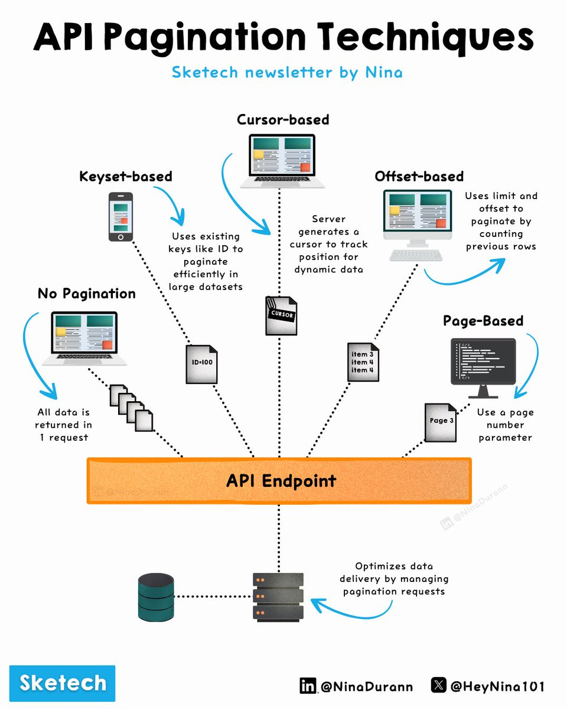

# Api Pagination Techniques

## Description
API Pagination Techniques Explained 

When an API handles large datasets, poor pagination can quickly become a bottleneck

Four Common Pagination Methods

Offset-based pagination: Relies on limit and ...

## Content
API Pagination Techniques Explained 

When an API handles large datasets, poor pagination can quickly become a bottleneck

Four Common Pagination Methods

Offset-based pagination: Relies on limit and offset parameters to paginate. Limit specifies how many items to return and offset defines where to start in the dataset.

Cursor-based pagination: Instead of relying on numerical offsets, the server generates a cursor to identify the starting point for the next page. Ideal for datasets where new entries are frequently added or removed.

Keyset-based pagination: Uses a stable key (e.g., ID, timestamp) to paginate efficiently in large datasets. This method bypasses row counting, improving speed and scalability.

Page-based pagination: Retrieves data using a page parameter (e.g., ?page=3) to specify which subset of data to return. It’s simple and intuitive but less effective in datasets that change frequently.

How to Implement Pagination in Your API

Offset-based Pagination: GET /items?limit=10&offset=20This request returns 10 items starting from the 21st record.

Cursor-based Pagination: GET /items?cursor=abc123The server provides a cursor like abc123 for the next page, allowing precise control over the data flow.

Keyset-based Pagination: GET /items?after_id=100This request retrieves items where the ID is greater than 100, efficiently leveraging indexed fields.

Page-based Pagination: GET /items?page=3Fetches the third page of results, with each page containing a predefined number of items.

Avoid These 3 Common Pagination Mistakes

Neglecting the last page: Ensure your API returns a clear response when users reach the final page of data.

Failing to account for real-time data: Use cursor-based or keyset-based pagination to avoid issues with missing or duplicated records in dynamic datasets.

Ignoring documentation: Clearly explain your pagination parameters (limit, offset, cursor, page) in your API documentation to avoid confusion.

Best Practices

Optimize database queries: Use indexes on fields you paginate (e.g., ID, timestamp).

Set a maximum page size: Protect your system by capping the number of items per page.

Validate pagination parameters: Ensure limit and offset values are valid to prevent errors.

Consistency across endpoints: Keep pagination formats uniform to maintain ease of use and prevent confusion.

What’s the biggest mistake you’ve seen in API pagination?

## Category Information

- Main Category: system_design
- Sub Category: api_design
- Item Name: api_pagination_techniques

## Source

- Original Tweet: [https://twitter.com/i/web/status/1880268843869958299](https://twitter.com/i/web/status/1880268843869958299)
- Date: 2025-02-20 15:36:34

## Media

### Media 1

**Description:** The infographic, titled "API Pagination Techniques," presents a comprehensive overview of various pagination techniques used in API design. The title is prominently displayed at the top, followed by a series of interconnected graphics that illustrate the different methods.

**Key Features:**

* **Cursor-based:** This method uses an existing key to paginate data efficiently in large datasets.
* **Offset-based:** It limits and offsets the number of rows to be fetched from the database.
* **Page-based:** This technique utilizes a page number parameter to retrieve data.
* **No Pagination:** In this approach, all data is returned in a single request.
* **Keyset-based:** Existing keys are used to paginate data efficiently in large datasets.

**Visual Representation:**

The infographic features a central orange rectangle labeled "API Endpoint" with arrows pointing to each of the five pagination techniques. Each technique has its own distinct graphic and description, providing a clear understanding of how they work together to optimize API performance.

**Conclusion:**

Overall, the infographic effectively communicates the importance of pagination in API design and provides a concise overview of the various techniques available. By highlighting the benefits and trade-offs of each approach, it serves as a valuable resource for developers looking to improve their API's efficiency and scalability.

*Last updated: 2025-02-20 15:36:34*