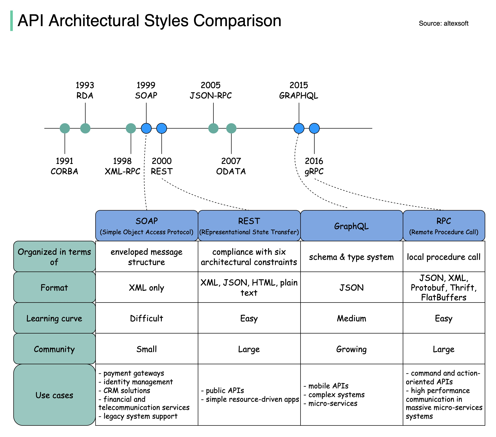

# Api Styles Comparison

## Description
SOAP vs REST vs GraphQL vs RPC....

## Content
SOAP vs REST vs GraphQL vs RPC.

## Category Information

- Main Category: system_design
- Sub Category: api_design
- Item Name: api_styles_comparison

## Source

- Original Tweet: [https://twitter.com/i/web/status/1891527731944235385](https://twitter.com/i/web/status/1891527731944235385)
- Date: 2025-02-20 15:36:34

## Media

### Media 1

**Description:** The infographic compares various API Architectural Styles, providing a comprehensive overview of their characteristics and applications.

**Title:** "API Architectural Styles Comparison"

**Timeline:**

* 1991: CORBA
* 1993: RDA
* 1998: XML-RPC
* 1999: SOAP
* 2000: REST
* 2005: JSON-RPC
* 2007: ODATA
* 2015: GraphQL

**Comparison Table:**

| API Architectural Style | Organized in terms of | Format | Learning Curve | Community Size |
| --- | --- | --- | --- | --- |
| CORBA | Enveloped message structure | XML only | Difficult | Small |
| RDA | Simple object access protocol | JSON, XML, Protobuf, Thrift, FlatBuffers | Easy | Growing |
| XML-RPC | XML-based request and response format | JSON, XML, Protobuf, Thrift, FlatBuffers | Medium | Large |

**Key Features:**

* CORBA:
	+ Enveloped message structure
	+ XML-only format
	+ Difficult learning curve
	+ Small community size
* RDA:
	+ Simple object access protocol
	+ JSON, XML, Protobuf, Thrift, FlatBuffers formats
	+ Easy learning curve
	+ Large community size

**Conclusion:**

The infographic provides a clear and concise comparison of various API Architectural Styles, highlighting their key features and applications. By examining the characteristics of each style, developers can choose the most suitable approach for their project needs.

**Answer:** The infographic compares CORBA, RDA, XML-RPC, SOAP, REST, JSON-RPC, ODATA, and GraphQL, providing a comprehensive overview of their characteristics and applications.

*Last updated: 2025-02-20 15:36:34*